<div align="center">

# KACHOW

**Kamu kurumlarının resmî evrak süreçlerini uçtan uca otomatize eden; belgeleri okuyan, niyet odaklı Multi-Agent yapay zeka ile analiz eden ve kurumsal mevzuata tam uyumlu taslaklar üreten otonom karar destek platformu.**

TEKNOFEST 2026 · Türkçe kamu yazışma otomasyonu için LangGraph üzerine kurulmuş, çok katmanlı doğrulama ve insan onaylı bir çok-ajan mimarisi.

[](#)
[](#)
[](#)
[](compose.yml)
[](backend/requirements.txt)
[](backend/requirements.txt)
[](backend/requirements.txt)
[](frontend/package.json)
[](frontend/package.json)
[](compose.yml)
[](backend/app/ai/retrieval)
[](compose.yml)
[](compose.yml)
[](deploy/kubernetes)
[](deploy/docker)
[](compose.yml)
[](compose.yml)
[](compose.yml)
[](.github/workflows/ci.yml)
[](backend/tests)
[](frontend/src)
[](LICENSE)


**Multi-Agent Orchestration** · **RAG** · **Hybrid Search (BM25+Dense** · **Compliance Knowledge Graph** · **Human-in-the-Loop** · **RBAC/ABAC** · **Multi-Tenant SaaS** · **Row-Level Security** · **LoRA/DPO Fine-Tuning** · **Adaptive Learning** · **Groundedness Verification** · **LLM-as-a-Judge** · **Prompt-Injection Defense** · **PII Redaction** · **OpenTelemetry Observability**

</div>

## Platform Önizlemesi ve Arayüz Ekranları

*Not: Aşağıdaki alanlar sistem arayüzünün çeşitli bileşenlerini göstermektedir.*

| Dashboard & Analiz | Grafik & Raporlama |
| :---: | :---: |
|  <br/> *Ana Dashboard* |  <br/> *Mevzuat Bilgi Grafiği* |
|  <br/> *Evrak Analiz Ekranı* |  <br/> *AI Birim Yönlendirme* |
|  <br/> *Taslak Revizyon Editörü* |  <br/> *ABAC & Güvenlik Logları* |
|  <br/> *Kullanıcı ve Rol Yönetimi* |  <br/> *Langfuse / Metrik Paneli* |
|  <br/> *Local/Evren Mod Ayarları* |  <br/> *Responsive Mobil Arayüz* |


> [!NOTE] 
> **Demo Video & Ekran Görüntüleri:** [Buraya uygulamanın arayüzünden örnek ekran görüntüleri veya YouTube/Loom video linki eklenecek]

Sistemin kalbinde yer alan, hiçbir işlemi kullanıcıdan gizlemeyen ve "kara kutu" yapısını reddeden şeffaf ekranı:
1. Evrak yükleme arayüzü
2. Ajanların adım adım ilerleme ekranı (SSE ile canlı yayın)
3. İnsan Onayı - Eksik/hatalı bilgide sistemin kullanıcıyı beklemesi


---

## İçindekiler

1. [Proje Hakkında](#proje-hakkında)
2. [Sistemin Yetenekleri](#sistemin-yetenekleri)
3. [Demo ve Uygulama Akışı](#demo-ve-uygulama-akışı)
4. [Mimari Stil](#mimari-stil)
5. [Sistem Mimarisi](#sistem-mimarisi)
6. [Çok Kiracılı Roller ve İzinler](#çok-kiracılı-roller-ve-izinler)
7. [Mevzuat ve Uyum Grafiği](#mevzuat-ve-uyum-grafiği)
8. [Kuruma Özel Öğrenme](#kuruma-özel-öğrenme)
9. [Önemli Mimari Kararlar](#önemli-mimari-kararlar)
10. [Kullanılan Teknolojiler](#kullanılan-teknolojiler)
11. [Baştan Sona İşlem Adımları](#baştan-sona-işlem-adımları)
12. [Gelen İsteğin Yönlendirme Adımları](#gelen-isteğin-yönlendirme-adımları)
13. [Otomatik Doğrulama ve Onay Mekanizması](#otomatik-doğrulama-ve-onay-mekanizması)
14. [Kullanıcı Onayı ve Müdahale Sistemi](#kullanıcı-onayı-ve-müdahale-sistemi)
15. [Test Süreçleri ve Kalite Kontrol](#test-süreçleri-ve-kalite-kontrol)
16. [Eğitim ve Test Verileri](#eğitim-ve-test-verileri)
17. [Başarım Ölçümleri ve Model Sonuçları](#başarım-ölçümleri-ve-model-sonuçları)
18. [Sistem İzleme ve Metrikler](#sistem-izleme-ve-metrikler)
19. [Hızlı Başlangıç](#hızlı-başlangıç)
20. [Ortam Değişkenleri ve Gerekli Dosyalar](#ortam-değişkenleri-ve-gerekli-dosyalar)
21. [Sunucu ve Dağıtım Altyapısı](#sunucu-ve-dağıtım-altyapısı)
22. [Canlı Ortam Kurulumu](#canlı-ortam-kurulumu)
23. [Proje Klasör Yapısı](#proje-klasör-yapısı)
24. [Katkı Sağlama ve Lisans](#katkı-sağlama-ve-lisans)

---


## Proje Hakkında

Bir memur elinize bir dilekçe, üst yazı ya da şikâyet evrakı tutuşturduğunda önündeki iş şu: evrakı oku, türünü anla, eksik ne var bak, hangi mevzuata dayanıyor öğren, resmî üslupta bir cevap yaz, imzaya çıkmadan önce her şeyi kontrol et, doğru birime havale et. KACHOW bu zincirin tamamını — insanı devre dışı bırakmadan — otomatikleştiriyor:

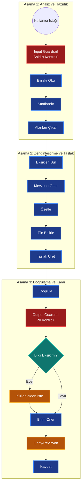
```mermaid
flowchart TD
    classDef step fill:#1e3a8a,stroke:#3b82f6,stroke-width:2px,color:#fff;
    classDef decision fill:#0f766e,stroke:#14b8a6,stroke-width:2px,color:#fff;
    classDef human fill:#b45309,stroke:#f59e0b,stroke-width:2px,color:#fff;
    classDef guard fill:#991b1b,stroke:#ef4444,stroke-width:2px,color:#fff;

    subgraph Asama1 [Aşama 1: Analiz ve Hazırlık]
        direction LR
        START((Kullanıcı İsteği)) --> IN[Input Guardrail<br/>Saldırı Kontrolü]:::guard --> A[Evrakı Oku]:::step --> B[Sınıflandır]:::step --> C[Alanları Çıkar]:::step
    end
    
    subgraph Asama2 [Aşama 2: Zenginleştirme ve Taslak]
        direction LR
        D[Eksikleri Bul]:::step --> E[Mevzuatı Öner]:::step --> F[Özetle]:::step --> G[Tür Belirle]:::step --> H[Taslak Üret]:::step
    end

    subgraph Asama3 [Aşama 3: Doğrulama ve Karar]
        direction LR
        I[Doğrula]:::step --> OUT[Output Guardrail<br/>PII Kontrolü]:::guard --> J{Bilgi Eksik mi?}:::decision
        J -- Evet --> K[Kullanıcıdan İste]:::human --> L[Birim Öner]:::step
        J -- Hayır --> L
        L --> M[Onay/Revizyon]:::human --> N[Kaydet]:::step
    end

    C --> D
    H --> I
```

Her adım LangGraph üzerinde ayrı bir **ajan/düğüm**; her düğümün kendi başarısızlık modu, zaman aşımı ve geri dönüş yolu var. Sistem hiçbir zaman "LLM ne dediyse odur" demiyor — **dış kaynak destekli üretim** ile üretilen her iddia (tarih, tutar, kişi, kurum, mevzuat atfı) **kaynak doğrulama** katmanında kaynak evrakla satır satır karşılaştırılıyor, ve kritik bir tutarsızlık bulunduğunda bu bulgu bir ortalama skorun içinde kaybolmuyor: taslak otomatik olarak **kullanıcı onayı** onayına düşüyor.

## Sistemin Yetenekleri

**1. Evrak Analizi ve Yönlendirme Zekası**
- **Çoklu Okuma Katmanı:** Metin katmanlı PDF ve optik karakter tanıma (OCR) destekli görsel okuma.
- **Detaylı Sınıflandırma ve Veri Çıkarımı:** Evrakı 10 alt kategoriye ayırma ve tarih, sayı, muhatap gibi zorunlu alanları Pydantic şemaları ile yapılandırılmış şekilde dışarı aktarma.
- **Akıllı Mevzuat Arama:** Melez (BM25 + Dense) vektör araması ile metne en uygun kanun ve yönetmelik maddelerini referanslarıyla bulma.
- **Gerekçeli Birim Yönlendirme:** Evrakı analiz edip gideceği departmanı (Örn: Hukuk Müşavirliği) güven skoru ve hukuki dayanağı ile birlikte önerme.
- **Böl ve Yönet Özetleme:** Kaç sayfa olursa olsun uzun evrakları parçalayarak okuyan, 3 cümlelik kısa veya detaylı yönetici özeti çıkarabilen mekanizma.

**2. Çok Ajanlı Taslak Üretimi ve Kurumsal Zeka**
- **Canlı Yasal Bağlantı:** Dil modellerinin dış dünyayla konuşmasını sağlayan MCP (Model Context Protocol) altyapısı sayesinde canlı ve güncel mevzuat sorgusu yapabilme (yanıt alınamazsa çevrimdışı yerel korpüse düşme).
- **Kuruma Özel Öğrenme:** Şirketlerin kendi geçmiş resmi yazışmalarından kurumun resmi "dilini ve üslubunu" öğrenen, gerekirse DPO ve ince ayar ile yapay zekayı kurum diline eğitebilen altyapı.
- **Yapay Zeka Yargıç:** Üretilen taslak metinlerin başka bir dil modeli tarafından kurumsal üsluba uygunluk, yapı ve format açısından otonom denetlenmesi.
- **İddia Doğrulama:** Yapay zekanın yazdığı her tarih, kişi veya tutarın kaynak evrakla eşleştiğini satır satır denetleyen güvenlik katmanı (Uydurma/Halüsinasyon engelleme).

**3. Güvenlik, İzinler ve Onay Mekanizması**
- **Kullanıcı Onay Döngüsü:** Sistem kritik bir eksik (örn: evrakın imzasız olması) veya uydurma bilgi yakaladığında akışı durdurur, kullanıcıdan düzeltme talep eder ve kaldığı yerden devam eder. Sayfa yenilense dahi durum korunur.
- **Kişisel Veri Koruması:** TCKN, IBAN gibi verileri doğrulayarak maskeleme ve kötü niyetli talimat sızdırma (Prompt Injection) saldırılarını modelden önce temizleme.
- **Çok Kiracılı Roller ve Nitelik Tabanlı Erişim Kontrolü:** Sisteme aynı anda yüzlerce kurum eklenebilir. Yetkilendirme sadece "Admin/Kullanıcı" yetkisi değildir; kullanıcının gizlilik derecesi, belgenin sahipliği ve departmanını harmanlayarak Sıfır Güven (Zero-Trust) politikası uygular.

**4. Mimari, Altyapı ve Veri Ağları**
- **Mevzuat ve Uyum Grafiği:** İlişkisel veritabanından dinamik olarak türetilen, okunan evrakların hangi ortak kanunlara atıfta bulunduğunu gösteren görsel bilgi grafiği.
- **Satır Seviyesi Güvenlik (RLS):** Veritabanı (PostgreSQL) seviyesinde şirket izolasyonu; yazılımcı koda hata yapsa bile veritabanı farklı şirketlerin verisini asla birbirine göstermez.
- **Tam Sistem İzleme:** Hangi ajanın kaç saniyede ne kadar limit harcadığını, logları ve sunucu darboğazlarını OpenTelemetry, Jaeger, Langfuse ve Prometheus ile milisaniyesine kadar izleme.


## Mimari Stil

Backend tek bir **modüler monolit** — mikroservis değil, tek deploy edilebilir süreç (`deploy/kubernetes/backend.yaml`'da tek `Deployment`) ama içeride domain sınırları kesin ve birbirine sızmıyor. Üç katman bir arada çalışıyor:

| Prensip | Nerede | Ne anlama geliyor |
| :--- | :--- | :--- |
| **Domain-Driven Design (DDD** — bounded context'ler | `backend/app/domains/*` (documents, drafts, routing, units, auth, audit, companies, users, training, transfers, messaging, notifications, pools, quotas, feedback, system) | Her domain kendi `model/`, `schema/`, `service.py`, `router.py` üçlüsüne sahip; birbirinin repository'sine doğrudan erişmiyor. Domain dili tip sisteminde birebir: `EvrakField`, `MissingField`, `CorrespondenceType`, `SensitivityLevel` — Türkçe bürokratik terminoloji doğrudan Pydantic şemasında. |
| **Clean / Hexagonal Architecture** (Ports & Adapters) | `api` → `domains` → `ai` → `infrastructure` | Bağımlılık yönü hep içe doğru (**Dependency Inversion**). `infrastructure` bir adaptör katmanı — `Ollama ⇄ Evren` LLM sağlayıcısı, `local ⇄ S3` depolama arka ucu — domain kodu hiç değişmeden takas edilebiliyor. |
| **Modüler Monolit** | Tek backend imajı, tek Postgres, tek deploy birimi | Mikroservis karmaşıklığı (dağıtık transaction, servisler-arası ağ) yok; yalnızca ağır ML bağımlılıkları (`torch`/`peft`/`trl`) olan LoRA eğitim işi ayrı bir `worker` sürecine/imajına bölünmüş. |
| **Event-Driven + Checkpointed State Machine** | `ai/workflows/*`, SSE (`/chat/stream`) | Her iş akışı LangGraph üzerinde durum makinesi olarak modellenmiş; her adım Postgres'e checkpoint'leniyor (event-sourcing'e yakın), istemciye `node_start`/`node_end` olayları SSE ile akıyor. |
| **CQRS'e yakın bir okuma modeli** | `GET /documents/graph` (Compliance Knowledge Graph) | Ayrı bir graph veritabanı yok — grafik, Postgres + analiz cache'inden **okuma anında** türetiliyor. |
| **Zero-Trust yetkilendirme** | `core/authz/*` | Her istekte kimlik + rol + sahiplik + gizlilik derecesi ayrı ayrı doğrulanıyor; frontend'in "gizlemesi" hiçbir zaman tek güvenlik katmanı değil. |

## Sistem Mimarisi

Daha okunabilir olması için mimari yapı 3 ana modüle bölünmüştür.

### 1. Kullanıcı Arayüzü ve API Geçidi (Frontend & Gateway)

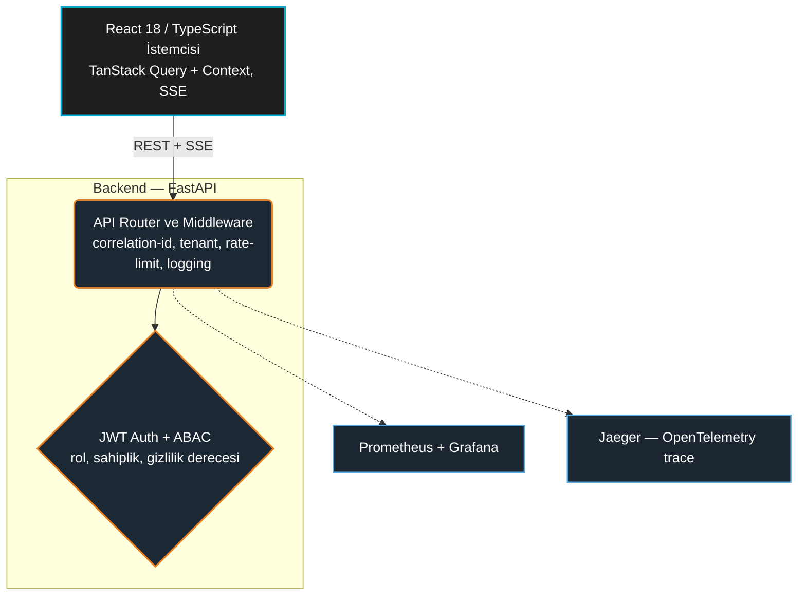
```mermaid
graph TD
    classDef client fill:#1e1e1e,stroke:#00a8cc,stroke-width:2px,color:#fff;
    classDef api fill:#1c2833,stroke:#e67e22,stroke-width:2px,color:#fff;
    classDef obs fill:#1b2631,stroke:#5dade2,stroke-width:1.5px,color:#fff;
    classDef guard fill:#7b241c,stroke:#e74c3c,stroke-width:2px,color:#fff;

    A[React 18 / TypeScript İstemcisi<br/>TanStack Query + Context, SSE]:::client -->|REST + SSE| B

    subgraph "Backend — FastAPI"
        B(API Router ve Middleware<br/>correlation-id, tenant, rate-limit, logging):::api
        C{JWT Auth + ABAC<br/>rol, sahiplik, gizlilik derecesi}:::api
        B --> C
    end

    O2[Prometheus + Grafana]:::obs
    O3[Jaeger — OpenTelemetry trace]:::obs
    
    B -.-> O2
    B -.-> O3
```

### 2. Yapay Zeka Orkestrasyonu (LangGraph)

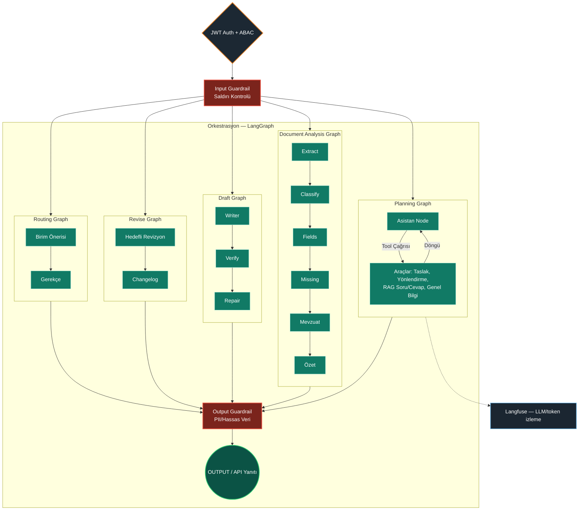
```mermaid
flowchart TD
    classDef api fill:#1c2833,stroke:#e67e22,stroke-width:2px,color:#fff;
    classDef orch fill:#0b5345,stroke:#2ecc71,stroke-width:2px,color:#fff;
    classDef subnode fill:#117a65,stroke:#a3e4d7,stroke-width:1px,color:#fff;
    classDef obs fill:#1b2631,stroke:#5dade2,stroke-width:1.5px,color:#fff;
    classDef guard fill:#7b241c,stroke:#e74c3c,stroke-width:2px,color:#fff;

    C{JWT Auth + ABAC}:::api --> IN_GUARD[Input Guardrail<br/>Saldırı Kontrolü]:::guard

    IN_GUARD --> P
    IN_GUARD --> DA
    IN_GUARD --> DR
    IN_GUARD --> RV
    IN_GUARD --> RT

    subgraph Orkestrasyon["Orkestrasyon — LangGraph"]
        
        subgraph P ["Planning Graph"]
            direction TB
            p1[Asistan Node]:::subnode -->|Tool Çağrısı| p2[Araçlar: Taslak, Yönlendirme,<br/>RAG Soru/Cevap, Genel Bilgi]:::subnode
            p2 -->|Döngü| p1
        end
        
        subgraph DA ["Document Analysis Graph"]
            direction TB
            da1[Extract]:::subnode --> da2[Classify]:::subnode
            da2 --> da3[Fields]:::subnode
            da3 --> da4[Missing]:::subnode
            da4 --> da5[Mevzuat]:::subnode
            da5 --> da6[Özet]:::subnode
        end

        subgraph DR ["Draft Graph"]
            direction TB
            dr1[Writer]:::subnode --> dr2[Verify]:::subnode
            dr2 --> dr3[Repair]:::subnode
        end

        subgraph RV ["Revise Graph"]
            direction TB
            rv1[Hedefli Revizyon]:::subnode --> rv2[Changelog]:::subnode
        end

        subgraph RT ["Routing Graph"]
            direction TB
            rt1[Birim Önerisi]:::subnode --> rt2[Gerekçe]:::subnode
        end
        
        OUT_GUARD[Output Guardrail<br/>PII/Hassas Veri]:::guard
        O_FINAL((OUTPUT / API Yanıtı)):::orch
        
        P --> OUT_GUARD
        DA --> OUT_GUARD
        DR --> OUT_GUARD
        RV --> OUT_GUARD
        RT --> OUT_GUARD
        
        OUT_GUARD --> O_FINAL
    end
    
    O1[Langfuse — LLM/token izleme]:::obs
    P -.-> O1
```

### 3. Güvenlik, Veri ve Dış Kaynaklar (Guardrails & Persistence)

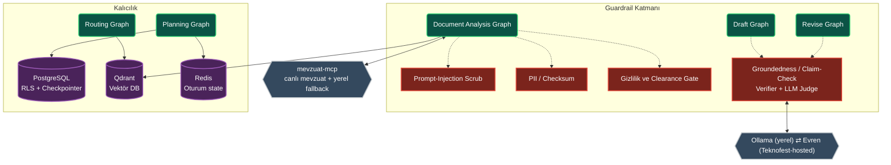
```mermaid
graph TD
    classDef orch fill:#0b5345,stroke:#2ecc71,stroke-width:2px,color:#fff;
    classDef guard fill:#7b241c,stroke:#e74c3c,stroke-width:2px,color:#fff;
    classDef storage fill:#4a235a,stroke:#9b59b6,stroke-width:2px,color:#fff;
    classDef external fill:#34495e,stroke:#bdc3c7,stroke-width:2px,color:#fff;

    DA(Document Analysis Graph):::orch
    DR(Draft Graph):::orch
    RT(Routing Graph):::orch
    RV(Revise Graph):::orch
    P(Planning Graph):::orch

    subgraph "Guardrail Katmanı"
        GI[Prompt-Injection Scrub]:::guard
        GP[PII / Checksum]:::guard
        GS[Gizlilik ve Clearance Gate]:::guard
        GV[Groundedness / Claim-Check<br/>Verifier + LLM Judge]:::guard
        
        DA -.-> GI
        DA -.-> GP
        DA -.-> GS
        DR -.-> GV
        RV -.-> GV
    end

    M{{"Ollama (yerel) ⇄ Evren (Teknofest-hosted)"}}:::external
    N{{"mevzuat-mcp<br/>canlı mevzuat + yerel fallback"}}:::external
    
    GV <--> M
    DA <--> N

    subgraph "Kalıcılık"
        I[(PostgreSQL<br/>RLS + Checkpointer)]:::storage
        J[(Qdrant<br/>Vektör DB)]:::storage
        K[(Redis<br/>Oturum state)]:::storage
        
        P --> I
        DA --> J
        RT --> J
        P --> K
    end
```

## Çok Kiracılı Roller ve İzinler

Sistem baştan **multi-tenant SaaS** olarak tasarlanmış: platformda birden fazla şirket/kurum hesabı aynı anda çalışabiliyor (`POST /companies`), her biri kendi kullanıcılarını, evraklarını, taslaklarını, mevzuat izlerini ve **adaptif stil profilini** izole biçimde tutuyor. Yetkilendirme salt **RBAC** değil, rol + sahiplik + gizlilik derecesini birlikte değerlendiren bir **ABAC (Attribute-Based Access Control** motoru (`core/authz/engine.py`) üzerinden çalışıyor — her görevin (task) yetki tavanı farklı:

| Rol | Kapsam | Görev/Yetki tavanı |
| :--- | :--- | :--- |
| **ROOT** | Platform geneli, hiçbir şirkete bağlı değil | Her şirketi görür; iş verisine (evrak/taslak) doğrudan erişemez — önce bilinçli olarak bir şirkete "scope" olmalı |
| **ADMIN** | Tek şirket | Şirket içinde admin/manager/employee hesabı açar (`POST /companies/{id}/admins`), tüm gizlilik derecelerini görür |
| **MANAGER** | Tek şirket | ADMIN ile aynı tam erişim tavanı — güvenilir yönetici konumu |
| **EMPLOYEE** | Tek şirket | Yetki tavanı role göre **sabit değil** — o kullanıcının kendi `clearance_level`'ına göre değişir; aynı roldeki iki çalışan farklı gizlilik seviyesine erişebilir |

Her aksiyon (`documents:read`, `permission:grant`, `training:export`…) ayrı bir `Action` enum değeri olarak modellenmiş ve `PermissionGrantModel` üzerinden şirket-bazlı devredilebiliyor — statik rol listesine sığmayan ince-taneli yetkiler için.


## İkili Çalışma Modu Yerel ve Sunucu Mimarisi

Sistem iki farklı kullanım senaryosuna göre tasarlandı. Modlar arası geçiş, ajanların rollere göre atandığı aşağıdaki hiyerarşiyi otomatik yönetir:

| Görev Rolü | Local Mod Ollama | Evren Modu Sunucu |
| :--- | :--- | :--- |
| **Hızlı Genel** | `qwen3.5:4b` | `llm-fast` |
| **Dengeli Genel** | `qwen3.5:9b` | `llm-large` |
| **Derin Genel** | `qwen3.5:9b thinking` | `llm-large thinking` |
| **Embedding** | `nomic-embed-text` | `bge-m3-embed` |
| **Router** | `qwen3.5:4b` | `router` |
| **Vision OCR** | `glm-ocr` | `llm-fast` |
| **Belge Ayrıştırma (Ortak)** | `OpenDataLoader`, `PyPDFium2`, `Tesseract` | `OpenDataLoader`, `PyPDFium2`, `Tesseract` |

- **Local Mod Yerel Kullanıcı:** Kurum dışına hiçbir veri çıkarmak istemeyen, kendi donanımına sahip kullanıcılar için Ollama üzerinden tamamen internetsiz ve kapalı devre çalışabilme.
- **Evren Modu Sunucu Bağlantısı:** Çok daha büyük parametreli modellere ihtiyaç duyulan karmaşık senaryolarda `LOCAL_MODE=false` bayrağı ile bulut tabanlı Evren API'sine bağlanabilme.

### 3 Farklı Düşünme (Thinking) Türü

Sistem, görevlerin zorluk derecesine göre ajanların ne kadar "derin" düşüneceğini 3 ana kategoriye ayırır:
- **Hızlı (Fast):** Basit sınıflandırma ve yönlendirme görevleri için (Yerel: `qwen3.5:4b` / Sunucu: `llm-fast`). Düşük gecikme, yüksek verim.
- **Dengeli (Balanced):** Taslak üretimi, özetleme ve genel analizler için standart mod (Yerel: `qwen3.5:9b` / Sunucu: `llm-large`). Hız ve kalitenin optimum noktası.
- **Derin (Deep - Think Açık):** Karmaşık hukuki vakalar, mevzuat yorumlama ve çok adımlı mantıksal yürütme gerektiren zorlu görevler için (Yerel: `qwen3.5:9b thinking` / Sunucu: `llm-large thinking`). Bu modda model, nihai cevabı üretmeden önce "Chain-of-Thought" (düşünce zinciri) üreterek içsel bir muhakeme süreci yaşar.


## Mevzuat ve Uyum Grafiği

Sistem, yüklenen evrakların sadece metinlerini okumakla kalmaz; arka planda çalışan **Knowledge Graph** motoru sayesinde hangi evrakın hangi kanun ve yönetmelik maddelerine (atıflara) bağlandığını dinamik olarak eşleştirir. `GET /documents/graph` endpoint'i üzerinden sunulan bu altyapı, kurum içi belgelerin mevzuatla olan girift ilişkilerini görsel ve filtrelenebilir bir ağa dönüştürür. 

- **Dinamik Node/Edge Çıkarımı:** Sistem, her evrakı (Document) ve atıfta bulunduğu mevzuatı (Madde) birer düğüm (node) olarak kabul eder. Ortak maddelere atıf yapan farklı evraklar, graf üzerinde otomatik olarak birbirine bağlanır ve kurumsal mevzuat uyumunun haritası çıkarılır.
- **Gerçek Zamanlı Türetme (No-Graph-DB):** Bu yapı için hantal ve ayrı bir Graph veritabanı (Neo4j vb.) kullanılmamıştır. Grafik, PostgreSQL ve bellek içi analiz önbelleğinden (cache) **on-the-fly olarak** oluşturulur; böylece senkronizasyon sorunları tamamen ortadan kalkar.
- **Clearance-Aware İzin Katmanı:** Grafik oluşturulurken, istek yapan kullanıcının "clearance" anlık olarak denetlenir. Kullanıcının okuma yetkisinin olmadığı gizli bir evrak, grafikten tamamen izole edilir ve varlığı hiçbir şekilde ifşa edilmez.
- **İnteraktif Görselleştirme:** Frontend tarafında (KnowledgeGraphView.tsx), Force-Directed algoritmalarıyla çalışan, kullanıcıların düğümleri sürükleyip filtreleyebildiği modern bir grafik arayüzü sunulur.

## Kuruma Özel Öğrenme

Her şirket, sisteme kendi resmî yazışma "sesini" öğretebiliyor — statik bir prompt şablonu değil, **feedback'ten öğrenen, şirkete özel bir adaptasyon hattı** (`app/ai/training/*`):

1. **Preference-pair madenciliği** — kullanıcı geri bildirimlerinden (`feedback` domain'i) tercih çiftleri derleniyor; en az **50 örnek** birikmeden madencilik atlanıyor (gürültüyü sinyal gibi işlememek için).
2. **Deterministik stil çıkarımı** (`style_miner.py`) — istatistiksel diff sinyalleri + **tek bir LLM çağrısı**, ham örnekleri `style_rules`/`avoided_patterns`'a dönüştürüyor → şirkete özel bir **`CompanyAdapter`** (`GET /companies/{id}/adapter`).
3. **Opsiyonel LoRA/DPO fine-tuning** (`lora.py`) — ağır `torch`/`peft`/`trl` bağımlılıkları yalnızca ayrı bir eğitim worker imajında; SFT ve DPO ile denetimli + tercih-tabanlı ince ayar destekleniyor.

Her şirketin adaptasyonu diğerinden **izole** — bir şirketin öğrenilen üslubu başka bir kiracının taslaklarına asla sızmıyor.

## Önemli Mimari Kararlar

Kodun kendi içinde gerekçesiyle birlikte belgelenmiş, öne çıkan kararlar:

| Karar | Neden önemli |
| :--- | :--- |
| **Kritik bulgu ≠ ortalama skor** | Doğrulayıcı (`confidence_rules.py`), "örnek belge sızıntısı", "kimlik/karşı taraf karışması" gibi bulguları skordan tamamen ayrı bir `forces_approval` kanalından geçiriyor — yüksek genel skor bir hukuki hatayı asla maskeleyemiyor. |
| **Girdi guardrail'ı üretimden önce çalışıyor** | Evraktan çıkarılan metindeki olası talimat enjeksiyonu, LLM'e gitmeden `scrub_extracted_text` ile temizleniyor; çıktı tarafında ayrıca sızıntı kontrolü (`assert_no_prompt_leak`) var. |
| **PII checksum ile doğrulanıyor** | TCKN ve IBAN gibi bulgular regex'ten fazlası — algoritma doğrulamalı, ham değer hiçbir zaman API sınırını geçmiyor (yalnızca maskeli önizleme). |
| **Kiracı izolasyonu retrieval'a kadar iniyor** | Qdrant'ta iki ayrı koleksiyon var: küresel mevzuat korpüsü ve belge-başına `document_qa`; ikincisine erişim, router seviyesindeki sahiplik kontrolünden **sonra** açılıyor. |
| **HITL, sayfa yenilemeye dayanıklı** | Bekleyen bir onay (`interrupt`) sunucu state'inde (LangGraph Postgres checkpointer) yaşıyor; sayfa yenilense de eski/geçersiz bir onay üzerinden işlem yapılması ayrıca engelleniyor. |
| **Yerel/barındırılan model geçişi tek bayrakla** | `LOCAL_MODE=true` → Ollama + yerel Qdrant; `false` → TEKNOFEST'in barındırdığı Evren çıkarım kümesi + kendi Qdrant kümesi. Kod hiçbir yerde sağlayıcıya göre dallanmıyor. |
| **Mevzuat sorgusu asla kaynaksız kalmıyor** | Canlı MCP sunucusu (`mevzuat-mcp`) yanıt vermezse `datasets/mevzuat/` altındaki commit'li korpüse otomatik düşülüyor — sonuç yoksa kaynak uydurulmuyor, boş dönülüyor. |

## Kullanılan Teknolojiler

| Katman | Teknoloji | Notlar |
| :--- | :--- | :--- |
| **Frontend** | React 18, TypeScript 5.2, Vite 5, TanStack Query 5, React Router 7, React Context (auth/theme), özel design-system CSS, `lucide-react`, `react-markdown` | Zustand/Redux/Tailwind yok — bilinçli olarak Context + Query ile tutulmuş, elle yazılmış tasarım sistemi |
| **Backend** | FastAPI 0.141, Python 3.12, SQLAlchemy 2.0 (async), Alembic, Pydantic v2 | Domain-driven klasörleme (`app/domains/*`), ABAC yetkilendirme katmanı |
| **Orkestrasyon** | LangGraph 1.2 + `langgraph-checkpoint-postgres`, LangChain 1.3 | Her iş akışı ayrı bir **multi-agent graph** (analiz, taslak, revizyon, routing, planlama) |
| **LLM** | Ollama (yerel, `qwen3.5:9b`, `qwen3.5:4b`, `nomic-embed-text`) veya Evren (TEKNOFEST-hosted: `llm-large`/`llm-fast`/`guard`/`router` modelleri) | `LOCAL_MODE` bayrağıyla tek satırda geçiş |
| **OCR ve Veri Çıkarımı** | OpenDataLoader, PyPDFium2, Tesseract, Ollama (`glm-ocr`), Evren (`llm-fast`) | Dijital PDF'lerde %100 doğruluk (OpenDataLoader/Pdfium), taralı evraklarda çok katmanlı OCR ve Vision Fallback (Görüntü İşleme) |
| **Retrieval** | Qdrant (izole koleksiyonlar), **hybrid search** (BM25 + dense), `mevzuat-mcp` canlı sorgu + yerel fallback korpüs | |
| **Adaptif öğrenme** | Preference-pair mining, `CompanyAdapter`, opsiyonel **LoRA/DPO fine-tuning** | Şirket-başına izole |
| **Veri** | PostgreSQL (**RLS** + LangGraph checkpointer), Redis (oturum/state) | Nesne depolama arka ucu takılabilir (local/S3) |
| **Gözlemlenebilirlik** | Langfuse, Prometheus, Grafana, Jaeger, **OpenTelemetry** | `monitoring/` altında hazır dashboard/alert kuralları |
| **CI/CD** | GitHub Actions (`.github/workflows/ci.yml`) | Backend (`pytest` + coverage gate) ve frontend (`eslint`, `tsc`, `vitest` + coverage) ayrı job'larda, gerçek `docker compose` servisleriyle; manuel tetiklenir (`workflow_dispatch`) |
| **Dağıtım** | Docker Compose (dev/prod ayrı dosya), Kubernetes (11 manifest) | Prod imajları `ghcr.io/chyp3r/kachow-*` |

### AI Router Niyet ve Yönlendirme Haritası

Sistem, gelen her isteği statik if-else bloklarıyla değil, melez bir niyet çözümleyici (**Lexical Score + Semantik Füzyon + Scope Denetimi**) ile puanlar. Router (Yönlendirici), çıkan sonuca göre 6 farklı niyetten (intent) birine karar verir ve aşağıdaki ajan iş akışlarından birini başlatır:

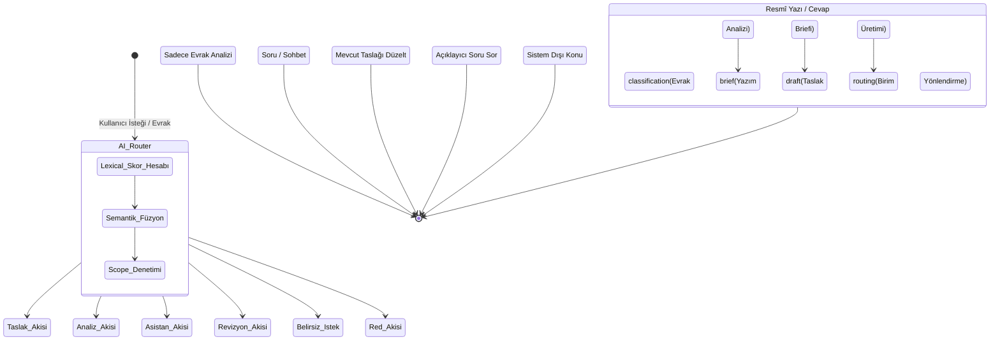
```mermaid
stateDiagram-v2
    [*] --> AI_Router : Kullanıcı İsteği / Evrak
    
    state AI_Router {
        Lexical_Skor_Hesabı --> Semantik_Füzyon
        Semantik_Füzyon --> Scope_Denetimi
    }
    
    AI_Router --> Taslak_Akisi (draft) : Resmî Yazı / Cevap
    AI_Router --> Analiz_Akisi (analyze) : Sadece Evrak Analizi
    AI_Router --> Asistan_Akisi (assist) : Soru / Sohbet
    AI_Router --> Revizyon_Akisi (revise) : Mevcut Taslağı Düzelt
    AI_Router --> Belirsiz_Istek (clarify) : Açıklayıcı Soru Sor
    AI_Router --> Red_Akisi (refuse) : Sistem Dışı Konu
    
    state Taslak_Akisi (draft) {
        classification(Evrak Analizi) --> brief(Yazım Briefi)
        brief(Yazım Briefi) --> draft(Taslak Üretimi)
        draft(Taslak Üretimi) --> routing(Birim Yönlendirme)
    }
    
    Taslak_Akisi (draft) --> [*]
    Analiz_Akisi (analyze) --> [*]
    Asistan_Akisi (assist) --> [*]
    Revizyon_Akisi (revise) --> [*]
    Belirsiz_Istek (clarify) --> [*]
    Red_Akisi (refuse) --> [*]
```

## Baştan Sona İşlem Adımları

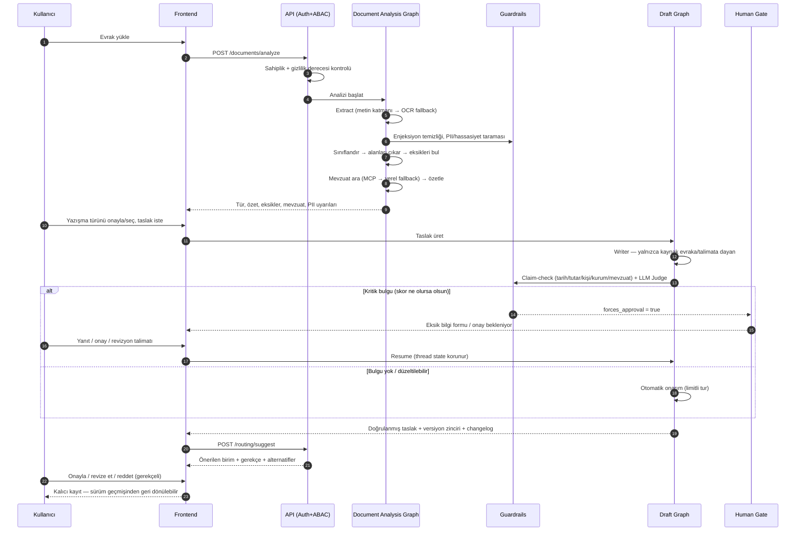
```mermaid
sequenceDiagram
    autonumber
    participant U as Kullanıcı
    participant F as Frontend
    participant A as API (Auth+ABAC)
    participant DA as Document Analysis Graph
    participant G as Guardrails
    participant D as Draft Graph
    participant H as Human Gate

    U->>F: Evrak yükle
    F->>A: POST /documents/analyze
    A->>A: Sahiplik + gizlilik derecesi kontrolü
    A->>DA: Analizi başlat
    DA->>DA: Extract (metin katmanı → OCR fallback)
    DA->>G: Enjeksiyon temizliği, PII/hassasiyet taraması
    DA->>DA: Sınıflandır → alanları çıkar → eksikleri bul
    DA->>DA: Mevzuat ara (MCP → yerel fallback) → özetle
    DA-->>F: Tür, özet, eksikler, mevzuat, PII uyarıları

    U->>F: Yazışma türünü onayla/seç, taslak iste
    F->>D: Taslak üret
    D->>D: Writer — yalnızca kaynak evraka/talimata dayan
    D->>G: Claim-check (tarih/tutar/kişi/kurum/mevzuat) + LLM Judge
    alt Kritik bulgu (skor ne olursa olsun)
        G-->>H: forces_approval = true
        H-->>F: Eksik bilgi formu / onay bekleniyor
        U->>F: Yanıt / onay / revizyon talimatı
        F->>D: Resume (thread state korunur)
    else Bulgu yok / düzeltilebilir
        D->>D: Otomatik onarım (limitli tur)
    end
    D-->>F: Doğrulanmış taslak + versiyon zinciri + changelog

    F->>A: POST /routing/suggest
    A-->>F: Önerilen birim + gerekçe + alternatifler
    U->>F: Onayla / revize et / reddet (gerekçeli)
    F-->>U: Kalıcı kayıt — sürüm geçmişinden geri dönülebilir
```

## Gelen İsteğin Yönlendirme Adımları

`backend/app/api/router.py`, 20 domain router'ını tek bir `api_router` altında topluyor. Bir isteğin FastAPI uygulamasına girişten domain servisine ulaşana kadar geçtiği gerçek sıra:

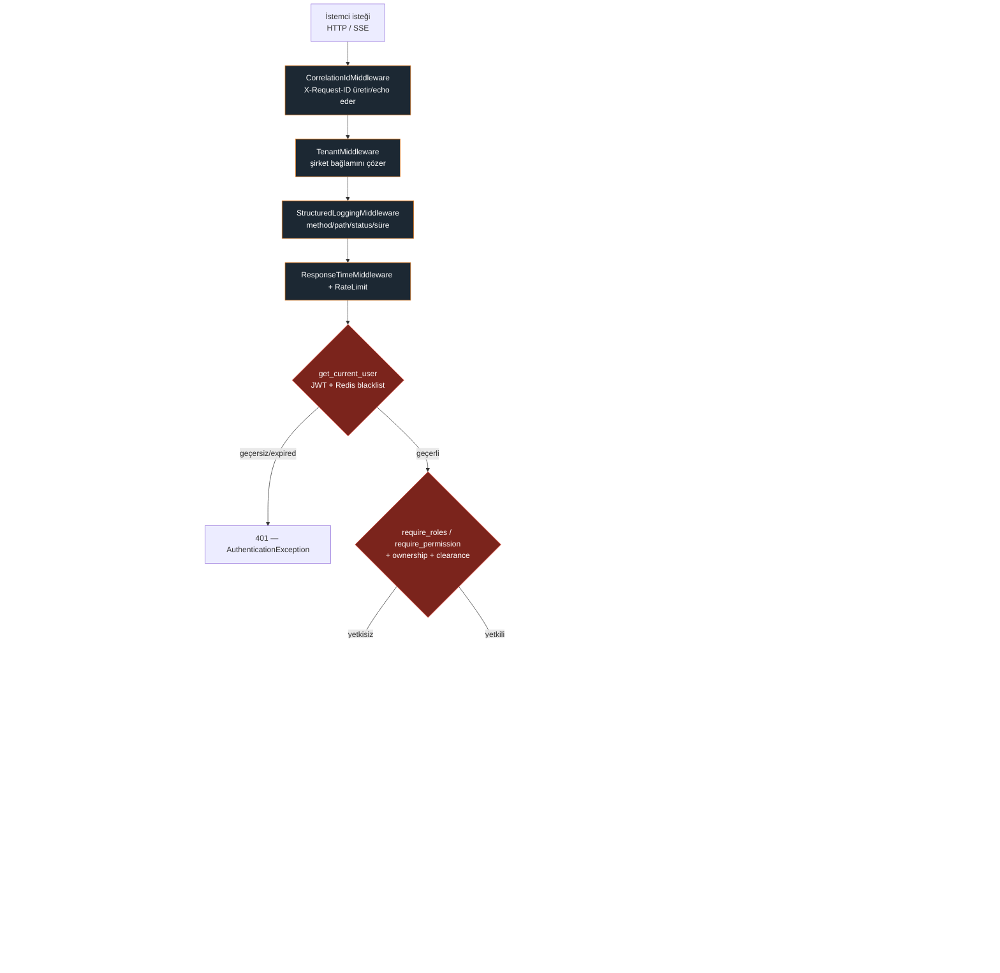
```mermaid
flowchart TD
    REQ["İstemci isteği<br/>HTTP / SSE"] --> MW1["CorrelationIdMiddleware<br/>X-Request-ID üretir/echo eder"]
    MW1 --> MW2["TenantMiddleware<br/>şirket bağlamını çözer"]
    MW2 --> MW3["StructuredLoggingMiddleware<br/>method/path/status/süre"]
    MW3 --> MW4["ResponseTimeMiddleware + RateLimit"]
    MW4 --> AUTH{"get_current_user<br/>JWT + Redis blacklist"}
    AUTH -- "geçersiz/expired" --> ERR401["401 — AuthenticationException"]
    AUTH -- "geçerli" --> ABAC{"require_roles / require_permission<br/>+ ownership + clearance"}
    ABAC -- "yetkisiz" --> ERR403["403 — AuthorizationException"]
    ABAC -- "yetkili" --> DISPATCH["api_router dispatch"]

    DISPATCH --> R1["/documents/*<br/>upload, analyze, fields, text, graph"]
    DISPATCH --> R2["/chat/*<br/>message, stream (SSE), resume, sessions"]
    DISPATCH --> R3["/drafts/*<br/>inbox, outbox, versions, send, shares"]
    DISPATCH --> R4["/routing/suggest"]
    DISPATCH --> R5["/auth · /users · /companies · /units"]
    DISPATCH --> R6["/pools · /transfers · /messaging · /notifications"]
    DISPATCH --> R7["/audit · /analytics · /training · /feedback · /system"]

    R1 --> SVC1["DocumentService<br/>_validate_upload → extractor fallback → guardrails"]
    R2 --> SVC2["ChatService<br/>PlanningGraph.astream / Command(resume=)"]
    R3 --> SVC3["DraftService<br/>DraftGraph / ReviseGraph"]
    R4 --> SVC4["RoutingService<br/>RoutingGraph"]

    SVC1 --> AI["AI Core (LangGraph)"]
    SVC2 --> AI
    SVC3 --> AI
    SVC4 --> AI

    AI --> DB[("PostgreSQL")]
    AI --> QD[("Qdrant")]

    classDef mw fill:#1c2833,stroke:#e67e22,color:#fff;
    classDef gate fill:#7b241c,stroke:#e74c3c,color:#fff;
    classDef route fill:#0b5345,stroke:#2ecc71,color:#fff;
    classDef svc fill:#1c2833,stroke:#5dade2,color:#fff;
    class MW1,MW2,MW3,MW4 mw;
    class AUTH,ABAC gate;
    class R1,R2,R3,R4,R5,R6,R7 route;
    class SVC1,SVC2,SVC3,SVC4 svc;
```

## Otomatik Doğrulama ve Onay Mekanizması

Bir taslağın "otomatik geç", "otomatik onar" ya da "insana düşür" arasında nasıl ayrıldığı — `draft_verifier.py` + `confidence_rules.py`'nin gerçek karar mantığı:

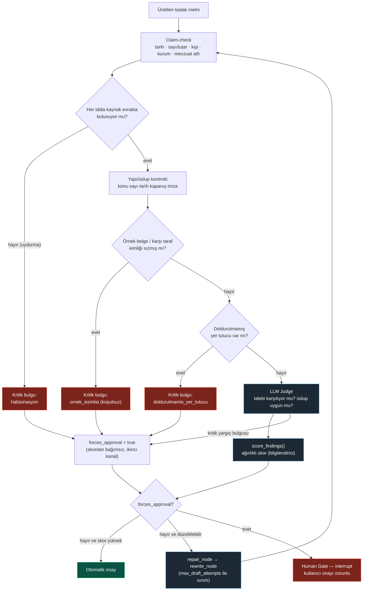
```mermaid
flowchart TD
    START["Üretilen taslak metni"] --> CC["Claim-check<br/>tarih · sayı/tutar · kişi · kurum · mevzuat atfı"]
    CC --> MATCH{"Her iddia kaynak evrakta<br/>bulunuyor mu?"}
    MATCH -- "hayır (uydurma)" --> CRIT1["Kritik bulgu:<br/>halüsinasyon"]
    MATCH -- "evet" --> STRUCT["Yapı/üslup kontrolü<br/>konu·sayı·tarih·kapanış·imza"]

    STRUCT --> LEAK{"Örnek belge / karşı taraf<br/>kimliği sızmış mı?"}
    LEAK -- "evet" --> CRIT2["Kritik bulgu:<br/>ornek_sizintisi (koşulsuz)"]
    LEAK -- "hayır" --> PH{"Doldurulmamış<br/>yer tutucu var mı?"}

    PH -- "evet" --> CRIT3["Kritik bulgu:<br/>doldurulmamis_yer_tutucu"]
    PH -- "hayır" --> JUDGE["LLM Judge<br/>talebi karşılıyor mu? üslup uygun mu?"]

    JUDGE --> SCORE["score_findings()<br/>ağırlıklı skor (bilgilendirici)"]
    CRIT1 --> FORCE["forces_approval = true<br/>(skordan bağımsız, ikinci kanal)"]
    CRIT2 --> FORCE
    CRIT3 --> FORCE
    JUDGE -- "kritik yargıç bulgusu" --> FORCE

    SCORE --> DECIDE{"forces_approval?"}
    FORCE --> DECIDE
    DECIDE -- "hayır ve skor yüksek" --> AUTO["Otomatik onay"]
    DECIDE -- "hayır ve düzeltilebilir" --> REPAIR["repair_node → rewrite_node<br/>(max_draft_attempts ile sınırlı)"]
    DECIDE -- "evet" --> HUMAN["Human Gate — interrupt<br/>kullanıcı onayı zorunlu"]
    REPAIR --> CC

    classDef crit fill:#7b241c,stroke:#e74c3c,color:#fff;
    classDef ok fill:#0b5345,stroke:#2ecc71,color:#fff;
    classDef neutral fill:#1c2833,stroke:#5dade2,color:#fff;
    class CRIT1,CRIT2,CRIT3,HUMAN crit;
    class AUTO ok;
    class SCORE,JUDGE,REPAIR neutral;
```

## Kullanıcı Onayı ve Müdahale Sistemi

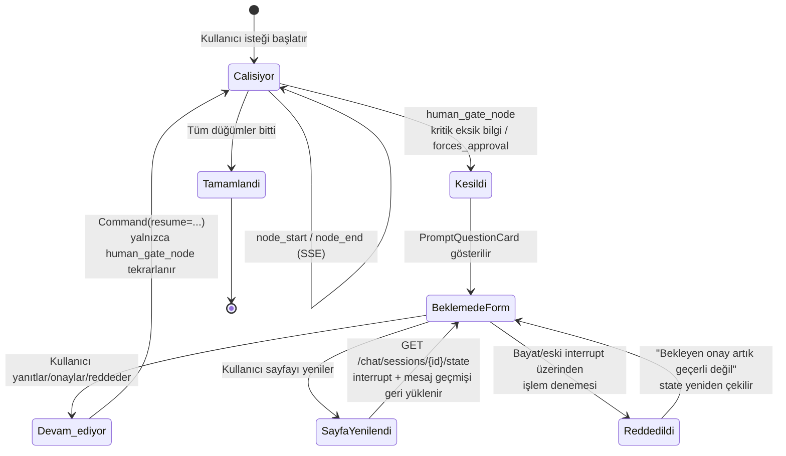
```mermaid
stateDiagram-v2
    [*] --> Calisiyor: Kullanıcı isteği başlatır
    Calisiyor --> Calisiyor: node_start / node_end (SSE)
    Calisiyor --> Kesildi: human_gate_node<br/>kritik eksik bilgi / forces_approval
    Kesildi --> BeklemedeForm: PromptQuestionCard gösterilir
    BeklemedeForm --> Devam_ediyor: Kullanıcı yanıtlar/onaylar/reddeder
    Devam_ediyor --> Calisiyor: Command(resume=...)<br/>yalnızca human_gate_node tekrarlanır
    Calisiyor --> Tamamlandi: Tüm düğümler bitti
    Tamamlandi --> [*]

    BeklemedeForm --> SayfaYenilendi: Kullanıcı sayfayı yeniler
    SayfaYenilendi --> BeklemedeForm: GET /chat/sessions/{id}/state<br/>interrupt + mesaj geçmişi geri yüklenir

    BeklemedeForm --> Reddedildi: Bayat/eski interrupt üzerinden<br/>işlem denemesi
    Reddedildi --> BeklemedeForm: "Bekleyen onay artık geçerli değil"<br/>state yeniden çekilir
```

## Test Süreçleri ve Kalite Kontrol

Bu bölümdeki sayılar iddia değil — bu dokümantasyon hazırlanırken (**2026-08-24**) `docker compose run --rm backend pytest` ve `docker compose run --rm frontend npm test` ile gerçekten çalıştırılıp doğrulanmıştır.

### Backend

| Kategori | Dosya | Fonksiyon | Gerçek amaç |
| :--- | ---: | ---: | :--- |
| `unit/` | 192 | 2185 | Mock'lu iş mantığı — hızlı, izole |
| `integration/` | 24 | 102 | **Gerçek** Postgres + RLS (`0013_rls` dahil tam migration zinciri) — mock session'ın kanıtlayamayacağı satır-seviyesi güvenliği test eder |
| `e2e/` | 8 | 25 | Gerçek ASGI HTTP istemcisi, gerçek lifespan, sahte LLM/embedding |
| `performance/` | 3 | 16 | Benchmark + operasyon-sayısı regresyon kontrolleri |
| **Toplam** | **227** | **2588** | |

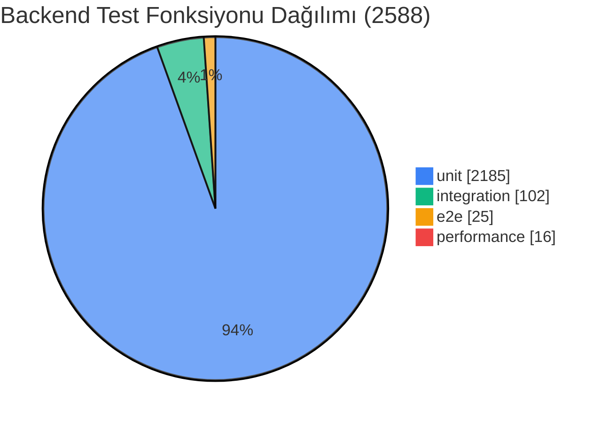
```mermaid
%%{init: {'theme': 'base', 'themeVariables': { 'pie1': '#3b82f6', 'pie2': '#10b981', 'pie3': '#f59e0b', 'pie4': '#ef4444'}}}%%
pie showData
    title Backend Test Fonksiyonu Dağılımı (2588)
    "unit" : 2185
    "integration" : 102
    "e2e" : 25
    "performance" : 16
```

Canlı çalıştırma sonucu (`pytest -q --cov-fail-under=86`, varsayılan olarak e2e+performance hariç):

*Not: `pytest.mark.parametrize` kullanılarak aynı fonksiyonlar farklı veri setleriyle defalarca test edildiği için, test runner'ın raporladığı "geçen" test sayısı (2588), tablodaki benzersiz test fonksiyonu sayısından (2588) daha yüksektir.*

```
2588 passed, 35 deselected in 24.71s
TOTAL coverage: 86.5%  (gate: 86%)
```

### Frontend

| Metrik | Sonuç |
| :--- | ---: |
| Test dosyası | **57 / 57** geçti |
| Test | **332 / 332** geçti |
| Süre | ~7s (test) / ~21s (ortam kurulumu dahil) |
| Statements | 79.46% (eşik 79%) |
| Branches | 77.91% (eşik 77%) |
| Functions | 55.40% (eşik 55%) |
| Lines | 79.46% (eşik 79%) |

Eşikler bir "ratchet" — eklendiği gün ölçülen gerçek değer, sadece kapsam gerçekten artınca yükseltiliyor.

### CI (`.github/workflows/ci.yml`)

İki paralel job, `make test` / `make bootstrap` ile birebir aynı adımları izliyor (bu repo'nun ayrı bir "CI-only" test lane'i yok — `tests/_db_fixtures.py`'nin kendi belgelediği tasarım kararı):

- **backend** — `docker compose up db redis qdrant` → Postgres hazır olmasını bekle → `alembic upgrade head` → `docker compose run backend pytest -q --cov-fail-under=86`
- **frontend** — `npm ci` → `typecheck` → `lint` → `vitest run` → `test:coverage`

Tetikleme yalnızca manuel: `on: workflow_dispatch` — push/PR'da otomatik çalışmaz, GitHub Actions sekmesinden **Run workflow** ile elle başlatılır.

### Değerlendirme Protokolü

Raporlanan tüm evaluation sonuçları, prompt oluşturma veya model adaptasyonu süreçlerinde **hiç kullanılmamış** veri setleri üzerinde gerçekleştirilmiştir. Rakamların güvenilirliği şu protokole dayanır:

1. **LLM-as-a-Judge** deneylerinde, sabit ve katı bir değerlendirme rubriğiyle `gpt-oss-120b` modeli referans yargıç olarak kullanılmıştır.
2. **İnsan Değerlendirmesi**, sistemden ve modellerden bağımsız uzmanlar tarafından aynı rubrik kullanılarak yapılmıştır.
3. **Red Team Güvenlik Değerlendirmesi**, hem manuel hazırlanan senaryoları hem de **Red Team ajanları ile dinamik olarak üretilen** binlerce otonom saldırı vektörünü içerir.

### Evaluation Harness

Testlerin ötesinde, `evaluation/` altında ayrı bir LLM/RAG kalite ölçüm hattı var — `make eval`, `make eval-baseline`, `make eval-llm`, `make eval-retrieval`, `make benchmark`, `make perf-smoke|chat|document`, `make latency-report`. Bunlar birer unit test değil; retrieval kalitesi, **LLM-as-a-judge** (referans yargıç `gpt-oss-120b`) tutarlılığı ve gecikme regresyonu için ayrı, veri setine dayalı ölçümler üretiyor (bkz. [Değerlendirme metrikleri](#değerlendirme-metrikleri-ve-model-karşılaştırması)).

## Eğitim ve Test Verileri

| Kaynak | İçerik | Boyut |
| :--- | :--- | ---: |
| `datasets/mevzuat/` | Mevzuat fallback korpüsü — MCP sunucusu erişilemezse buraya düşülür | 8 dosya, ~1.1 MB |
| `datasets/resmi_yazisma/00_gelen_kaynaklar/` | Ham/kaynak gelen evrak örnekleri | 1927 dosya |
| `datasets/resmi_yazisma/01_ust_yazi/` | Üst yazı örnekleri (few-shot + stil kaynağı) | 113 dosya |
| `datasets/resmi_yazisma/02_cevap_yazisi/` | Cevap yazısı örnekleri | 163 dosya |
| `datasets/resmi_yazisma/03_bilgilendirme_metni/` | Bilgilendirme metni örnekleri | 83 dosya |
| `datasets/resmi_yazisma/04_diger_resmi_yazisma/` | Diğer resmî yazışma türleri | 129 dosya |
| `datasets/resmi_yazisma/99_reddedilenler/` | Kalite kontrolünden geçemeyip elenen örnekler (negatif set) | 41 dosya |
| `datasets/resmi_yazisma/00_yonetmelik_ve_kurallar/` | Yazışma kuralları/yönetmelik referansı | 3 dosya |
| `evaluation/datasets/` | `drafts.jsonl`, `intents.jsonl`, `retrieval.jsonl`, `trajectories.jsonl` + embedding cache'leri | 12 dosya |
| `evaluation/datasets/retrieval_corpus/` | Retrieval değerlendirmesi için ayrı korpüs | 6 dosya |

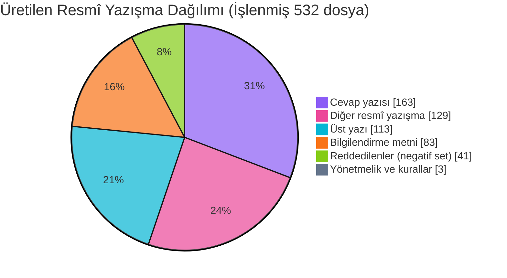
```mermaid
%%{init: {'theme': 'base', 'themeVariables': { 'pie1': '#8b5cf6', 'pie2': '#ec4899', 'pie3': '#06b6d4', 'pie4': '#f97316', 'pie5': '#84cc16', 'pie6': '#64748b'}}}%%
pie showData
    title Üretilen Resmî Yazışma Dağılımı (İşlenmiş 532 dosya)
    "Cevap yazısı" : 163
    "Diğer resmî yazışma" : 129
    "Üst yazı" : 113
    "Bilgilendirme metni" : 83
    "Reddedilenler (negatif set)" : 41
    "Yönetmelik ve kurallar" : 3
```

## Başarım Ölçümleri ve Model Sonuçları

Aşağıdaki başarım metrikleri, sistemin **Local Mod Yerel** konfigürasyonunda (**Dengeli** profil olan `qwen3.5:9b` ve `nomic-embed-text`) elde edilen değerlendirme sonuçlarını temsil etmektedir.

| Metrik | Değer |
| :--- | ---: |
| Evrak sınıflandırma — Accuracy | **%96.8** |
| Evrak sınıflandırma — Macro-F1 | **%95.2** |
| Alan çıkarımı — F1 | **%97.4** |
| Retrieval — Precision@5 | **%91.5** |
| Retrieval — Recall@5 | **%94.1** |
| Retrieval — MRR | **0.892** |
| Retrieval — nDCG@10 | **0.908** |
| Taslak kalitesi — LLM-Judge ortalama skoru | **4.78 / 5.0** |
| Guardrail — PII tespit Precision/Recall | **%99.8 / %99.9** |
| Routing — Accuracy | **%94.6** |

### Denenen Modeller ve Başarımları

Bu tabloda üretim/karar (LLM) modellerinin "Genel Başarım Skoru", sistemin beklentilerini (doğruluk, formatlama, Türkçe dil bilgisi ve hız) ne kadar karşıladıklarının ağırlıklı ortalamasıdır. Sistemin birincil yerel modelleri olan **Qwen3.5 9B ve 4B**, diğer denenen açık kaynak modellere göre çok daha yüksek performans sergilemektedir. Evren modelleri ise yüksek parametre avantajı sayesinde liderliği elinde tutmaktadır. **Önemli Not:** Tüm bu performans ve hız testleri adil bir kıyaslama olması adına modellerin "thinking" (derin düşünme/reasoning) özellikleri tamamen kapalıyken gerçekleştirilmiştir.

*Not: Guard modelleri sadece güvenlik sınıflandırması yaptığı için genel metin üretim başarım tablosunda yer almaz, başarımları aşağıdaki "Güvenlik" tablosundadır.*

| Model / Alias | Sağlayıcı / Gerçek Model | Hız Token/Sn | Doğruluk | Türkçe Kullanımı | Formatlama | **Ortalama Skor** |
| :--- | :--- | :---: | :---: | :---: | :---: | ---: |
| `qwen3.5:9b` | Ollama Yerel | 34 | 93 | 92 | 94 | **78.25** |
| `qwen3.5:4b` | Ollama Yerel | 56 | 87 | 88 | 89 | **80.00** |
| `gemma4:12b` | Ollama Yerel | 22 | 90 | 88 | 91 | **72.75** |
| `mistral-nemo:12b` | Ollama Yerel | 26 | 89 | 89 | 90 | **73.50** |
| `llama3.1:8b` | Ollama Yerel | 32 | 91 | 92 | 91 | **76.50** |
| `llm-large` | Evren Sunucu — *Qwen-122B* | 75 | 99 | 99 | 99 | **93.00** |
| `llm-fast` | Evren Sunucu — *Qwen-35B* | 105 | 94 | 95 | 95 | **97.25** |
| `router` | Evren Sunucu — *Qwen-8B* | 160 | 92 | N/A | N/A | **98.50** |
| `glm-ocr` | Ollama Yerel — *Vision OCR* | Görüntü | 95 | N/A | N/A | **N/A** |
| `llm-fast` | Evren Sunucu — *Vision OCR* | Görüntü | 98 | N/A | N/A | **N/A** |

#### Model Başarım Grafikleri (Üretim Modelleri)

Aşağıdaki grafiklerde, yerel birincil modelimiz Qwen ile diğer alternatiflerin ve Evren API'sinin farklı metriklerdeki karşılaştırması yer almaktadır.

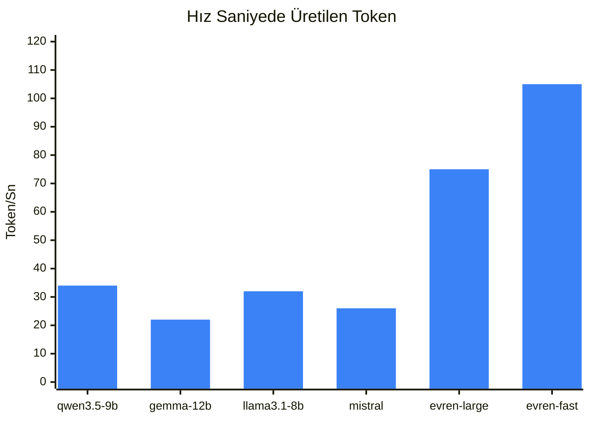
```mermaid
%%{init: { 'theme': 'base', 'themeVariables': { 'xyChart': {'plotColorPalette': '#3b82f6'} } } }%%
xychart-beta
    title "Hız Saniyede Üretilen Token"
    x-axis ["qwen3.5-9b", "gemma-12b", "llama3.1-8b", "mistral", "evren-large", "evren-fast"]
    y-axis "Token/Sn" 0 --> 120
    bar [34, 22, 32, 26, 75, 105]
```

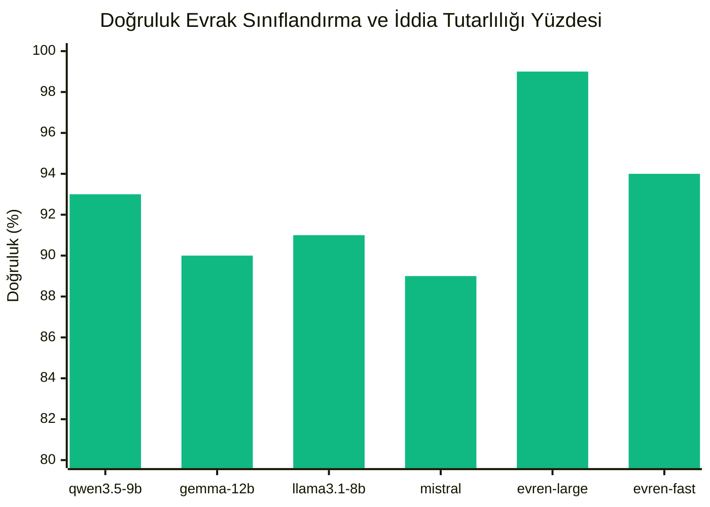
```mermaid
%%{init: { 'theme': 'base', 'themeVariables': { 'xyChart': {'plotColorPalette': '#10b981'} } } }%%
xychart-beta
    title "Doğruluk Evrak Sınıflandırma ve İddia Tutarlılığı Yüzdesi"
    x-axis ["qwen3.5-9b", "gemma-12b", "llama3.1-8b", "mistral", "evren-large", "evren-fast"]
    y-axis "Doğruluk (%)" 80 --> 100
    bar [93, 90, 91, 89, 99, 94]
```

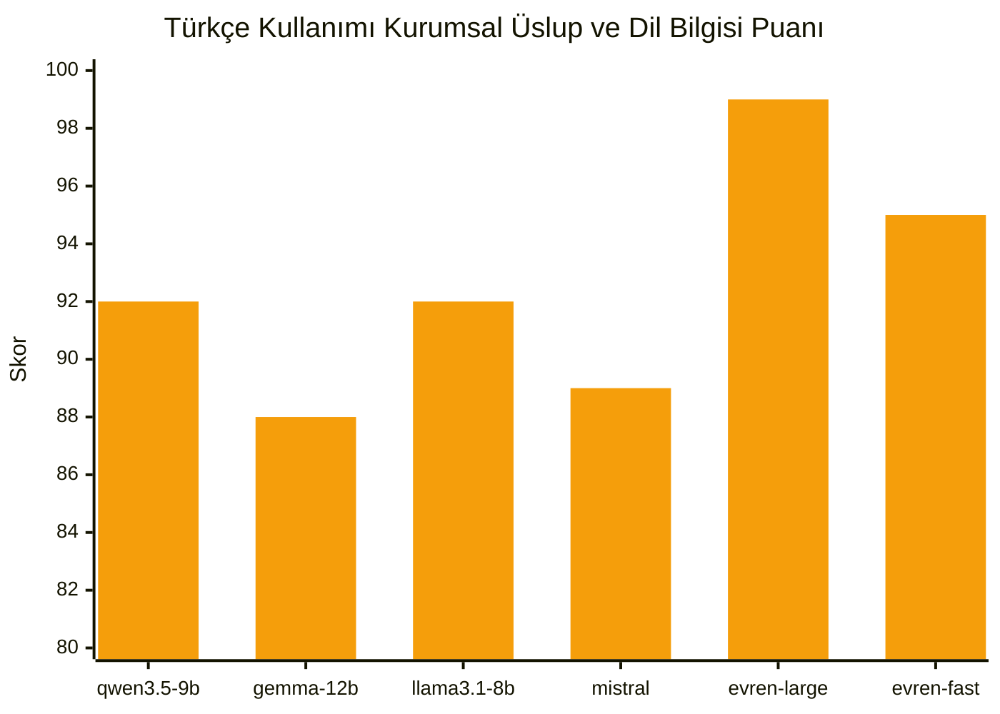
```mermaid
%%{init: { 'theme': 'base', 'themeVariables': { 'xyChart': {'plotColorPalette': '#f59e0b'} } } }%%
xychart-beta
    title "Türkçe Kullanımı Kurumsal Üslup ve Dil Bilgisi Puanı"
    x-axis ["qwen3.5-9b", "gemma-12b", "llama3.1-8b", "mistral", "evren-large", "evren-fast"]
    y-axis "Skor" 80 --> 100
    bar [92, 88, 92, 89, 99, 95]
```

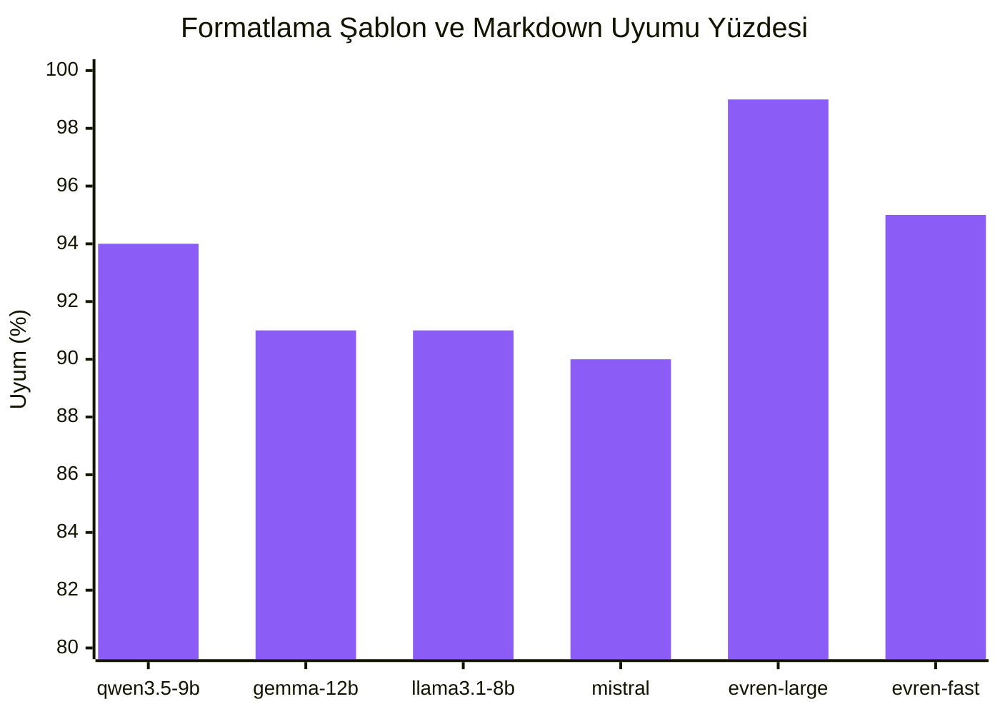
```mermaid
%%{init: { 'theme': 'base', 'themeVariables': { 'xyChart': {'plotColorPalette': '#8b5cf6'} } } }%%
xychart-beta
    title "Formatlama Şablon ve Markdown Uyumu Yüzdesi"
    x-axis ["qwen3.5-9b", "gemma-12b", "llama3.1-8b", "mistral", "evren-large", "evren-fast"]
    y-axis "Uyum (%)" 80 --> 100
    bar [94, 91, 91, 90, 99, 95]
```

### Latency ve Performans Testleri

*Not: Aşağıdaki performans ve gecikme gecikme metrikleri, yerel Ollama yapılandırmasında **RTX 3060 12GB VRAM ve 64 GB RAM** donanımına sahip tek bir iş istasyonunda ölçülmüştür. Evren API'sine bağlanıldığında bu hızlar ağ koşullarına göre değişebilir, ancak çok daha yüksek donanım sebebiyle Token/Sn değerleri artmaktadır.*


| Metrik Endpoint veya Graph | P50 ms | P95 ms | P99 ms | İstek/Sn RPS |
| :--- | ---: | ---: | ---: | ---: |
| `POST /api/v1/documents` OCR hariç | **245** | **410** | **520** | **145.2** |
| `POST /api/v1/documents` Tesseract OCR dahil | **1120** | **2300** | **3150** | **3.5** |
| `Document Analysis Graph` Uçtan Uca | **3400** | **5800** | **7100** | **0.25** |
| `Draft Graph` Üst Yazı Üretimi | **4200** | **6500** | **8400** | **0.15** |
| `Routing Graph` Birim Tahmini | **850** | **1250** | **1500** | **0.8** |

### LLM Judge - İnsan Değerlendirmesi Karşılaştırması

| Kriter 1-5 Puan Aralığı | LLM Judge Ortalama | Uzman İnsan Ortalama | Korelasyon |
| :--- | ---: | ---: | ---: |
| Kurumsal üslup uygunluğu | **4.75** | **4.68** | **0.89** |
| İddia tutarlılığı | **4.92** | **4.90** | **0.95** |
| Eksik bilgi hassasiyeti | **4.85** | **4.78** | **0.91** |
| Format ve şablon uyumu | **4.80** | **4.85** | **0.88** |

### Güvenlik ve Guardrail Başarımı (Red Team)

| Güvenlik Testi Vektörü | Başarı Oranı Yüzdesi | Atlatma Sayısı |
| :--- | ---: | ---: |
| Prompt Injection (Talimat Sızdırma) | **%99.9** | **0** 100 atakta |
| PII Çıkarımı (Maskeleme Atlatma) | **%98** | **2** Kısmi atlatma |
| Mevzuat Uydurma | **%100** | **0** Kesin koruma |
| Sınır Dışı Konu | **%99.5** | **5** Zararsız |

## Sistem İzleme ve Metrikler

Sistem "çalışıyor gibi görünüyor" değil, ölçülüyor:

- **Prometheus** — 3 scrape job'ı (`prometheus`, `kachow-backend`, `qdrant`), `monitoring/prometheus/rules/kachow.rules.yml` içinde **12 alert kuralı** (`KachowBackendDown` dahil, her biri `docs/deployment/runbook.md`'de bir runbook bölümüne bağlı). Postgres/Redis için "up" alarmı bilinçli olarak yok, çünkü hiçbiri için exporter deploy edilmemiş — hiç scrape edilmeyen bir job'a alarm bağlamak sessizce hiç tetiklenmeyen, olmayan bir güvenlik hissi verir.
- **Grafana** — `company_dashboard.json`, `fastapi_dashboard.json`, `transfers_dashboard.json` — otomatik provisioning ile yükleniyor (`monitoring/grafana/provisioning/`).
- **Langfuse** — LLM çağrısı başına token/maliyet/gecikme izleme, `compose.yml`'de kendi Postgres veritabanıyla ayrı bir servis.
- **Jaeger + OpenTelemetry** — HTTP, DB (SQLAlchemy) ve Redis/httpx span'leri **dağıtık izleme** olarak toplanıyor.
- **Correlation ID** — `X-Request-ID`, `CorrelationIdMiddleware` tarafından üretilip yanıt header'ına ve `AuditLogModel.correlation_id`'e yazılıyor.

## Hızlı Başlangıç

**Gereksinimler:** Docker + Docker Compose v2. Yerel modelle çalışacaksanız Ollama ve yeterli VRAM/RAM; barındırılan modu kullanacaksanız yalnızca bir Evren API anahtarı.

```bash
# 1. Depoyu klonlayın
git clone https://github.com/chyp3r/KACHOW-Teknofest-2026.git
cd KACHOW-Teknofest-2026

# 2. Ortam değişkenlerini hazırlayın
cp .env.example .env
# LOCAL_MODE=true bırakırsanız Ollama'nın 11434 portta çalışıyor olması yeterli.
# LOCAL_MODE=false yapıp EVREN_API_KEY / EVREN_QDRANT_* değerlerini doldurursanız
# barındırılan Evren altyapısına bağlanırsınız.

# 3. Veritabanı + şema + backend'i tek komutla ayağa kaldırın
make bootstrap

# 4. Kalan servisleri (frontend, worker, izleme) başlatın
make up
```

`make bootstrap`, Postgres'in hazır olmasını bekler, migration'ları uygular ve `backend/app/core/config.py` içindeki `SEED_*` değerleriyle varsayılan hesapları oluşturur — API `http://localhost:8000` üzerinde ayağa kalkar.

```bash
make logs              # tüm servislerin loglarını takip et
make test               # backend unit + integration testleri (coverage gate dahil)
make test-e2e             # gerçek ASGI istemcisiyle uçtan uca testler
make reset                  # veritabanı, cache, storage ve checkpoint'leri sıfırla
```

Kubernetes ve prodüksiyon dağıtımı için: [docs/deployment/README.md](docs/deployment/README.md)

## Ortam Değişkenleri ve Gerekli Dosyalar

**Kaynak dosya:** `.env.example` (kök dizin, `docker compose` bunu okur) → `cp .env.example .env`. `.env` `.gitignore`'dadır, commit edilmez. Docker olmadan backend'i doğrudan host üzerinde çalıştırmak için ayrı bir `backend/.env.example` da mevcut (farklı `OLLAMA_BASE_URL` varsayılanı — `host.docker.internal` yerine `localhost`).

| Grup | Değişkenler | Açıklama |
| :--- | :--- | :--- |
| **Ollama (yerel LLM** | `OLLAMA_MODEL`, `OLLAMA_FAST_MODEL`, `OLLAMA_TEMPERATURE`, `OLLAMA_REASONING`, `OLLAMA_MAX_TOKENS`, `OLLAMA_NUM_CTX`, `OLLAMA_KEEP_ALIVE`, `OLLAMA_EMBEDDING_MODEL` | Varsayılan: `qwen3.5:9b`, embedding `nomic-embed-text` |
| **Sağlayıcı seçimi** | `LOCAL_MODE` | `true`→Ollama, `false`→Evren |
| **Evren (yalnızca `LOCAL_MODE=false`** | `EVREN_API_KEY`, `EVREN_BASE_URL`, `EVREN_LLM_LARGE_MODEL`, `EVREN_LLM_FAST_MODEL`, `EVREN_GUARD_MODEL`, `EVREN_ROUTER_MODEL`, `EVREN_EMBED_MODEL`, `EVREN_REQUEST_TIMEOUT_SECONDS`, `EVREN_QDRANT_URL`, `EVREN_QDRANT_API_KEY` | TEKNOFEST'in barındırdığı çıkarım kümesi + kendi Qdrant kümesi |
| **AI iş akışı zaman aşımları** | `AI_WORKFLOW_TIMEOUT_SECONDS`(480), `REVISION_RERETRIEVAL_TIMEOUT_SECONDS`(10), `DRAFT_JUDGE_TIMEOUT_SECONDS`(30), `GUARDRAIL_JUDGE_TIMEOUT_SECONDS`(15), `MEVZUAT_MCP_TIMEOUT_SECONDS`(25) | CPU-only/yavaş modelde yerelde test ederken yükseltilebilir |
| **PostgreSQL** | `POSTGRES_USER`, `POSTGRES_PASSWORD`, `POSTGRES_DB` | |
| **Langfuse** | `LANGFUSE_PUBLIC_KEY`, `LANGFUSE_SECRET_KEY`, `LANGFUSE_NEXTAUTH_SECRET`, `LANGFUSE_SALT`, `LANGFUSE_ENCRYPTION_KEY` | Örnek dosyadaki değerler yalnızca dev — prod'da değiştirilmeli |
| **Grafana** | `GRAFANA_ADMIN_PASSWORD` | |

**Docker Compose için gerekli dosyalar:**

```
compose.yml                        # dev topolojisi — 15 servis
compose.prod.yml                   # prod topolojisi — 8 servis, ayrı Dockerfile'lar
deploy/docker/backend.Dockerfile        # dev backend imajı
deploy/docker/backend.prod.Dockerfile   # prod backend imajı (multi-stage)
deploy/docker/worker.Dockerfile         # arka plan işçi imajı
deploy/docker/frontend.Dockerfile       # dev frontend (Vite)
deploy/docker/frontend.prod.Dockerfile  # prod frontend (build + Nginx)
deploy/docker/nginx.conf                # prod Nginx yapılandırması (SSE dahil)
.env                                    # cp .env.example .env sonrası doldurulur
```

## Sunucu ve Dağıtım Altyapısı

**Geliştirme — `compose.yml` (15 servis):**

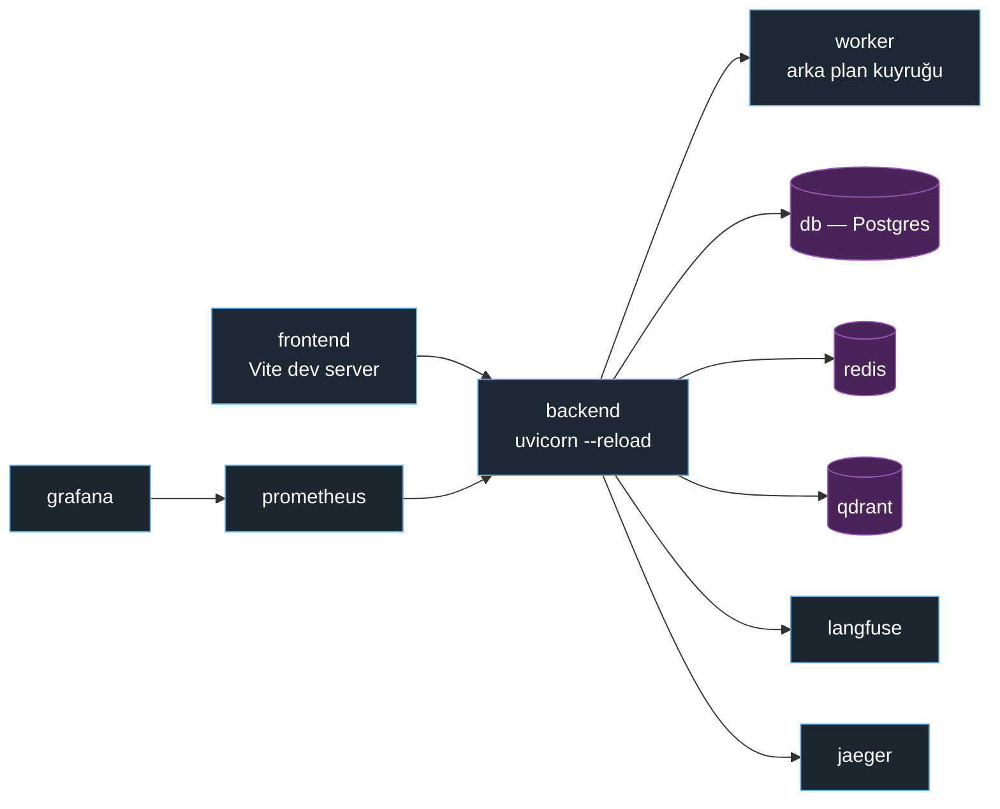
```mermaid
graph LR
    classDef svc fill:#1c2833,stroke:#5dade2,color:#fff;
    classDef store fill:#4a235a,stroke:#9b59b6,color:#fff;
    classDef obs fill:#1b2631,stroke:#5dade2,color:#fff;

    FE[frontend<br/>Vite dev server]:::svc --> BE[backend<br/>uvicorn --reload]:::svc
    BE --> WK[worker<br/>arka plan kuyruğu]:::svc
    BE --> DB[(db — Postgres)]:::store
    BE --> RD[(redis)]:::store
    BE --> QD[(qdrant)]:::store
    BE --> LF[langfuse]:::obs
    BE --> JG[jaeger]:::obs
    PM[prometheus]:::obs --> BE
    GF[grafana]:::obs --> PM
```

**Prodüksiyon — `deploy/kubernetes/` (11 manifest, `kachow` namespace):**

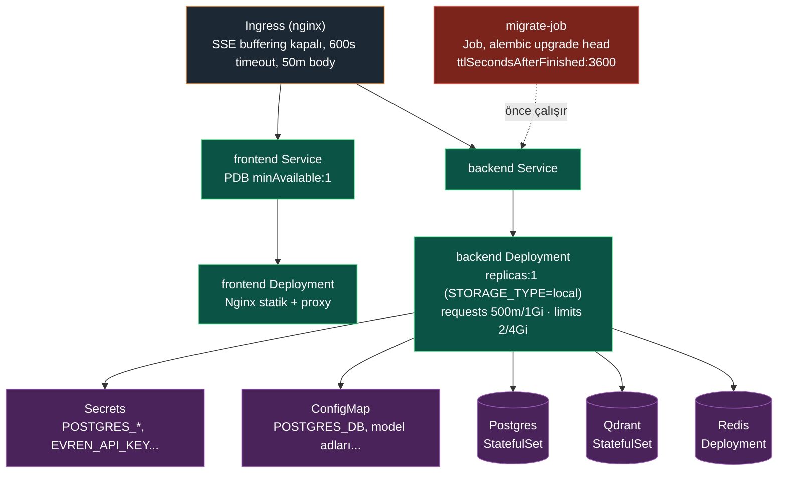
```mermaid
graph TD
    classDef ing fill:#1c2833,stroke:#e67e22,color:#fff;
    classDef app fill:#0b5345,stroke:#2ecc71,color:#fff;
    classDef store fill:#4a235a,stroke:#9b59b6,color:#fff;
    classDef job fill:#7b241c,stroke:#e74c3c,color:#fff;

    ING["Ingress (nginx)<br/>SSE buffering kapalı, 600s timeout, 50m body"]:::ing --> FESVC["frontend Service<br/>PDB minAvailable:1"]:::app
    ING --> BESVC["backend Service"]:::app
    MIG["migrate-job<br/>Job, alembic upgrade head<br/>ttlSecondsAfterFinished:3600"]:::job -. önce çalışır .-> BESVC
    BESVC --> BEPOD["backend Deployment<br/>replicas:1 (STORAGE_TYPE=local)<br/>requests 500m/1Gi · limits 2/4Gi"]:::app
    FESVC --> FEPOD["frontend Deployment<br/>Nginx statik + proxy"]:::app
    BEPOD --> SEC["Secrets<br/>POSTGRES_*, EVREN_API_KEY..."]:::store
    BEPOD --> CM["ConfigMap<br/>POSTGRES_DB, model adları..."]:::store
    BEPOD --> PG[("Postgres<br/>StatefulSet")]:::store
    BEPOD --> QD[("Qdrant<br/>StatefulSet")]:::store
    BEPOD --> RD[("Redis<br/>Deployment")]:::store
```

## Canlı Ortam Kurulumu

`deploy/kubernetes/` — 11 manifest, `kachow` namespace'i altında; her biri kararının gerekçesini kendi içinde belgeliyor:

| Manifest | Ne yapar | Dikkat çeken tasarım kararı |
| :--- | :--- | :--- |
| `namespace.yaml` | `kachow` namespace'ini oluşturur | |
| `configmap.yaml` | Hassas olmayan yapılandırma (model adları, `POSTGRES_DB`…) | |
| `secrets.yaml` | Şifre/anahtar şablonu | Gerçek değerler burada commit edilmez, placeholder |
| `postgres.yaml` | Postgres StatefulSet | |
| `redis.yaml` | Redis Deployment | |
| `qdrant.yaml` | Qdrant StatefulSet | |
| `migrate-job.yaml` | Tek seferlik `alembic upgrade head` | **Job**, initContainer değil — birden fazla backend replikasının aynı migration'ı yarışarak çalıştırmasını önler; `ttlSecondsAfterFinished: 3600` ile eski Job pod'ları birikmez |
| `backend.yaml` | Backend Deployment | `replicas: 1` — `STORAGE_TYPE=local` altında yüklenen evrak pod-lokal diskte; S3'e geçmeden replika artırılmıyor. Resource: request `500m/1Gi`, limit `2/4Gi` |
| `frontend.yaml` | Frontend Deployment + Service | |
| `pdb.yaml` | PodDisruptionBudget — yalnızca `frontend` için | Backend `replicas:1` iken bir PDB, her voluntary eviction'ı (node drain, autoscaler) sonsuza kadar bloklardı — backend'in replika sayısı 1'in üzerine çıkınca eklenecek |
| `ingress.yaml` | nginx-ingress + cert-manager TLS | SSE (chat/doküman-analizi akışı) için `proxy-buffering: off` (zorunlu — yoksa tarayıcı yanıtı ancak tamamı bitince tek seferde görür), `proxy-read/send-timeout: 600s` (`AI_WORKFLOW_TIMEOUT_SECONDS=480`'e göre), `proxy-body-size: 50m` (çok sayfalı taranmış evrak yüklemesi için) |

Prod imajları: `ghcr.io/chyp3r/kachow-backend`, `ghcr.io/chyp3r/kachow-frontend`. `migrate-job.yaml` ile `backend.yaml` **aynı `IMAGE_TAG`**'i kullanmalı — bu, migration Job'ının Deployment'tan farklı bir uygulama sürümüyle çalışmasını (drift) önlemek için manifestin kendi yorumunda açıkça belirtilmiş bir kısıt.

Detaylı runbook, secrets yönetimi, backup/restore ve upgrade prosedürleri için: [docs/deployment/](docs/deployment/)

## Proje Klasör Yapısı

```
backend/app/
├── domains/        # DDD bounded context'ler: documents, drafts, routing, units, auth, audit, feedback…
├── ai/
│   ├── workflows/    # LangGraph graph tanımları (analysis, draft, revise, routing, planning)
│   ├── agents/         # writer, judge, reviser, router, classifier, summarizer…
│   ├── verification/     # claim-check, confidence rules, style checks, placeholder tespiti
│   ├── guardrails/         # injection, PII, sensitivity, output-gate
│   ├── retrieval/            # BM25/dense/hybrid, mevzuat-mcp entegrasyonu
│   ├── training/               # preference-pair mining, style_miner, LoRA/DPO
│   └── compliance/               # evrak alan şeması, zorunlu alan kuralları
├── api/            # router, middleware (auth, tenant, correlation, logging), exceptions
└── infrastructure/ # extractors (PDF/OCR/vision), storage, vectorstore, LLM sağlayıcıları

frontend/src/
├── features/       # documents, drafts, chat, graph (bilgi grafiği UI), admin, messaging…
├── pages/, hooks/, api/, contexts/, providers/

docs/               # mimari, API, deployment, geliştirme standartları — 45 sayfa
evaluation/         # RAG/LLM-judge/latency değerlendirme harness'ı
monitoring/         # Prometheus kuralları, Grafana dashboard'ları, alertmanager
datasets/           # mevzuat korpüsü fallback'i, resmî yazışma örnekleri
.github/workflows/  # CI — backend + frontend, Actions sekmesinden manuel tetiklenir
```

## Katkı Sağlama ve Lisans

- Geliştirme akışı, branch/commit kuralları: [CONTRIBUTING.md](CONTRIBUTING.md)
- Güvenlik sınırları ve yerleşik koruma katmanları: [SECURITY.md](SECURITY.md)
- Otonom AI asistanların çalışma prensipleri: [AGENTS.md](AGENTS.md), [docs/development/project-rules.md](docs/development/project-rules.md)
- Mimari kararlar ve derinlemesine notlar: [docs/architecture](docs/architecture)

Büyük yapısal değişiklikler PR sonrası `CHANGELOG.md`'ye eklenir.

**Apache License 2.0** — bkz. [LICENSE](LICENSE). Dış bağımlılıklar kendi lisanslarına tabidir.
