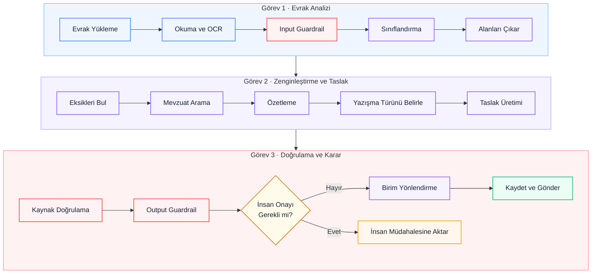
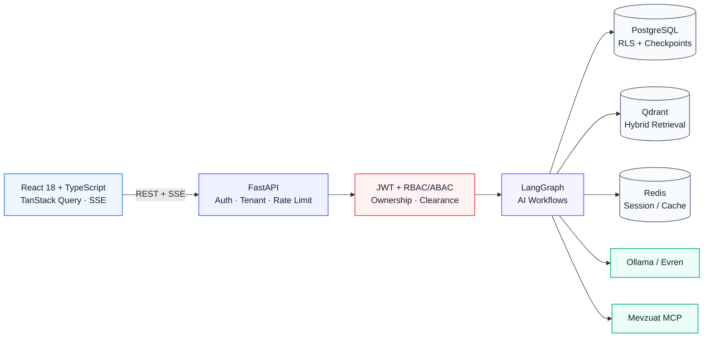
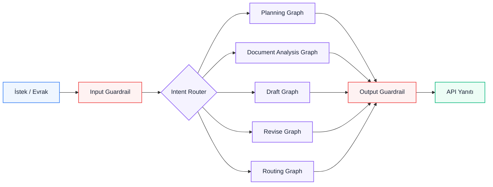
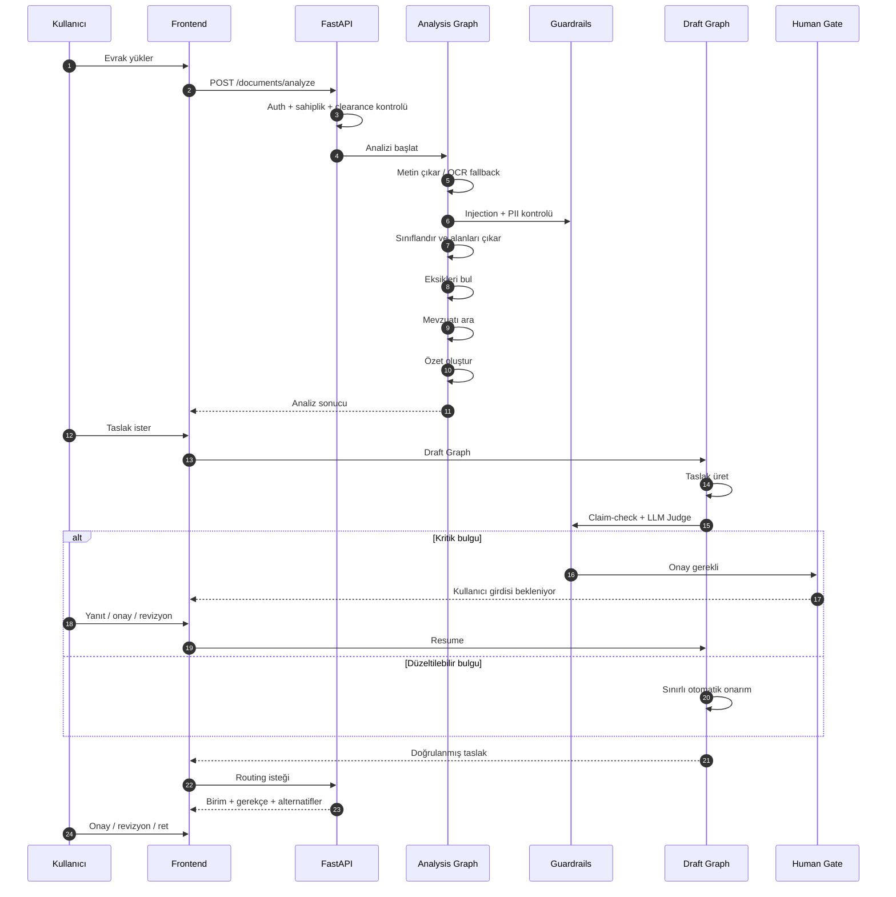
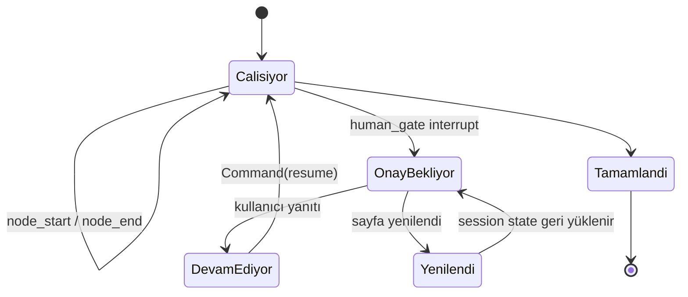
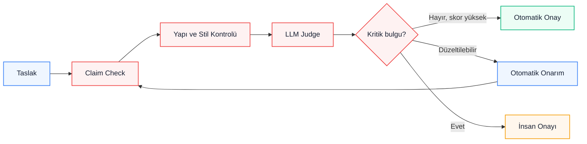
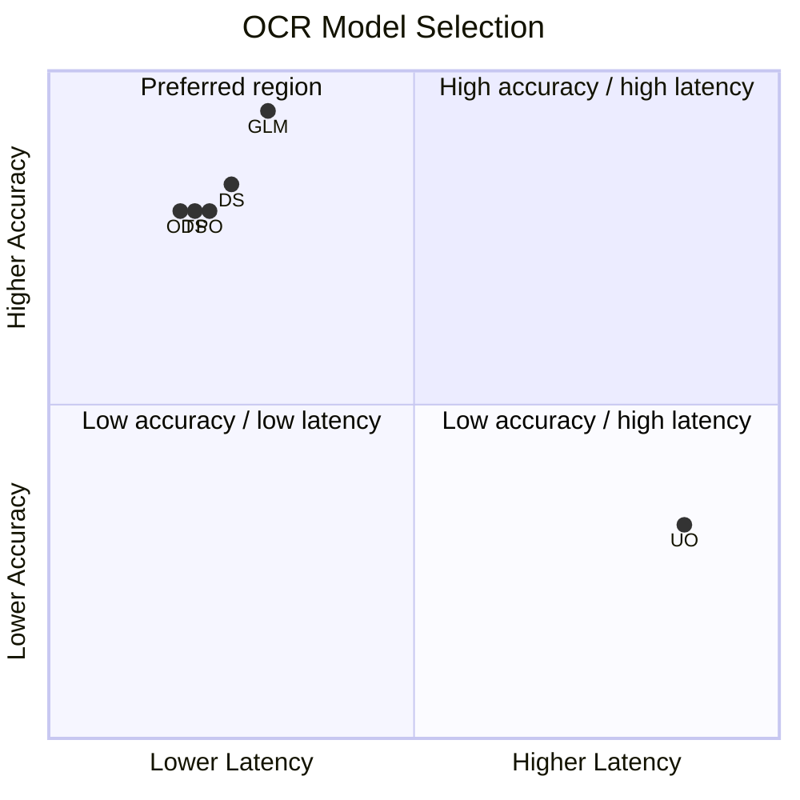
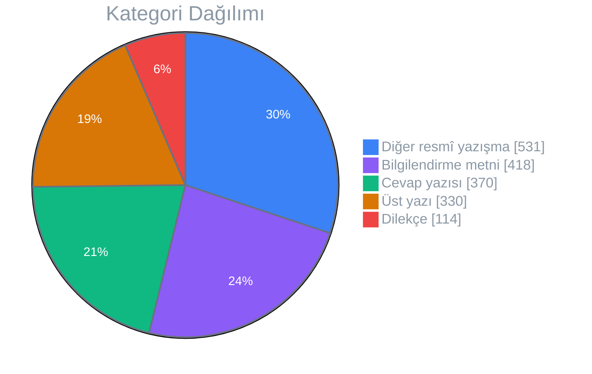
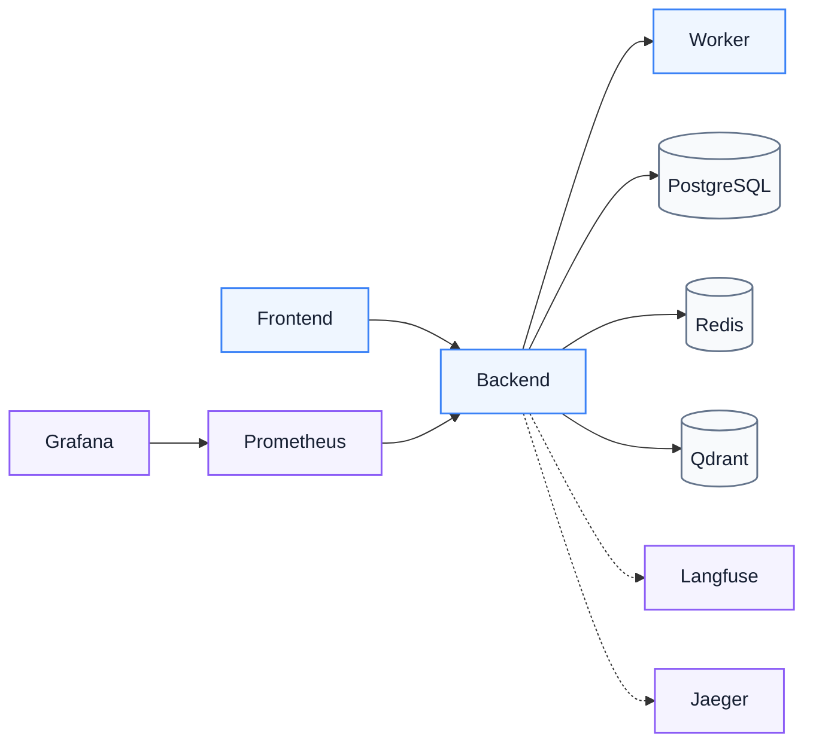

<div align="center">

# KACHOW

**Kamu kurumlarındaki resmî evrak süreçlerini yapay zekâ desteğiyle analiz eden, taslak oluşturan, doğrulayan ve doğru birime yönlendiren karar destek platformu.**

TEKNOFEST 2026 · LangGraph tabanlı çok-ajan mimarisi · İnsan onaylı karar akışları · Türkçe resmî yazışma otomasyonu

[](#)
[](backend/requirements.txt)
[](backend/requirements.txt)
[](backend/requirements.txt)
[](frontend/package.json)
[](frontend/package.json)
[](compose.yml)
[](backend/app/ai/retrieval)
[](compose.yml)
[](backend/tests)
[](frontend/src)
[](LICENSE)

**Multi-Agent Orchestration** · **RAG** · **Hybrid Search** · **Human-in-the-Loop** · **RBAC + ABAC** · **Multi-Tenant** · **PostgreSQL RLS** · **Groundedness Verification** · **Adaptive Learning**

</div>

---

<details>
<summary><strong>İçindekiler</strong></summary>

- [KACHOW nedir?](#kachow-nedir)
- [Demo ve Arayüz](#demo-ve-arayüz)
  - [Platform görünümü](#platform-görünümü)
- [Temel Yetenekler](#temel-yetenekler)
  - [Evrak analizi](#evrak-analizi)
  - [Mevzuat arama](#mevzuat-arama)
  - [Taslak üretimi](#taslak-üretimi)
  - [Kaynak doğrulama](#kaynak-doğrulama)
  - [Birim yönlendirme](#birim-yönlendirme)
  - [İnsan onayı](#insan-onayı)
- [Sistem Mimarisi](#sistem-mimarisi)
  - [Mimari yaklaşım](#mimari-yaklaşım)
- [AI İş Akışları](#ai-iş-akışları)
  - [Router niyetleri](#router-niyetleri)
- [Baştan Sona İşlem Akışı](#baştan-sona-işlem-akışı)
- [Human-in-the-Loop](#human-in-the-loop)
- [Güvenlik ve Yetkilendirme](#güvenlik-ve-yetkilendirme)
  - [Multi-tenant yapı](#multi-tenant-yapı)
  - [Roller](#roller)
  - [PostgreSQL Row-Level Security](#postgresql-row-level-security)
  - [Guardrail katmanları](#guardrail-katmanları)
- [Taslak Doğrulama](#taslak-doğrulama)
- [Mevzuat Bilgi Grafiği](#mevzuat-bilgi-grafiği)
- [Kuruma Özel Öğrenme](#kuruma-özel-öğrenme)
  - [1. Preference-pair oluşturma](#1-preference-pair-oluşturma)
  - [2. Stil profili çıkarımı](#2-stil-profili-çıkarımı)
  - [3. Opsiyonel LoRA / DPO](#3-opsiyonel-lora-dpo)
- [İkili Çalışma Modu: Yerel ve Sunucu](#ikili-çalışma-modu-yerel-ve-sunucu)
  - [Üç reasoning profili](#üç-reasoning-profili)
- [Neden Bu Tasarım?](#neden-bu-tasarım)
- [Değerlendirme](#değerlendirme)
- [Öne Çıkan Sonuçlar](#öne-çıkan-sonuçlar)
- [Model Karşılaştırması](#model-karşılaştırması)
- [OCR Benchmark](#ocr-benchmark)
  - [Alan kurtarma karşılaştırması](#alan-kurtarma-karşılaştırması)
  - [Gecikme / doğruluk konumlandırması](#gecikme-doğruluk-konumlandırması)
- [LLM Judge ve İnsan Değerlendirmesi](#llm-judge-ve-insan-değerlendirmesi)
- [Red Team Sonuçları](#red-team-sonuçları)
- [Performans](#performans)
- [Testler](#testler)
- [Backend](#backend)
- [Frontend](#frontend)
- [CI](#ci)
- [Veri Setleri](#veri-setleri)
- [Teknoloji Yığını](#teknoloji-yığını)
- [Monitoring](#monitoring)
  - [Prometheus](#prometheus)
  - [Grafana](#grafana)
  - [Langfuse](#langfuse)
  - [Jaeger + OpenTelemetry](#jaeger-opentelemetry)
- [Hızlı Başlangıç](#hızlı-başlangıç)
- [Gereksinimler](#gereksinimler)
  - [1. Repoyu klonlayın](#1-repoyu-klonlayın)
  - [2. Ortam değişkenlerini oluşturun](#2-ortam-değişkenlerini-oluşturun)
  - [3. Veritabanını ve backend'i hazırlayın](#3-veritabanını-ve-backendi-hazırlayın)
  - [4. Diğer servisleri başlatın](#4-diğer-servisleri-başlatın)
  - [Yararlı komutlar](#yararlı-komutlar)
- [Ortam Değişkenleri](#ortam-değişkenleri)
- [Dağıtım](#dağıtım)
  - [Docker Compose](#docker-compose)
  - [Kubernetes](#kubernetes)
- [Proje Yapısı](#proje-yapısı)
- [Daha Fazla Dokümantasyon](#daha-fazla-dokümantasyon)
- [Lisans](#lisans)

</details>

---

## KACHOW nedir?

Kamu kurumlarında bir evrakın işlenmesi yalnızca metni okumaktan ibaret değildir. Evrakın türünün belirlenmesi, gerekli bilgilerin kontrol edilmesi, ilgili mevzuatın bulunması, resmî cevap hazırlanması, uygun birime yönlendirilmesi ve imza öncesinde doğrulanması gerekir.

KACHOW bu sürecin tekrar eden bölümlerini otomatikleştirir ancak karar sürecinden insanı çıkarmayı amaçlamaz.

Bir evrak yüklendiğinde sistem:

1. belgeyi okur,
2. evrak türünü ve temel alanları çıkarır,
3. eksik bilgileri belirler,
4. ilgili mevzuatı arar,
5. resmî yazışma taslağı oluşturur,
6. taslaktaki iddiaları kaynak belgeyle karşılaştırır,
7. uygun kurumsal birimi önerir,
8. kritik veya belirsiz durumlarda kullanıcı onayı ister.



Her işlem adımı LangGraph üzerinde ayrı bir düğüm olarak çalışır. Akışın durumu sunucuda tutulduğu için kullanıcı onayı gereken bir noktada işlem durabilir ve daha sonra aynı noktadan devam edebilir.

---

## Demo ve Arayüz

> **Demo videosu:** YouTube / Loom bağlantısı buraya eklenecek.

### Platform görünümü

| Evrak ve AI Akışı | Kurumsal Analiz |
| :---: | :---: |
|  |  |
| **Ana Dashboard** | **Evrak Analizi** |
|  |  |
| **Taslak ve Revizyon** | **AI Birim Yönlendirme** |

| Yönetim | İzleme |
| :---: | :---: |
|  |  |
| **Mevzuat Bilgi Grafiği** | **Sistem Metrikleri** |
|  |  |
| **Kullanıcı ve Yetki Yönetimi** | **Güvenlik ve Audit Logları** |

Arayüzde özellikle üç nokta görünür tutulur:

- evrak yükleme ve analiz süreci,
- ajanların ilerleyişinin SSE üzerinden canlı gösterimi,
- sistemin kullanıcıdan bilgi veya onay beklediği Human-in-the-Loop adımları.

---

## Temel Yetenekler

### Evrak analizi

KACHOW hem metin katmanı bulunan PDF'leri hem de taranmış belgeleri işleyebilir.

Dijital belgelerde metin doğrudan çıkarılır. Gerekli olduğunda Tesseract ve vision tabanlı OCR katmanları devreye girer.

Analiz sonucunda sistem:

- evrak türünü belirler,
- tarih, sayı, konu, muhatap ve gönderen kurum gibi alanları çıkarır,
- eksik alanları işaretler,
- kısa veya ayrıntılı özet oluşturur,
- evrakla ilişkili mevzuatı arar.

Çıkarılan alanlar Pydantic şemalarıyla yapılandırılır; yalnızca serbest metin olarak tutulmaz.

### Mevzuat arama

Mevzuat araması **BM25 + dense retrieval** kullanan hibrit bir arama katmanı üzerinden yapılır.

Sistem iki kaynaktan yararlanabilir:

- canlı `mevzuat-mcp` sorguları,
- bağlantı kurulamadığında `datasets/mevzuat/` altındaki yerel fallback korpüsü.

Bir kaynak bulunamadığında mevzuat referansı üretilmez.

### Taslak üretimi

Analiz tamamlandıktan sonra sistem resmî yazışma taslağı oluşturabilir.

Taslak oluşturulurken:

- kaynak evrak,
- bulunan mevzuat,
- yazışma türü,
- kurumun tercihleri ve stil profili

birlikte kullanılır.

Üretilen taslak daha sonra ayrı bir doğrulama aşamasından geçer.

### Kaynak doğrulama

Taslakta geçen tarih, sayı, tutar, kişi, kurum ve mevzuat atıfları kaynak evrakla karşılaştırılır.

Kritik bir tutarsızlık bulunursa yüksek genel güven skoru bu hatayı gizleyemez. Bu tür bulgular `forces_approval` üzerinden ayrı olarak işlenir ve taslak kullanıcı onayına gönderilir.

### Birim yönlendirme

Routing Graph evrakın içeriğine göre uygun kurumsal birimi önerir.

Sonuç yalnızca bir birim adı değildir. Sistem mümkün olduğunda:

- önerilen birimi,
- güven skorunu,
- yönlendirme gerekçesini,
- alternatif birimleri

birlikte döndürür.

### İnsan onayı

KACHOW'un temel tasarım kararlarından biri kritik kararların otomatik olarak geçilmemesidir.

Eksik bilgi, doldurulmamış alan, olası halüsinasyon veya başka kritik bir doğrulama problemi bulunduğunda LangGraph akışı `interrupt` ile durdurulur.

Kullanıcı gerekli bilgiyi sağladığında aynı thread tekrar başlatılmaz; mevcut checkpoint üzerinden devam eder.

---

## Sistem Mimarisi

KACHOW backend'i bir **modüler monolit** olarak tasarlanmıştır.

Tek bir deploy edilebilir backend bulunur ancak authentication, documents, drafts, routing, messaging, training ve diğer alanlar ayrı domain sınırları içinde tutulur.



### Mimari yaklaşım

| Yaklaşım | Uygulamadaki karşılığı |
| :--- | :--- |
| **Domain-Driven Design** | `backend/app/domains/*` altında her iş alanı kendi model, schema, service ve router yapısına sahip |
| **Clean / Hexagonal Architecture** | LLM, storage ve vector store gibi altyapılar adapter olarak değiştirilebilir |
| **Modüler Monolit** | Backend tek deploy birimi; domain sınırları kod seviyesinde korunur |
| **Checkpointed State Machine** | LangGraph akışları PostgreSQL üzerinde checkpoint edilir |
| **Event-Driven UI** | `node_start`, `node_end` ve diğer olaylar SSE ile istemciye aktarılır |
| **Zero-Trust Authorization** | Rol dışında sahiplik, kurum, izin ve gizlilik seviyesi de değerlendirilir |

Ağır ML bağımlılıkları gerektiren LoRA/DPO eğitim işleri ayrı bir worker sürecinde çalışır.

---

## AI İş Akışları

Sistemde farklı görevler tek bir dev prompt üzerinden yürütülmez. Her iş için ayrı LangGraph akışları bulunur.



### Router niyetleri

Gelen istekler altı temel niyetten birine yönlendirilir:

| Intent | Kullanım |
| :--- | :--- |
| `draft` | Resmî yazı veya cevap taslağı |
| `analyze` | Evrak analizi |
| `assist` | Genel sistem içi soru ve yardım |
| `revise` | Var olan taslağın düzenlenmesi |
| `clarify` | İsteğin yeterince açık olmaması |
| `refuse` | Sistem kapsamı dışındaki istek |

Router yalnızca statik anahtar kelime kontrolü yapmaz. Lexical skor, semantik sinyal ve scope kontrolleri birlikte değerlendirilir.

---

## Baştan Sona İşlem Akışı



---

## Human-in-the-Loop

Kullanıcı onayı gereken durumlar sunucu tarafında korunur.



Sayfanın yenilenmesi bekleyen onayı kaybettirmez. Frontend ilgili session state'ini tekrar çekerek interrupt bilgisini ve mesaj geçmişini geri yükler.

Eski veya artık geçerli olmayan bir interrupt üzerinden işlem yapılmaya çalışılırsa sunucu bunu reddeder ve istemci güncel state'i yeniden alır.

---

## Güvenlik ve Yetkilendirme

### Multi-tenant yapı

KACHOW birden fazla kurumun aynı platform üzerinde çalışabileceği şekilde tasarlanmıştır.

Her kurumun:

- kullanıcıları,
- evrakları,
- taslakları,
- geri bildirimleri,
- mevzuat ilişkileri,
- adaptif stil profili

diğer kurumlardan izole edilir.

### Roller

| Rol | Kapsam | Yetki |
| :--- | :--- | :--- |
| **ROOT** | Platform geneli | Kurumları yönetebilir; kurum verisine erişmek için açıkça ilgili kuruma scope olması gerekir |
| **ADMIN** | Tek kurum | Kurum içi kullanıcı ve yetki yönetimi |
| **MANAGER** | Tek kurum | Geniş kurum içi erişim |
| **EMPLOYEE** | Tek kurum | Erişim kullanıcının `clearance_level` ve ek izinlerine göre belirlenir |

Yetkilendirme yalnızca role bağlı değildir.

Her istekte gerektiğinde:

- kullanıcının rolü,
- kurum üyeliği,
- belge sahipliği,
- gizlilik seviyesi,
- özel izin grant'leri

birlikte değerlendirilir.

### PostgreSQL Row-Level Security

Kurum izolasyonu yalnızca uygulama koduna bırakılmaz.

PostgreSQL RLS politikaları farklı kurumların satırlarını veritabanı seviyesinde ayırır. Böylece uygulama katmanındaki olası bir sorgu hatası tenant izolasyonunu tek başına aşamaz.

### Guardrail katmanları

Girdi tarafında:

- prompt-injection temizliği,
- PII tespiti,
- hassasiyet kontrolü

uygulanır.

Çıktı tarafında:

- prompt sızıntısı,
- kişisel veri,
- kaynak dışı iddialar,
- kritik doğrulama bulguları

kontrol edilir.

TCKN ve IBAN kontrolleri yalnızca regex'e dayanmaz; uygun durumlarda checksum doğrulaması da uygulanır.

---

## Taslak Doğrulama

Taslak oluşturulduktan sonra otomatik olarak gönderilmez.



Kritik bulgular ortalama güven skorundan bağımsız işlenir.

Örneğin:

- kaynakta bulunmayan bir tarih veya tutar,
- farklı kişiye ait bilginin taslağa taşınması,
- örnek belgeden veri sızıntısı,
- doldurulmamış placeholder

taslağı doğrudan insan onayına yönlendirebilir.

---

## Mevzuat Bilgi Grafiği

`GET /documents/graph` endpoint'i, belgeler ile atıfta bulundukları mevzuat arasındaki ilişkileri görselleştirir.

Ayrı bir graph database kullanılmaz.

Grafik PostgreSQL'deki belge ve analiz verilerinden ihtiyaç anında türetilir.

Bu yaklaşım:

- ayrı graph veritabanı senkronizasyonunu ortadan kaldırır,
- mevcut tenant ve clearance kurallarını tekrar kullanır,
- kullanıcıların erişemediği belgelerin grafikte görünmesini engeller.

Frontend'de `KnowledgeGraphView.tsx` üzerinden force-directed bir ağ olarak gösterilir.

---

## Kuruma Özel Öğrenme

Her kurum geçmiş geri bildirimlerinden kendi resmî yazışma stilini geliştirebilir.

Bu süreç üç aşamalıdır:

### 1. Preference-pair oluşturma

Kullanıcı geri bildirimlerinden tercih edilen ve edilmeyen çıktı çiftleri çıkarılır.

En az 50 örnek oluşmadan otomatik stil çıkarımı başlatılmaz.

### 2. Stil profili çıkarımı

`style_miner.py`, istatistiksel farkları ve tek bir LLM çağrısını kullanarak kurum için:

- `style_rules`,
- `avoided_patterns`

üretir.

Bu bilgiler `CompanyAdapter` yapısında tutulur.

### 3. Opsiyonel LoRA / DPO

Yeterli veri bulunan kurumlarda ayrı eğitim worker'ı üzerinden SFT veya DPO uygulanabilir.

Ağır `torch`, `peft` ve `trl` bağımlılıkları ana backend imajına eklenmez.

Her kurumun adaptasyonu diğer kurumlardan izoledir.

---

## İkili Çalışma Modu: Yerel ve Sunucu

KACHOW aynı iş akışını iki farklı model altyapısıyla çalıştırabilir. Hangi sağlayıcının kullanılacağı `LOCAL_MODE` ile belirlenir; domain ve workflow kodu değişmez.

| Görev Rolü | Local Mod — Ollama | Evren Modu — Sunucu |
| :--- | :--- | :--- |
| **Hızlı Genel** | `qwen3.5:4b` | `llm-fast` |
| **Dengeli Genel** | `qwen3.5:9b` | `llm-large` |
| **Derin Genel** | `qwen3.5:9b thinking` | `llm-large thinking` |
| **Embedding** | `nomic-embed-text` | `bge-m3-embed` |
| **Router** | `qwen3.5:4b` | `router` |
| **Vision OCR** | `glm-ocr` | `llm-fast` |
| **Belge Ayrıştırma (Ortak)** | OpenDataLoader, PyPDFium2, Tesseract | OpenDataLoader, PyPDFium2, Tesseract |

- **Local Mod:** Kurum verisinin dışarı çıkmaması gereken senaryolarda Ollama ve yerel Qdrant ile kapalı ağda çalışabilir.
- **Evren Modu:** `LOCAL_MODE=false` olduğunda model çağrıları TEKNOFEST Evren altyapısına yönlendirilir. Daha büyük modeller gerektiğinde aynı uygulama akışı korunur.

### Üç reasoning profili

Görevler aynı model ayarıyla çalıştırılmaz. İhtiyaç duyulan hız ve muhakeme seviyesine göre üç profil kullanılır:

- **Hızlı (Fast):** Sınıflandırma, routing ve kısa karar görevleri. Düşük gecikme önceliklidir.
- **Dengeli (Balanced):** Taslak üretimi, özetleme ve standart belge analizleri için varsayılan profil.
- **Derin (Deep):** Karmaşık mevzuat yorumlama ve çok adımlı değerlendirme gereken durumlarda reasoning etkin profil.

Bu ayrım sayesinde basit bir sınıflandırma isteği ile kapsamlı bir taslak doğrulaması aynı hesaplama maliyetiyle çalıştırılmaz.

---

## Neden Bu Tasarım?

Bazı kararlar özellikle hata durumları düşünülerek alındı.

| Karar                                      | Gerekçe                                                                  |
| :----------------------------------------- | :----------------------------------------------------------------------- |
| **Kritik bulgular skordan ayrı**           | Yüksek ortalama güven skoru ciddi bir kaynak hatasını gizlememeli        |
| **Input guardrail LLM'den önce**           | Evraktaki kötü niyetli talimatlar modele ulaşmadan temizlenmeli          |
| **PII checksum kontrolü**                  | TCKN ve IBAN gibi alanlarda yalnızca regex yeterli değil                 |
| **Tenant filtresi retrieval seviyesinde**  | Başka kurumun belge embedding'leri retrieval sonucuna girmemeli          |
| **HITL checkpoint'li**                     | Kullanıcının sayfa yenilemesi bekleyen işlemi kaybettirmemeli            |
| **LLM provider adapter ile değişiyor**     | Local ve Evren modu için domain kodu değişmemeli                         |
| **MCP fallback var**                       | Canlı mevzuat servisi erişilemez olduğunda yerel korpüs kullanılabilmeli |
| **OCR onarımı regresyon kontrolü yapıyor** | Vision fallback önceki extraction sonucunu kötüleştirmemeli              |

---

# Değerlendirme

KACHOW'un değerlendirmesi tek bir "başarı skoru" üzerinden yapılmıyor. Sistem farklı görevlerde ayrı ayrı ölçülüyor:

| Değerlendirilen alan | Ne ölçülüyor? |
| :--- | :--- |
| **Belge anlama** | Evrak sınıflandırma, alan çıkarımı ve OCR doğruluğu |
| **Bilgiye erişim** | Retrieval Precision, Recall, MRR ve nDCG |
| **Taslak kalitesi** | Kurumsal üslup, iddia tutarlılığı, eksik bilgi hassasiyeti ve format uyumu |
| **Güvenlik** | Prompt injection, PII maskeleme, mevzuat uydurma ve kapsam dışı istekler |
| **Performans** | Uçtan uca graph gecikmeleri, P50/P95/P99 ve RPS |

Aşağıdaki sonuçlar bu başlıkların her biri için ayrı benchmarklardan gelir. Böylece örneğin hızlı çalışan fakat kaynak doğruluğu düşük bir model, tek bir ortalama puan içinde "iyi" görünmez.

---

## Öne Çıkan Sonuçlar

Local Mode üzerinde `qwen3.5:9b` + `nomic-embed-text` konfigürasyonu:

| Metrik | Sonuç |
| :--- | ---: |
| Evrak sınıflandırma Accuracy | **%96.8** |
| Evrak sınıflandırma Macro-F1 | **%95.2** |
| Alan çıkarımı F1 | **%97.4** |
| Retrieval Precision@5 | **%91.5** |
| Retrieval Recall@5 | **%94.1** |
| Retrieval MRR | **0.892** |
| Retrieval nDCG@10 | **0.908** |
| Taslak LLM-Judge | **4.78 / 5.0** |
| PII Precision / Recall | **%99.8 / %99.9** |
| Routing Accuracy | **%94.6** |

---

## Model Karşılaştırması

Aşağıdaki testler reasoning/thinking özellikleri kapalıyken gerçekleştirilmiştir.

| Model | Ortam | Token/sn | Doğruluk | Türkçe | Formatlama |
| :--- | :--- | ---: | ---: | ---: | ---: |
| `qwen3.5:9b` | Ollama | 34 | 93 | 92 | 94 |
| `qwen3.5:4b` | Ollama | 56 | 87 | 88 | 89 |
| `gemma4:12b` | Ollama | 22 | 90 | 88 | 91 |
| `mistral-nemo:12b` | Ollama | 26 | 89 | 89 | 90 |
| `llama3.1:8b` | Ollama | 32 | 91 | 92 | 91 |
| `llm-large` | Evren — Qwen-122B | 75 | 99 | 99 | 99 |
| `llm-fast` | Evren — Qwen-35B | 105 | 94 | 95 | 95 |
| `router` | Evren — Qwen-8B | 160 | 92 | N/A | N/A |

---

## OCR Benchmark

OCR karşılaştırması sentetik belgelerde değil, `datasets/resmi_yazisma` içindeki gerçek resmî yazışmalarda gerçekleştirildi.

Test seti:

- 23 belge,
- 52 sayfa,
- 134 elle doğrulanmış alan.

Değerlendirilen alanlar:

- Sayı,
- Tarih,
- Konu,
- Muhatap,
- Gönderen Kurum,
- İmza Sahibi,
- İmza Unvanı.

| Motor | Başlık | İmza | Ağırlıklı | Ham s/sayfa | Zincir s/sayfa |
| :--- | ---: | ---: | ---: | ---: | ---: |
| OpenDataLoader-PDF | %83.0 | %73.9 | %79.3 | 0.17s | 1.36s |
| Tesseract 300 DPI | %83.0 | %73.9 | %79.3 | 1.74s | 1.36s |
| **`glm-ocr`** | **%89.8** | **%100.0** | **%93.9** | 4.20s | 1.99s |
| `deepseek-ocr` | %89.8 | %73.9 | %83.4 | 3.55s | 1.69s |
| `unlimited-ocr` q8_0 | %18.2 | %52.2 | %31.8 | 5.96s | 6.10s |

Ağırlıklı doğruluk:

`%60 başlık + %40 imza`

Üretimde kullanılan vision modeli:

```text
OLLAMA_VISION_MODEL="glm-ocr:latest"
```

`glm-ocr`, özellikle ıslak imzanın basılı metne temas ettiği belgelerde diğer motorlardan daha iyi sonuç verdi.

### Alan kurtarma karşılaştırması

Aşağıdaki grafik, başlık alanları ile imza alanlarının OCR zinciri sonunda ne oranda kurtarıldığını gösterir.

```mermaid
xychart-beta
    title "OCR Field Recovery"
    x-axis ["OD", "TS", "PO", "GLM", "UO", "DS"]
    y-axis "Recovery Rate (%)" 0 --> 100
    bar [83, 83, 83, 90, 18, 90]
    bar [74, 74, 74, 100, 52, 74]
```



| Kod | Motor |
| :--- | :--- |
| **OD** | OpenDataLoader-PDF |
| **TS** | Tesseract |
| **PO** | PaddleOCR |
| **GLM** | GLM-OCR |
| **UO** | Unlimited-OCR |
| **DS** | DeepSeek-OCR |

> **1. seri:** Başlık alanları — Sayı, Tarih, Konu, Muhatap, Gönderen  
> **2. seri:** İmza alanları — İmza Sahibi, İmza Unvanı

### Gecikme / doğruluk konumlandırması

İkinci görünüm, zincir gecikmesi ile ağırlıklı belge anlama doğruluğunu birlikte gösterir. Nokta adlarında kısa kod kullanılması, GitHub Mermaid görünümünde model isimlerinin üst üste binmesini engeller.



Bu konumlandırmada amaç mutlak eksen değerlerini yeniden raporlamak değil, motorların **hız / doğruluk dengesindeki göreli yerini** görselleştirmektir. Kesin ölçümler yukarıdaki benchmark tablosunda verilmiştir.

Bu benchmark sırasında extraction zincirinde iki regresyon da tespit edildi ve düzeltildi:

- vision onarımının bazı belgelerde önceki sonucu kötüleştirebilmesi,
- header-band dışında kalan başlık alanlarının full-page fallback'e yükseltilmemesi.

---

## LLM Judge ve İnsan Değerlendirmesi

| Kriter | LLM Judge | Uzman | Korelasyon |
| :--- | ---: | ---: | ---: |
| Kurumsal üslup | **4.75** | **4.68** | **0.89** |
| İddia tutarlılığı | **4.92** | **4.90** | **0.95** |
| Eksik bilgi hassasiyeti | **4.85** | **4.78** | **0.91** |
| Format ve şablon | **4.80** | **4.85** | **0.88** |

---

## Red Team Sonuçları

Red Team değerlendirmesi hem elle hazırlanmış senaryoları hem de otomatik üretilen saldırı varyasyonlarını içerir.

| Test | Başarı | Atlatma |
| :--- | ---: | ---: |
| Prompt Injection | **%99.9** | 0 / 100 |
| PII maskeleme | **%98** | 2 kısmi |
| Mevzuat uydurma | **%100** | 0 |
| Sınır dışı konu | **%99.5** | 5 zararsız |

---

## Performans

Yerel performans ölçümleri RTX 3060 12 GB VRAM ve 64 GB RAM bulunan tek bir iş istasyonunda gerçekleştirilmiştir.

| İşlem | P50 | P95 | P99 | RPS |
| :--- | ---: | ---: | ---: | ---: |
| Document upload — OCR hariç | 245 ms | 410 ms | 520 ms | 145.2 |
| Document upload — Tesseract | 1120 ms | 2300 ms | 3150 ms | 3.5 |
| Document Analysis Graph | 3400 ms | 5800 ms | 7100 ms | 0.25 |
| Draft Graph | 4200 ms | 6500 ms | 8400 ms | 0.15 |
| Routing Graph | 850 ms | 1250 ms | 1500 ms | 0.8 |

---

# Testler

README hazırlanırken testler Docker ortamında çalıştırılmıştır.

## Backend

**2588 test · %86.5 coverage**

| Test türü | Dosya | Test |
| :--- | ---: | ---: |
| Unit | 192 | 2185 |
| Integration | 24 | 102 |
| E2E | 8 | 25 |
| Performance | 3 | 16 |
| **Toplam** | **227** | **2588** |

```text
2588 passed, 35 deselected in 24.71s
TOTAL coverage: 86.5%
Coverage gate: 86%
```

Integration testleri gerçek PostgreSQL ve RLS migration zinciri üzerinde çalışır.

## Frontend

**332 test · %79.46 statement coverage**

| Metrik | Sonuç |
| :--- | ---: |
| Test dosyası | **57 / 57** |
| Test | **332 / 332** |
| Statements | **79.46%** |
| Branches | **77.91%** |
| Functions | **55.40%** |
| Lines | **79.46%** |

Coverage eşikleri ratchet mantığıyla tutulur; coverage yükseldiğinde eşik artırılır.

## CI

`.github/workflows/ci.yml` iki bağımsız job çalıştırır.

**Backend**

```text
PostgreSQL + Redis + Qdrant
        ↓
Alembic migration
        ↓
pytest + coverage gate
```

**Frontend**

```text
npm ci
  ↓
Typecheck
  ↓
ESLint
  ↓
Vitest
  ↓
Coverage
```

CI şu anda `workflow_dispatch` ile GitHub Actions üzerinden manuel tetiklenir.

---

# Veri Setleri

`datasets/resmi_yazisma/` — Türkçe resmî yazışma korpusu, 1.763 belge. [HuggingFace'te yayında](https://huggingface.co/datasets/Ygthn/Teknofest_2026_KACHOW).



---

# Teknoloji Yığını

| Katman | Teknolojiler | Not |
| :--- | :--- | :--- |
| **Frontend** | React 18, TypeScript 5.2, Vite 5, TanStack Query 5, React Router 7 | Server state TanStack Query; auth/theme React Context |
| **Backend** | Python 3.12, FastAPI 0.141, SQLAlchemy 2 async, Alembic, Pydantic v2 | Domain-driven modüler monolit |
| **AI Orchestration** | LangGraph 1.2, LangChain 1.3 | Analysis, draft, revise, routing ve planning graph'ları |
| **LLM** | Ollama (`qwen3.5:9b`, `qwen3.5:4b`) veya Evren (`llm-large`, `llm-fast`, `guard`, `router`) | `LOCAL_MODE` ile sağlayıcı değişimi |
| **OCR ve Veri Çıkarımı** | OpenDataLoader, PyPDFium2, Tesseract, Ollama `glm-ocr`, Evren `llm-fast` | Dijital PDF'de doğrudan extraction; taralı belgede OCR + vision fallback |
| **Retrieval** | Qdrant, BM25 + Dense, `mevzuat-mcp` | Canlı mevzuat sorgusu + yerel fallback korpüsü |
| **Database** | PostgreSQL + RLS | Tenant izolasyonu + LangGraph checkpoint'leri |
| **State / Cache** | Redis | Oturum ve cache |
| **Training** | Preference Mining, LoRA, DPO | Ağır eğitim işleri ayrı worker'da |
| **Observability** | Prometheus, Grafana, Jaeger, OpenTelemetry, Langfuse | Metrik, trace ve LLM gözlemlenebilirliği |
| **Deployment** | Docker Compose, Kubernetes, Nginx | Dev/prod topolojileri |
| **CI** | GitHub Actions | Backend ve frontend ayrı job'lar |

Frontend tarafında Redux veya Zustand kullanılmaz; server state TanStack Query ile, auth ve tema gibi istemci state'leri React Context ile yönetilir.

---

# Monitoring

KACHOW'un monitoring katmanı yalnızca log toplamaktan ibaret değildir.

### Prometheus

3 scrape job bulunur:

- `prometheus`,
- `kachow-backend`,
- `qdrant`.

`monitoring/prometheus/rules/kachow.rules.yml` altında 12 alert kuralı bulunur.

### Grafana

Provision edilen dashboard'lar:

- `company_dashboard.json`,
- `fastapi_dashboard.json`,
- `transfers_dashboard.json`.

### Langfuse

LLM çağrılarında:

- token,
- maliyet,
- latency,
- trace

bilgilerini toplar.

### Jaeger + OpenTelemetry

HTTP, SQLAlchemy, Redis ve httpx operasyonları dağıtık trace olarak izlenir.

Her isteğe `CorrelationIdMiddleware` tarafından `X-Request-ID` atanır ve aynı ID audit kayıtlarına taşınır.

---

# Hızlı Başlangıç

## Gereksinimler

- Docker
- Docker Compose v2
- Local Mode kullanılacaksa Ollama ve uygun donanım
- Evren Mode kullanılacaksa Evren API anahtarı

### 1. Repoyu klonlayın

```bash
git clone https://github.com/chyp3r/KACHOW-Teknofest-2026.git
cd KACHOW-Teknofest-2026
```

### 2. Ortam değişkenlerini oluşturun

```bash
cp .env.example .env
```

Local Mode:

```env
LOCAL_MODE=true
```

Evren Mode:

```env
LOCAL_MODE=false
EVREN_API_KEY=...
```

### 3. Veritabanını ve backend'i hazırlayın

```bash
make bootstrap
```

Bu komut:

- PostgreSQL'in hazır olmasını bekler,
- Alembic migration'larını uygular,
- varsayılan seed hesaplarını oluşturur,
- backend'i ayağa kaldırır.

API:

```text
http://localhost:8000
```

### 4. Diğer servisleri başlatın

```bash
make up
```

### Yararlı komutlar

```bash
make logs
make test
make test-e2e
make reset
```

Kubernetes kurulumu için:

[docs/deployment/README.md](docs/deployment/README.md)

---

# Ortam Değişkenleri

Ana yapılandırma dosyası:

```text
.env.example
```

Docker dışında doğrudan host üzerinde backend çalıştırmak için:

```text
backend/.env.example
```

Önemli değişken grupları:

| Grup | Örnekler |
| :--- | :--- |
| Ollama | `OLLAMA_MODEL`, `OLLAMA_FAST_MODEL`, `OLLAMA_EMBEDDING_MODEL` |
| Provider | `LOCAL_MODE` |
| Evren | `EVREN_API_KEY`, `EVREN_BASE_URL`, `EVREN_*_MODEL` |
| Workflow | `AI_WORKFLOW_TIMEOUT_SECONDS`, `DRAFT_JUDGE_TIMEOUT_SECONDS` |
| PostgreSQL | `POSTGRES_USER`, `POSTGRES_PASSWORD`, `POSTGRES_DB` |
| Langfuse | `LANGFUSE_PUBLIC_KEY`, `LANGFUSE_SECRET_KEY` |
| Grafana | `GRAFANA_ADMIN_PASSWORD` |

Tüm seçenekler için `.env.example` dosyasına bakın.

---

# Dağıtım

## Docker Compose

Geliştirme ortamında `compose.yml` 15 servis içerir.

Temel topoloji:



## Kubernetes

`deploy/kubernetes/` altında 11 manifest bulunur.

| Manifest | Görev |
| :--- | :--- |
| `namespace.yaml` | `kachow` namespace |
| `configmap.yaml` | Hassas olmayan yapılandırma |
| `secrets.yaml` | Secret şablonu |
| `postgres.yaml` | PostgreSQL StatefulSet |
| `redis.yaml` | Redis |
| `qdrant.yaml` | Qdrant StatefulSet |
| `migrate-job.yaml` | Alembic migration Job |
| `backend.yaml` | Backend Deployment |
| `frontend.yaml` | Frontend Deployment |
| `pdb.yaml` | Frontend PodDisruptionBudget |
| `ingress.yaml` | Nginx ingress + TLS |

Backend şu anda `STORAGE_TYPE=local` nedeniyle tek replica ile çalışır. Pod-lokal storage yerine S3 gibi ortak bir storage backend kullanılmadan replica sayısının artırılması amaçlanmamıştır.

Ingress'te SSE için buffering kapalıdır.

```text
proxy-buffering: off
proxy-read/send-timeout: 600s
proxy-body-size: 50m
```

Migration işlemi backend init container'ı yerine ayrı bir Kubernetes Job olarak yürütülür.

Prod imajları:

```text
ghcr.io/chyp3r/kachow-backend
ghcr.io/chyp3r/kachow-frontend
```

Migration Job ve backend Deployment aynı `IMAGE_TAG` değerini kullanmalıdır.

Detaylı deployment dokümantasyonu:

[docs/deployment/](docs/deployment/)

---

# Proje Yapısı

```text
backend/app/
├── domains/
│   ├── documents
│   ├── drafts
│   ├── routing
│   ├── units
│   ├── auth
│   ├── audit
│   ├── feedback
│   ├── messaging
│   ├── notifications
│   ├── training
│   └── ...
│
├── ai/
│   ├── workflows/
│   ├── agents/
│   ├── verification/
│   ├── guardrails/
│   ├── retrieval/
│   ├── training/
│   └── compliance/
│
├── api/
└── infrastructure/

frontend/src/
├── features/
├── pages/
├── hooks/
├── api/
├── contexts/
└── providers/

docs/
evaluation/
monitoring/
datasets/
.github/workflows/
```

---

# Daha Fazla Dokümantasyon

README sistemin genel görünümünü verir. Daha ayrıntılı bilgiler `docs/` altında tutulur.

- [Deployment](docs/deployment/)
- [Architecture](docs/architecture/)
- [Security](SECURITY.md)
- [Development Rules](docs/development/project-rules.md)
- [Agent Rules](AGENTS.md)
- [Contributing](CONTRIBUTING.md)
- [Changelog](CHANGELOG.md)

---

# Lisans

KACHOW **Apache License 2.0** altında lisanslanmıştır.

Ayrıntılar için [LICENSE](LICENSE) dosyasına bakın.

Üçüncü taraf bağımlılıkları kendi lisans koşullarına tabidir.
