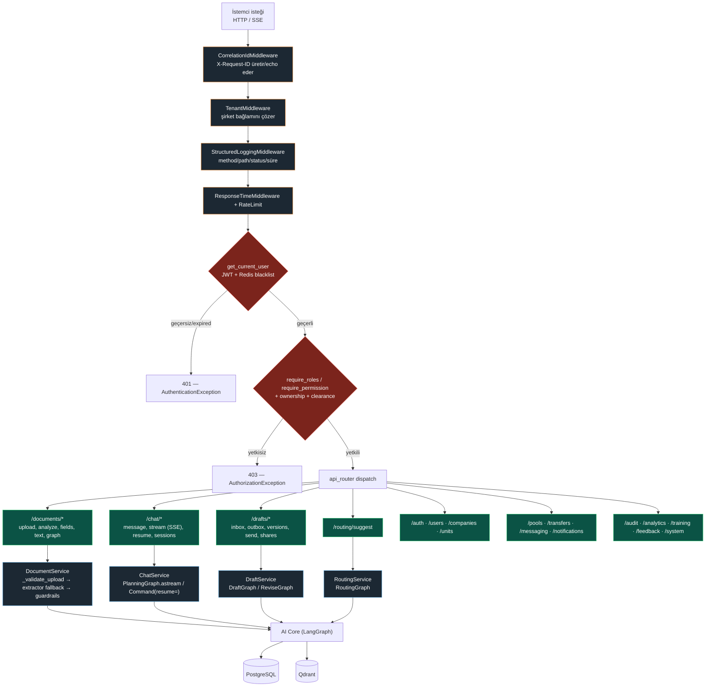
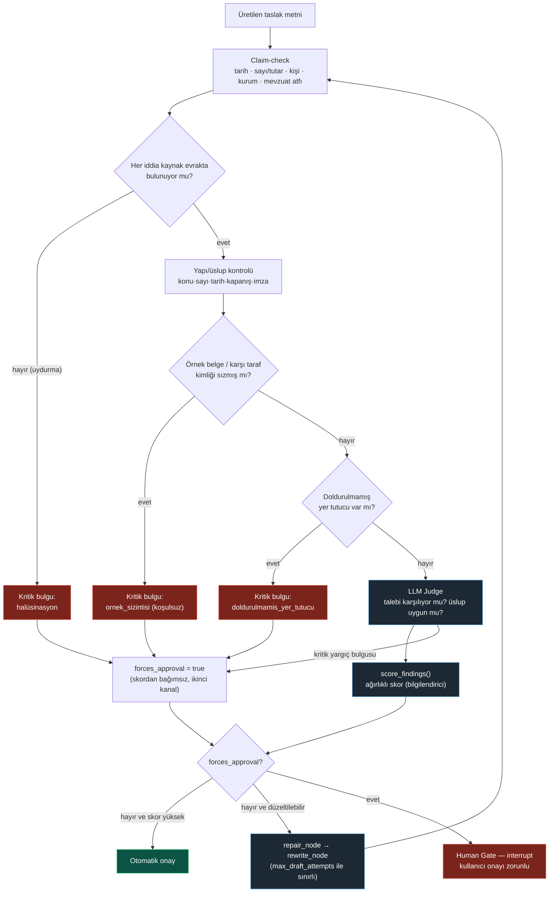
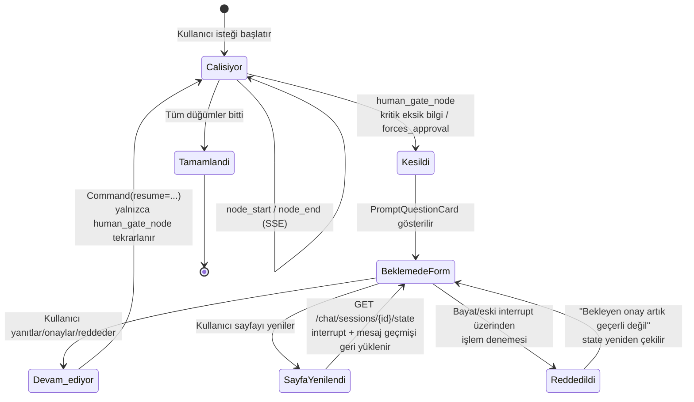
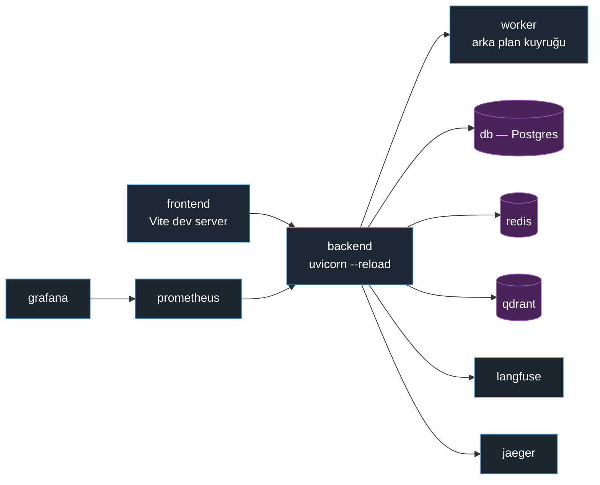
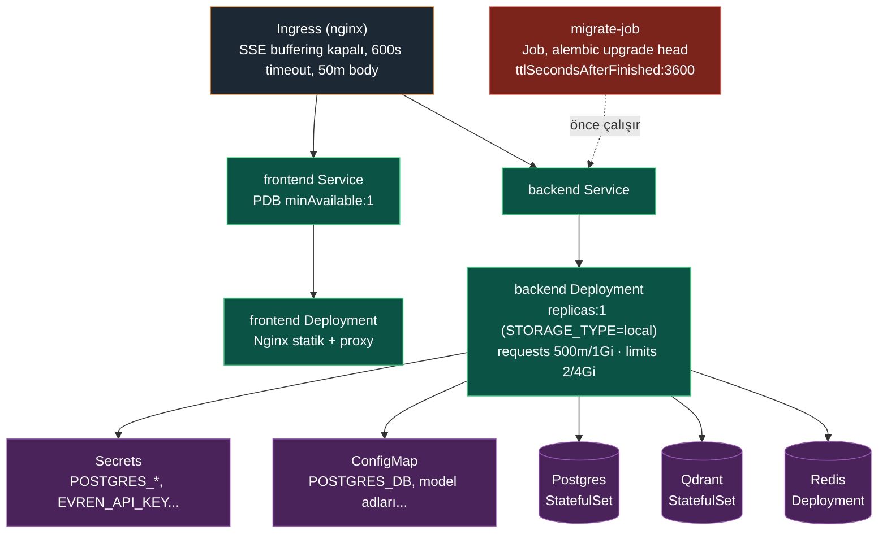

<div align="center">

# KACHOW

**Kamu evrakını okuyan, sınıflandıran, resmî cevabını taslak hâline getiren, doğrulayan ve doğru birime yönlendiren ajan tabanlı sistem.**

TEKNOFEST 2026 · Türkçe kamu yazışma otomasyonu için LangGraph üzerine kurulmuş, çok katmanlı doğrulama ve insan onaylı bir çok-ajan mimarisi.

[](backend/requirements.txt)
[](backend/requirements.txt)
[](backend/requirements.txt)
[](frontend/package.json)
[](frontend/package.json)
[](compose.yml)
[](backend/app/ai/retrieval)
[](deploy/kubernetes)
[](.github/workflows/ci.yml)
[](backend/tests)
[](frontend/src)
[-8BC34A)](backend/pyproject.toml)
[](LICENSE)

</div>

---

## İçindekiler

1. [Bu ne yapıyor](#bu-ne-yapıyor)
2. [Neden bu mimari — mühendislik tercihleri](#neden-bu-mimari--mühendislik-tercihleri)
3. [Sistem mimarisi](#sistem-mimarisi)
4. [Router'dan başlayan istek akışı](#routerdan-başlayan-i̇stek-akışı)
5. [Uçtan uca iş akışı](#uçtan-uca-i̇ş-akışı)
6. [Taslak doğrulama karar ağacı](#taslak-doğrulama-karar-ağacı)
7. [HITL — insan onayı durum makinesi](#hitl--i̇nsan-onayı-durum-makinesi)
8. [Dağıtım topolojisi: Docker Compose (dev) vs Kubernetes (prod)](#dağıtım-topolojisi-docker-compose-dev-vs-kubernetes-prod)
9. [Neler var — özellik envanteri](#neler-var--özellik-envanteri)
10. [Teknoloji yığını](#teknoloji-yığını)
11. [Test, kalite kapıları ve CI](#test-kalite-kapıları-ve-ci)
12. [Veri setleri](#veri-setleri)
13. [Gözlemlenebilirlik ve metrikler](#gözlemlenebilirlik-ve-metrikler)
14. [Hızlı başlangıç](#hızlı-başlangıç)
15. [Ortam değişkenleri ve gerekli dosyalar](#ortam-değişkenleri-ve-gerekli-dosyalar)
16. [Kubernetes prodüksiyon ortamı](#kubernetes-prodüksiyon-ortamı)
17. [Depo yapısı](#depo-yapısı)
18. [Katkı, güvenlik, lisans](#katkı-güvenlik-lisans)

---

## Bu ne yapıyor

Bir memur elinize bir dilekçe, üst yazı ya da şikâyet evrakı tutuşturduğunda önündeki iş şu: evrakı oku, türünü anla, eksik ne var bak, hangi mevzuata dayanıyor öğren, resmî üslupta bir cevap yaz, imzaya çıkmadan önce her şeyi kontrol et, doğru birime havale et. KACHOW bu zincirin tamamını — insanı devre dışı bırakmadan — otomatikleştiriyor:

```
Evrakı oku  →  sınıflandır  →  alanları çıkar  →  eksikleri bul  →  mevzuatı öner
   →  özetle  →  yazışma türünü belirle  →  resmî taslak üret  →  doğrula
   →  gerekirse kullanıcıdan bilgi iste  →  birim öner  →  onay/revizyon  →  kaydet
```

Her adım LangGraph üzerinde ayrı bir düğüm; her düğümün kendi başarısızlık modu, zaman aşımı ve geri dönüş yolu var. Sistem hiçbir zaman "LLM ne dediyse odur" demiyor — üretilen her iddia (tarih, tutar, kişi, kurum, mevzuat atfı) kaynak evrakla satır satır karşılaştırılıyor, ve kritik bir tutarsızlık bulunduğunda bu bulgu bir ortalama skorun içinde kaybolmuyor: taslak otomatik olarak insana düşüyor.

## Neden bu mimari — mühendislik tercihleri

Bir yarışma prototipinin ötesine geçen, kod içinde gerekçesiyle birlikte belgelenmiş gerçek kararlar:

| Karar | Neden önemli |
| :--- | :--- |
| **Kritik bulgu ≠ ortalama skor** | Doğrulayıcı (`confidence_rules.py`), "örnek belge sızıntısı", "kimlik/karşı taraf karışması" gibi bulguları skordan tamamen ayrı bir `forces_approval` kanalından geçiriyor. Kodun kendi içindeki not: bu, eski 0.6/0.4 ağırlıklı-ortalama tasarımının **bilinçli olarak düzeltilmiş bir hatası** — yüksek genel skor artık bir hukuki hatayı asla maskeleyemiyor. |
| **Girdi guardrail'ı üretimden önce çalışıyor** | Evraktan çıkarılan metindeki olası talimat enjeksiyonu, LLM'e gitmeden `scrub_extracted_text` ile temizleniyor; çıktı tarafında ayrıca sızıntı kontrolü (`assert_no_prompt_leak`) var. |
| **PII checksum ile doğrulanıyor** | TCKN ve IBAN gibi bulgular regex'ten fazlası — algoritma doğrulamalı, ham değer hiçbir zaman API sınırını geçmiyor (yalnızca maskeli önizleme, bkz. `PiiFindingSchema`). |
| **Kiracı izolasyonu retrieval'a kadar iniyor** | Qdrant'ta iki ayrı koleksiyon var: küresel mevzuat korpüsü ve belge-başına `document_qa`; ikincisine erişim, router seviyesindeki sahiplik kontrolünden (`_authorize_document`) **sonra** açılıyor. |
| **HITL, sayfa yenilemeye dayanıklı** | Bekleyen bir onay (`interrupt`) sunucu state'inde (LangGraph Postgres checkpointer) yaşıyor; sayfa yenilense de eski/geçersiz bir onay üzerinden işlem yapılması ayrıca engelleniyor. |
| **Yerel/barındırılan model geçişi tek bayrakla** | `LOCAL_MODE=true` → Ollama + yerel Qdrant; `false` → TEKNOFEST'in barındırdığı Evren çıkarım kümesi + kendi Qdrant kümesi. Kod hiçbir yerde sağlayıcıya göre dallanmıyor — `get_llm_client()` fabrikası tek karar noktası. |
| **Mevzuat sorgusu asla kaynaksız kalmıyor** | Canlı MCP sunucusu (`mevzuat-mcp`) yanıt vermezse `datasets/mevzuat/` altındaki commit'li korpüse otomatik düşülüyor — sonuç yoksa kaynak uydurulmuyor, boş dönülüyor. |
| **Backend tek replika, kasıtlı** | `deploy/kubernetes/backend.yaml`'da `replicas: 1` — varsayılan `STORAGE_TYPE=local` altında yüklenen evrak dosyaları pod-lokal disktedir; birden fazla replika bu evrağı rastgele bir pod'a kilitleyebilir. S3 depolamaya geçilmeden replika artırılmıyor. |
| **CPU tabanlı HPA bilinçli olarak yok** | Backend isteklerinin çoğu Ollama/Evren'i beklerken CPU değil G/Ç bloklanıyor — istek hacmi patlarken CPU düz kalabilir, HPA hiç tepki vermez. Doğru eksen (kuyruk derinliği / eşzamanlı istek sayısı) için özel bir metrics adaptörü gerekiyor; bu, "işe yaramayacak CPU-HPA" yerine bilinçli olarak ertelenmiş bir iş. |
| **Test eşikleri "gerçekleşmiş", "hedeflenmiş" değil** | Backend `--cov-fail-under=86` ve frontend `thresholds{lines:79, branches:77, functions:55}` — ikisi de eklendiği gün ölçülen gerçek değer; sadece kapsam gerçekten artınca yükseltiliyor, düşüren bir PR eşiği aşağı çekmiyor, testi geri getiriyor. |

## Sistem Mimarisi

```mermaid
graph TD
    classDef client fill:#1e1e1e,stroke:#00a8cc,stroke-width:2px,color:#fff;
    classDef api fill:#1c2833,stroke:#e67e22,stroke-width:2px,color:#fff;
    classDef graph fill:#0b5345,stroke:#2ecc71,stroke-width:2px,color:#fff;
    classDef guard fill:#7b241c,stroke:#e74c3c,stroke-width:2px,color:#fff;
    classDef storage fill:#4a235a,stroke:#9b59b6,stroke-width:2px,color:#fff;
    classDef external fill:#34495e,stroke:#bdc3c7,stroke-width:2px,color:#fff;
    classDef obs fill:#1b2631,stroke:#5dade2,stroke-width:1.5px,color:#fff;

    A[React 18 / TypeScript İstemcisi<br/>TanStack Query + Context, SSE]:::client -->|REST + SSE| B

    subgraph "Backend — FastAPI"
        B(API Router ve Middleware<br/>correlation-id, tenant, rate-limit, logging):::api
        C{JWT Auth + ABAC<br/>rol, sahiplik, gizlilik derecesi}:::api
        B --> C
    end

    subgraph "Orkestrasyon — LangGraph"
        P(Planning Graph<br/>retry/timeout/döngü limiti):::graph
        DA(Document Analysis Graph<br/>extract → classify → fields → missing → mevzuat → özet):::graph
        DR(Draft Graph<br/>writer → verify → repair):::graph
        RV(Revise Graph<br/>hedefli revizyon → changelog):::graph
        RT(Routing Graph<br/>birim önerisi + gerekçe):::graph
        C --> P
        P --> DA
        P --> DR
        P --> RV
        P --> RT
    end

    subgraph "Guardrail Katmanı"
        GI[Prompt-Injection Scrub]:::guard
        GP[PII / Checksum]:::guard
        GS[Gizlilik ve Clearance Gate]:::guard
        GV[Groundedness / Claim-Check<br/>Verifier + LLM Judge]:::guard
        DA -.-> GI
        DA -.-> GP
        DA -.-> GS
        DR -.-> GV
        RV -.-> GV
    end

    M{{Ollama (yerel) ⇄ Evren (Teknofest-hosted)<br/>LOCAL_MODE anahtarı}}:::external
    N{{mevzuat-mcp<br/>canlı mevzuat + yerel fallback korpüs}}:::external
    GV <--> M
    DA <--> N

    subgraph "Kalıcılık"
        I[(PostgreSQL<br/>RLS + LangGraph Checkpointer)]:::storage
        J[(Qdrant<br/>mevzuat vs. document_qa — izole)]:::storage
        K[(Redis<br/>oturum ve kısa süreli state)]:::storage
        P --> I
        DA --> J
        RT --> J
        P --> K
    end

    subgraph "Gözlemlenebilirlik"
        O1[Langfuse — LLM/token izleme]:::obs
        O2[Prometheus + Grafana]:::obs
        O3[Jaeger — OpenTelemetry trace]:::obs
    end
    P -.-> O1
    B -.-> O2
    B -.-> O3
```

## Router'dan Başlayan İstek Akışı

`backend/app/api/router.py`, 20 domain router'ını tek bir `api_router` altında topluyor. Bir isteğin FastAPI uygulamasına girişten domain servisine ulaşana kadar geçtiği gerçek sıra:



## Uçtan Uca İş Akışı


## Taslak Doğrulama Karar Ağacı

Bir taslağın "otomatik geç", "otomatik onar" ya da "insana düşür" arasında nasıl ayrıldığı — `draft_verifier.py` + `confidence_rules.py`'nin gerçek karar mantığı:



## HITL — İnsan Onayı Durum Makinesi



## Dağıtım Topolojisi: Docker Compose (dev) vs Kubernetes (prod)

**Geliştirme — `compose.yml` (15 servis):**



**Prodüksiyon — `deploy/kubernetes/` (11 manifest, `kachow` namespace):**



## Neler var — özellik envanteri

<table>
<tr><td width="50%" valign="top">

**Evrak analizi**
- Metin katmanlı PDF + taranmış PDF/görsel OCR, otomatik geçiş zinciri
- 10 evrak türü sınıflandırması (dilekçe, üst yazı, şikâyet, sirküler, yönerge, rapor, tutanak, izin talebi…)
- Yapılandırılmış alan çıkarımı (sayı, tarih, konu, muhatap, gönderen kurum, imza…)
- Evrak türüne göre zorunlu/önerilen alan kontrolü, eksik alan listesi
- Mevzuat önerisi — kanun/madde adı + alıntı + kaynak, retrieval ile üretim ayrışık
- 3 cümlelik kısa özet + isteğe bağlı ayrıntılı özet (map-reduce)

</td><td width="50%" valign="top">

**Taslak üretimi ve doğrulama**
- 4 resmî yazışma türü (üst yazı, cevap yazısı, bilgilendirme, diğer + serbest alt-tür)
- Kaynağa bağlı üretim — çapraz evrak sızıntısı ve uydurma bilgi engelleme
- Çok katmanlı doğrulama: yapı, üslup, iddia kontrolü, LLM yargıç
- Kritik bulgular skor ortalamasında kaybolmuyor, otomatik insan onayına düşüyor
- Hedefli revizyon, değişiklik günlüğü, tam sürüm zinciri
- Talimat–mevzuat çelişki tespiti

</td></tr>
<tr><td width="50%" valign="top">

**Birim yönlendirme**
- İçerik tabanlı hedef birim önerisi + gerekçe + güven durumu
- Alternatif birimler ve bağımsız `/routing/suggest` uç noktası
- Öneri hiçbir zaman kesin idari karar olarak sunulmuyor

</td><td width="50%" valign="top">

**İnsan-döngüde (HITL)**
- Kritik eksik bilgide workflow duruyor, gerekçeli form ile soruyor
- `resume` ile kaldığı yerden devam, çift gönderim ve bayat onay koruması
- Sayfa yenilenince bekleyen onay + mesaj geçmişi geri yükleniyor

</td></tr>
</table>

## Teknoloji Yığını

| Katman | Teknoloji | Notlar |
| :--- | :--- | :--- |
| **Frontend** | React 18, TypeScript 5.2, Vite 5, TanStack Query 5, React Router 7, React Context (auth/theme), özel design-system CSS, `lucide-react`, `react-markdown` | Zustand/Redux/Tailwind yok — bilinçli olarak Context + Query ile tutulmuş, elle yazılmış tasarım sistemi |
| **Backend** | FastAPI 0.141, Python 3.12, SQLAlchemy 2.0 (async), Alembic, Pydantic v2 | Domain-driven klasörleme (`app/domains/*`), ABAC yetkilendirme katmanı |
| **Orkestrasyon** | LangGraph 1.2 + `langgraph-checkpoint-postgres`, LangChain 1.3 | Her iş akışı ayrı bir graph (analiz, taslak, revizyon, routing, planlama) |
| **LLM** | Ollama (yerel, `qwen3.5:9b`) veya Evren (TEKNOFEST-hosted: `llm-large`/`llm-fast`/`guard`/`router` modelleri) | `LOCAL_MODE` bayrağıyla tek satırda geçiş |
| **Retrieval** | Qdrant (izole koleksiyonlar), BM25 + dense hybrid, `mevzuat-mcp` canlı sorgu + yerel fallback korpüs | |
| **Veri** | PostgreSQL (RLS + LangGraph checkpointer), Redis (oturum/state) | Nesne depolama arka ucu takılabilir (local/S3) |
| **Gözlemlenebilirlik** | Langfuse, Prometheus, Grafana, Jaeger, OpenTelemetry | `monitoring/` altında hazır dashboard/alert kuralları |
| **CI/CD** | GitHub Actions (`.github/workflows/ci.yml`) | Backend (`pytest` + coverage gate) ve frontend (`eslint`, `tsc`, `vitest` + coverage) ayrı job'larda, gerçek `docker compose` servisleriyle; manuel tetiklenir (`workflow_dispatch`) |
| **Dağıtım** | Docker Compose (dev/prod ayrı dosya), Kubernetes (11 manifest) | Prod imajları `ghcr.io/chyp3r/kachow-*` |

## Test, Kalite Kapıları ve CI

Bu bölümdeki sayılar iddia değil — bu dokümantasyon hazırlanırken (**2026-08-24**) `docker compose run --rm backend pytest` ve `docker compose run --rm frontend npm test` ile gerçekten çalıştırılıp doğrulanmıştır.

### Backend

| Kategori | Dosya | Fonksiyon | Gerçek amaç |
| :--- | ---: | ---: | :--- |
| `unit/` | 192 | 2185 | Mock'lu iş mantığı — hızlı, izole |
| `integration/` | 24 | 102 | **Gerçek** Postgres + RLS (`0013_rls` dahil tam migration zinciri) — mock session'ın kanıtlayamayacağı satır-seviyesi güvenliği test eder |
| `e2e/` | 8 | 25 | Gerçek ASGI HTTP istemcisi, gerçek lifespan, sahte LLM/embedding |
| `performance/` | 3 | 16 | Benchmark + operasyon-sayısı regresyon kontrolleri |
| **Toplam** | **227** | **2328** | |

Canlı çalıştırma sonucu (`pytest -q --cov-fail-under=86`, varsayılan olarak e2e+performance hariç):

```
2588 passed, 35 deselected in 24.71s
TOTAL coverage: 85.6%  (gate: 86%)
```

### Frontend

```
Test Files  57 passed (57)
     Tests  332 passed (332)
  Duration  ~7s (test) / ~21s (ortam kurulumuyla birlikte)

Coverage — Statements 79.46% · Branches 77.91% · Functions 55.40% · Lines 79.46%
(ratchet eşiği: lines/statements 79%, branches 77%, functions 55% — hepsi karşılanıyor)
```

### CI (`.github/workflows/ci.yml`)

İki paralel job, `make test` / `make bootstrap` ile birebir aynı adımları izliyor (bu repo'nun ayrı bir "CI-only" test lane'i yok — `tests/_db_fixtures.py`'nin kendi belgelediği tasarım kararı):

- **backend** — `docker compose up db redis qdrant` → Postgres hazır olmasını bekle → `alembic upgrade head` → `docker compose run backend pytest -q --cov-fail-under=86`
- **frontend** — `npm ci` → `typecheck` → `lint` → `vitest run` → `test:coverage`

Tetikleme yalnızca manuel: `on: workflow_dispatch` — push/PR'da otomatik çalışmaz, GitHub Actions sekmesinden **Run workflow** ile elle başlatılır.

### Değerlendirme (Eval) Harness

Testlerin ötesinde, `evaluation/` altında ayrı bir LLM/RAG kalite ölçüm hattı var — `make eval`, `make eval-baseline`, `make eval-llm`, `make eval-retrieval`, `make benchmark`, `make perf-smoke|chat|document`, `make latency-report`. Bunlar birer unit test değil; retrieval kalitesi, LLM-as-a-judge tutarlılığı ve gecikme regresyonu için ayrı, veri setine dayalı ölçümler üretiyor (bkz. bir sonraki bölüm).

## Veri Setleri

| Kaynak | İçerik | Boyut |
| :--- | :--- | ---: |
| `datasets/mevzuat/` | Mevzuat fallback korpüsü — MCP sunucusu erişilemezse buraya düşülür | 8 dosya, ~1.1 MB |
| `datasets/resmi_yazisma/00_gelen_kaynaklar/` | Ham/kaynak gelen evrak örnekleri | 1927 dosya |
| `datasets/resmi_yazisma/01_ust_yazi/` | Üst yazı örnekleri (few-shot + stil kaynağı) | 113 dosya |
| `datasets/resmi_yazisma/02_cevap_yazisi/` | Cevap yazısı örnekleri | 163 dosya |
| `datasets/resmi_yazisma/03_bilgilendirme_metni/` | Bilgilendirme metni örnekleri | 83 dosya |
| `datasets/resmi_yazisma/04_diger_resmi_yazisma/` | Diğer resmî yazışma türleri | 129 dosya |
| `datasets/resmi_yazisma/99_reddedilenler/` | Kalite kontrolünden geçemeyip elenen örnekler (negatif set) | 41 dosya |
| `datasets/resmi_yazisma/00_yonetmelik_ve_kurallar/` | Yazışma kuralları/yönetmelik referansı | 3 dosya |
| `evaluation/datasets/` | `drafts.jsonl`, `intents.jsonl`, `retrieval.jsonl`, `trajectories.jsonl` + embedding cache'leri | 12 dosya |
| `evaluation/datasets/retrieval_corpus/` | Retrieval değerlendirmesi için ayrı korpüs | 6 dosya |

`99_reddedilenler` klasörünün varlığı kendi başına anlamlı: few-shot/stil kaynağı sadece "iyi" örneklerden değil, bilinçli olarak elenmiş kötü örneklerden de derlenmiş — kalite kontrolünün veri toplama aşamasında başladığını gösteriyor.

## Gözlemlenebilirlik ve Metrikler

Sistem "çalışıyor gibi görünüyor" değil, ölçülüyor:

- **Prometheus** — 3 scrape job'ı (`prometheus`, `kachow-backend`, `qdrant`), `monitoring/prometheus/rules/kachow.rules.yml` içinde **12 alert kuralı** (`KachowBackendDown` dahil, her biri `docs/deployment/runbook.md`'de bir runbook bölümüne bağlı). Kuralların kendi yorumunda önemli bir dürüstlük notu var: Postgres/Redis için "up" alarmı **bilinçli olarak yok**, çünkü hiçbiri için exporter deploy edilmemiş — hiç scrape edilmeyen bir job'a alarm bağlamak sessizce hiç tetiklenmeyen, olmayan bir güvenlik hissi verir.
- **Grafana** — `company_dashboard.json`, `fastapi_dashboard.json`, `transfers_dashboard.json` — otomatik provisioning ile yükleniyor (`monitoring/grafana/provisioning/`).
- **Langfuse** — LLM çağrısı başına token/maliyet/gecikme izleme, `compose.yml`'de kendi Postgres veritabanıyla ayrı bir servis.
- **Jaeger + OpenTelemetry** — HTTP, DB (SQLAlchemy) ve Redis/httpx span'leri dağıtık iz olarak toplanıyor.
- **Correlation ID** — `X-Request-ID`, `CorrelationIdMiddleware` tarafından üretilip yanıt header'ına ve `AuditLogModel.correlation_id`'e yazılıyor.

## Hızlı Başlangıç

**Gereksinimler:** Docker + Docker Compose v2. Yerel modelle çalışacaksanız Ollama ve yeterli VRAM/RAM; barındırılan modu kullanacaksanız yalnızca bir Evren API anahtarı.

```bash
# 1. Depoyu klonlayın
git clone https://github.com/chyp3r/KACHOW-Teknofest-2026.git
cd KACHOW-Teknofest-2026

# 2. Ortam değişkenlerini hazırlayın
cp .env.example .env
# LOCAL_MODE=true bırakırsanız Ollama'nın 11434 portta çalışıyor olması yeterli.
# LOCAL_MODE=false yapıp EVREN_API_KEY / EVREN_QDRANT_* değerlerini doldurursanız
# barındırılan Evren altyapısına bağlanırsınız.

# 3. Veritabanı + şema + backend'i tek komutla ayağa kaldırın
make bootstrap

# 4. Kalan servisleri (frontend, worker, izleme) başlatın
make up
```

`make bootstrap`, Postgres'in hazır olmasını bekler, migration'ları uygular ve `backend/app/core/config.py` içindeki `SEED_*` değerleriyle varsayılan hesapları oluşturur — API `http://localhost:8000` üzerinde ayağa kalkar.

```bash
make logs              # tüm servislerin loglarını takip et
make test               # backend unit + integration testleri (coverage gate dahil)
make test-e2e             # gerçek ASGI istemcisiyle uçtan uca testler
make eval                   # RAG/LLM-judge değerlendirme paketi
make perf-document            # doküman iş akışı için performans smoke testi
make reset                      # veritabanı, cache, storage ve checkpoint'leri sıfırla
```

Kubernetes ve prodüksiyon dağıtımı için: [docs/deployment/README.md](docs/deployment/README.md)

## Ortam Değişkenleri ve Gerekli Dosyalar

**Kaynak dosya:** `.env.example` (kök dizin, `docker compose` bunu okur) → `cp .env.example .env`. `.env` `.gitignore`'dadır, commit edilmez. Docker olmadan backend'i doğrudan host üzerinde çalıştırmak için ayrı bir `backend/.env.example` da mevcut (farklı `OLLAMA_BASE_URL` varsayılanı — `host.docker.internal` yerine `localhost`).

| Grup | Değişkenler | Açıklama |
| :--- | :--- | :--- |
| **Ollama (yerel LLM)** | `OLLAMA_MODEL`, `OLLAMA_FAST_MODEL`, `OLLAMA_TEMPERATURE`, `OLLAMA_REASONING`, `OLLAMA_MAX_TOKENS`, `OLLAMA_NUM_CTX`, `OLLAMA_KEEP_ALIVE`, `OLLAMA_EMBEDDING_MODEL` | Varsayılan: `qwen3.5:9b`, embedding `nomic-embed-text` |
| **Sağlayıcı seçimi** | `LOCAL_MODE` | `true`→Ollama, `false`→Evren |
| **Evren (yalnızca `LOCAL_MODE=false`)** | `EVREN_API_KEY`, `EVREN_BASE_URL`, `EVREN_LLM_LARGE_MODEL`, `EVREN_LLM_FAST_MODEL`, `EVREN_GUARD_MODEL`, `EVREN_ROUTER_MODEL`, `EVREN_EMBED_MODEL`, `EVREN_REQUEST_TIMEOUT_SECONDS`, `EVREN_QDRANT_URL`, `EVREN_QDRANT_API_KEY` | TEKNOFEST'in barındırdığı çıkarım kümesi + kendi Qdrant kümesi |
| **AI iş akışı zaman aşımları** | `AI_WORKFLOW_TIMEOUT_SECONDS`(480), `REVISION_RERETRIEVAL_TIMEOUT_SECONDS`(10), `DRAFT_JUDGE_TIMEOUT_SECONDS`(30), `GUARDRAIL_JUDGE_TIMEOUT_SECONDS`(15), `MEVZUAT_MCP_TIMEOUT_SECONDS`(25) | CPU-only/yavaş modelde yerelde test ederken yükseltilebilir |
| **PostgreSQL** | `POSTGRES_USER`, `POSTGRES_PASSWORD`, `POSTGRES_DB` | |
| **Langfuse** | `LANGFUSE_PUBLIC_KEY`, `LANGFUSE_SECRET_KEY`, `LANGFUSE_NEXTAUTH_SECRET`, `LANGFUSE_SALT`, `LANGFUSE_ENCRYPTION_KEY` | Örnek dosyadaki değerler yalnızca dev — prod'da değiştirilmeli |
| **Grafana** | `GRAFANA_ADMIN_PASSWORD` | |

**Docker Compose için gerekli dosyalar:**

```
compose.yml                        # dev topolojisi — 15 servis
compose.prod.yml                   # prod topolojisi — 8 servis, ayrı Dockerfile'lar
deploy/docker/backend.Dockerfile        # dev backend imajı
deploy/docker/backend.prod.Dockerfile   # prod backend imajı (multi-stage)
deploy/docker/worker.Dockerfile         # arka plan işçi imajı
deploy/docker/frontend.Dockerfile       # dev frontend (Vite)
deploy/docker/frontend.prod.Dockerfile  # prod frontend (build + Nginx)
deploy/docker/nginx.conf                # prod Nginx yapılandırması (SSE dahil)
.env                                    # cp .env.example .env sonrası doldurulur
```

## Kubernetes Prodüksiyon Ortamı

`deploy/kubernetes/` — 11 manifest, `kachow` namespace'i altında; her biri kararının gerekçesini kendi içinde belgeliyor:

| Manifest | Ne yapar | Dikkat çeken tasarım kararı |
| :--- | :--- | :--- |
| `namespace.yaml` | `kachow` namespace'ini oluşturur | |
| `configmap.yaml` | Hassas olmayan yapılandırma (model adları, `POSTGRES_DB`…) | |
| `secrets.yaml` | Şifre/anahtar şablonu | Gerçek değerler burada commit edilmez, placeholder |
| `postgres.yaml` | Postgres StatefulSet | |
| `redis.yaml` | Redis Deployment | |
| `qdrant.yaml` | Qdrant StatefulSet | |
| `migrate-job.yaml` | Tek seferlik `alembic upgrade head` | **Job**, initContainer değil — birden fazla backend replikasının aynı migration'ı yarışarak çalıştırmasını önler; `ttlSecondsAfterFinished: 3600` ile eski Job pod'ları birikmez |
| `backend.yaml` | Backend Deployment | `replicas: 1` — `STORAGE_TYPE=local` altında yüklenen evrak pod-lokal diskte; S3'e geçmeden replika artırılmıyor. Resource: request `500m/1Gi`, limit `2/4Gi` |
| `frontend.yaml` | Frontend Deployment + Service | |
| `pdb.yaml` | PodDisruptionBudget — yalnızca `frontend` için | Backend `replicas:1` iken bir PDB, her voluntary eviction'ı (node drain, autoscaler) sonsuza kadar bloklardı — backend'in replika sayısı 1'in üzerine çıkınca eklenecek |
| `ingress.yaml` | nginx-ingress + cert-manager TLS | SSE (chat/doküman-analizi akışı) için `proxy-buffering: off` (zorunlu — yoksa tarayıcı yanıtı ancak tamamı bitince tek seferde görür), `proxy-read/send-timeout: 600s` (`AI_WORKFLOW_TIMEOUT_SECONDS=480`'e göre), `proxy-body-size: 50m` (çok sayfalı taranmış evrak yüklemesi için) |

Prod imajları: `ghcr.io/chyp3r/kachow-backend`, `ghcr.io/chyp3r/kachow-frontend`. `migrate-job.yaml` ile `backend.yaml` **aynı `IMAGE_TAG`**'i kullanmalı — bu, migration Job'ının Deployment'tan farklı bir uygulama sürümüyle çalışmasını (drift) önlemek için manifestin kendi yorumunda açıkça belirtilmiş bir kısıt.

Detaylı runbook, secrets yönetimi, backup/restore ve upgrade prosedürleri için: [docs/deployment/](docs/deployment/)

## Depo Yapısı

```
backend/app/
├── domains/        # DDD: documents, drafts, routing, units, auth, audit, feedback…
├── ai/
│   ├── workflows/    # LangGraph graph tanımları (analysis, draft, revise, routing, planning)
│   ├── agents/         # writer, judge, reviser, router, classifier, summarizer…
│   ├── verification/     # claim-check, confidence rules, style checks, placeholder tespiti
│   ├── guardrails/         # injection, PII, sensitivity, output-gate
│   ├── retrieval/            # BM25/dense/hybrid, mevzuat-mcp entegrasyonu
│   └── compliance/             # evrak alan şeması, zorunlu alan kuralları
├── api/            # router, middleware (auth, tenant, correlation, logging), exceptions
└── infrastructure/ # extractors (PDF/OCR/vision), storage, vectorstore, LLM sağlayıcıları

frontend/src/
├── features/       # documents, drafts, chat, graph, admin, messaging…
├── pages/, hooks/, api/, contexts/, providers/

docs/               # mimari, API, deployment, geliştirme standartları — 45 sayfa
evaluation/         # RAG/LLM-judge/latency değerlendirme harness'ı
monitoring/         # Prometheus kuralları, Grafana dashboard'ları, alertmanager
datasets/           # mevzuat korpüsü fallback'i, resmî yazışma örnekleri
.github/workflows/  # CI — backend + frontend, Actions sekmesinden manuel tetiklenir
```

## Katkı, Güvenlik, Lisans

- Geliştirme akışı, branch/commit kuralları: [CONTRIBUTING.md](CONTRIBUTING.md)
- Güvenlik sınırları ve yerleşik koruma katmanları: [SECURITY.md](SECURITY.md)
- Otonom AI asistanların çalışma prensipleri: [AGENTS.md](AGENTS.md), [docs/development/project-rules.md](docs/development/project-rules.md)
- Mimari kararlar ve derinlemesine notlar: [docs/architecture](docs/architecture)

Büyük yapısal değişiklikler PR sonrası `CHANGELOG.md`'ye eklenir.

**Apache License 2.0** — bkz. [LICENSE](LICENSE). Dış bağımlılıklar kendi lisanslarına tabidir.
