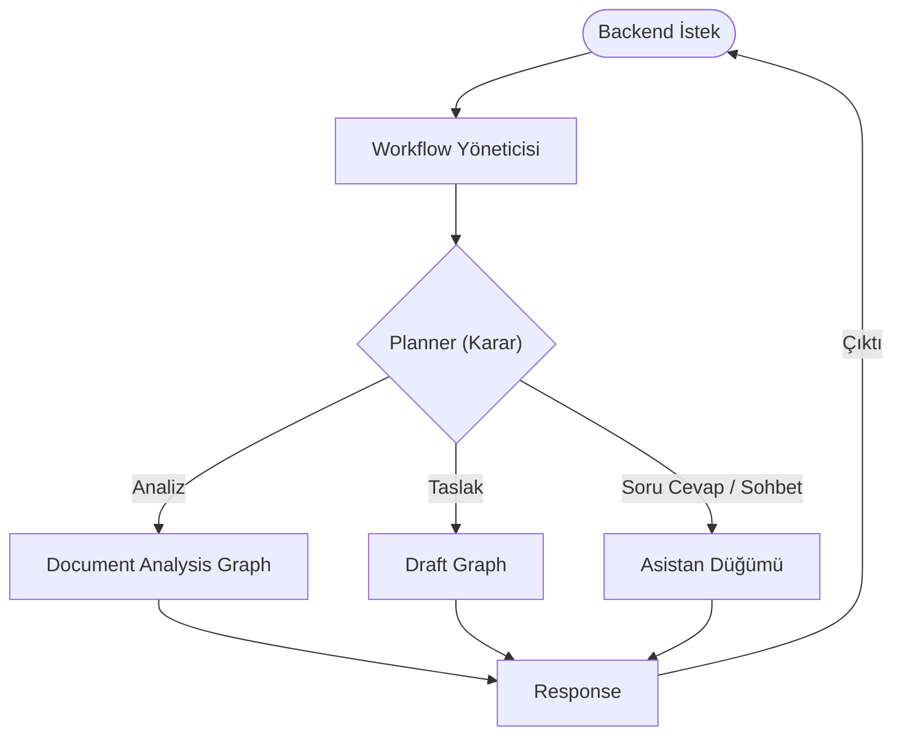
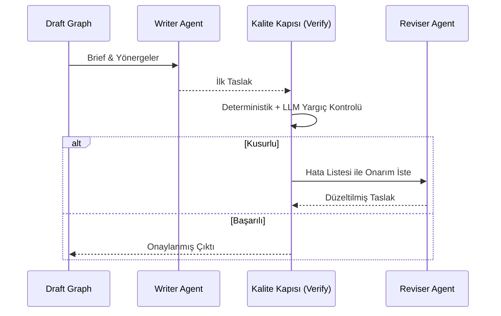

# AI Mimarisi

> **NOT:**
> Bu doküman sistemin yapay zekâ mimarisini, LangGraph iş akışlarını (workflows), RAG altyapısını ve karar verme (Reasoning/Planner) mekanizmalarını açıklar. AI katmanı, sistemin bağımsız çalışan bir "beyni" olarak kurgulanmıştır ve Backend'den ayrı yönetilir.

## Mimari Yaklaşım

AI sistemi SOTA (State-of-the-Art) yaklaşımlarla aşağıdaki prensipler üzerine kurulmuştur:

| Prensip | Açıklama |
| --- | --- |
| **Agentic AI** | Uzmanlaşmış ajanlar üzerinden bağımsız karar verebilme yeteneği. |
| **Workflow Driven Architecture** | Statik kod yerine LangGraph ile olay/düğüm (node) tabanlı akış kontrolü. |
| **RAG (Retrieval-Augmented Generation)** | Halüsinasyonu önlemek için vektör arama (Dense) ve anahtar kelime (Sparse) tabanlı bağlam beslemesi. |
| **Provider Independent LLM Layer** | Model bağımsız (Ollama, OpenAI vb.) soyutlama katmanı. |
| **Stateless Workflow** | Akışların her çalıştırmada kendi durumu üzerinden ilerlemesi (Checkpoint Memory). |

## AI Katmanları ve Genel Yapı

AI modülleri `backend/app/ai/` altında spesifik görevlere ayrılmıştır:

- `workflows/`: LangGraph ile tanımlanan iş akışları (Grafikler).
- `agents/`: Pydantic temelli doğrulama ve Prompting yeteneklerine sahip uzman modeller.
- `prompts/`: Ajanların `.md` formatında tutulan sistem yönergeleri (Diskten dinamik okunur).
- `llm/`: Sağlayıcı soyutlaması (OllamaClient).
- `retrieval/` & `embeddings/`: Vektör ve metin tabanlı arama, parçalama (chunking) işlemleri.
- `policy/`: Sınırlar, eşikler ve bütçelerin bulunduğu karar kuralları katmanı.

## AI İstek Yaşam Döngüsü

Sisteme düşen bir talep, AI katmanında şu şemayı izleyerek çözülür:

## LangGraph İş Akışları (Workflows)

Sistem 1 orkestratör (Planner) ve 4 ana iş akışından oluşur:

### 1. Planning Graph (Yönetici Katman)
Tüm istekleri karşılayan orkestrasyon grafiğidir (`planning_graph.py`). Gelen mesajı veya belgeyi analiz ederek bir plan (hangi grafiklerin çalışacağı) çıkarır ve bağımlılıkları gözeterek yürütür. Checkpoint memory kullanan tek grafiktir.

### 2. Document Analysis Graph (Görev 1)
Belge sınıflandırma ve yapılandırılmış alan (EvrakField) çıkarımını **tek bir ClassifierAgent çağrısıyla** yapar. Ayrıca eksik bilgi tespiti ve RAG üzerinden mevzuat taraması yürütür.

### 3. Draft Graph (Görev 2)
Taslak üretimi ve onarımı için kurulan hibrit kalite kapılı (Reflexion) döngüdür.
- İlk olarak bir `writer` ajanı taslağı oluşturur.
- Deterministik ve LLM tabanlı (JudgeAgent) kalite kontrolünden geçirilir.
- Hatalar varsa, `reviser` ajanına numaralı kusur listesiyle gönderilip düzeltilir. Maksimum 2 deneme hakkı vardır.

### 4. Asistan Düğümü (Genel Soru-Cevap)
Sohbet ve belge/mevzuat sorularını tek bir düğümde karşılar (`planning_graph._run_assist` + `AssistantAgent`). Model, tur başına hangi aracı çağıracağına kendisi karar verir; bir belge ekliyse belge kapsamlı araçlar da bağlanır. Araç seti:

| Araç | Ne yapar |
| --- | --- |
| `search_document` | Belge içinde **anlamsal (vektör)** arama; `[s. N]` sayfa atfı taşır. |
| `search_document_regex` | Belge metninde **regex / birebir dizge** ile satır araması -- kesin bir sayı, tarih, atıf kodu veya bir terimin kaç kez geçtiği gibi anlamsal aramanın zayıf kaldığı durumlar için. `[s. N]` atfı taşır, 40 eşleşmede kesip toplamı belirtir. |
| `get_document_details` | Belgenin özeti, üst verileri, uygunluk denetimi sonucu. |
| `get_document_outline` | Sayfa listesi ve her sayfanın ilk satırı. |
| `get_document_section` | Belirli bir sayfanın tam metni. |
| `search_legislation` | Yerel mevzuat korpüsünde (Qdrant + BM25, RRF) arama. |
| `search_legislation_live` | Yerel korpüs yetersizse `mevzuat.gov.tr` üzerinden canlı sorgu (MCP). |

Her araç, modele döndürdüğü metni ayrıca yapılandırılmış bir `ToolResult` olarak da raporlar; çıktı guardrail'i (`output_gate`) yanıtı **yalnızca bu tur gerçekten alınan** kaynaklara göre dayanaklılık denetiminden geçirir.

Yanıtın `details.context_usage` alanı, o turun bağlam penceresini nasıl kullandığını (sistem yönergesi, belge bağlamı, geçmiş özeti, sohbet geçmişi, güncel mesaj, tamamlama için ayrılan pay) gerçek token sayılarıyla döker; frontend'in sohbet alanındaki dairesel gösterge bunu okur.

### 5. Routing Graph
Hazırlanan taslağın (güven skoru dikkate alınarak) en uygun kurumsal birime yönlendirilmesini sağlar. Güven skoru yetersizse insan onayına düşürür.

## RAG (Retrieval-Augmented Generation)

Projede arama doğruluğunu artırmak için **Reciprocal Rank Fusion (RRF)** kullanılır:

1. **Dense Search (Qdrant):** Anlamsal benzerlik arar (Kavramsal uyum).
2. **Sparse Search (BM25):** Anahtar kelime eşleşmesi arar (Özel terimler, kodlar).
3. **RRF Birleşimi:** İki arama sonucunu harmanlayarak en üst düzey ilgili dokümanları seçer.

> **İPUCU:**
> Çıktıyı geciktirdiği ve kaliteyi majör olarak artırmadığı için LLM Reranker (Yeniden sıralayıcı) adımı sistemden kaldırılmış, RRF'nin doğrudan çıktısı kullanılmaya başlanmıştır.

## Planner Füzyon ve Karar Mekanizması

Eski kural tabanlı sistem yerine, 3 sinyalli bir **Füzyon (Fusion)** mekanizması getirilmiştir:
- **Sözlüksel Kanıt:** Mesajdaki spesifik kalıplar (regex).
- **Semantik Kanıt:** Gömme (Embedding) benzerliği.
- **Bağlamsal Kanıt:** Dosya eki, önceki niyet gibi ek veriler.

Bu 3 sinyal çok sınıflı lojistik regresyonla füzyonlanarak kesin bir eylem (taslak yaz, analiz et vb.) olasılığına dönüştürülür. Eğer olasılık arada kalırsa, "Model" çağrısına bırakılır (Hızlı katman karar).

## Prompt Yönetimi

Sistem kod içi promptlar yerine dışarıdan (diskten) okunabilen, Markdown tabanlı merkezi bir şablonlama sistemi kullanır:
- `prompts/templates/*.md` (Örn: `writer.md`, `judge.md`)
- Bellek üzerinde önbelleklenir.
- Değişken geçişleri `{{degisken}}` formatıyla JSON şeması çakışmalarını ({} kullanımı) önleyecek şekilde tasarlanmıştır.

> **UYARI:**
> Promptlarda yapılacak herhangi bir değişiklik, doğrudan modelin karar ve çıktı dilini etkileyeceğinden dikkatli test (Eval) edilmelidir. Ajanlar promptlarını doğrudan `get_prompt_manager()` üzerinden yükler.
