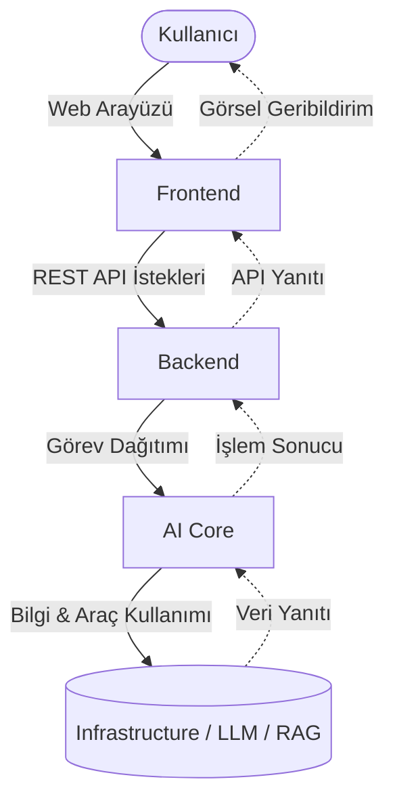
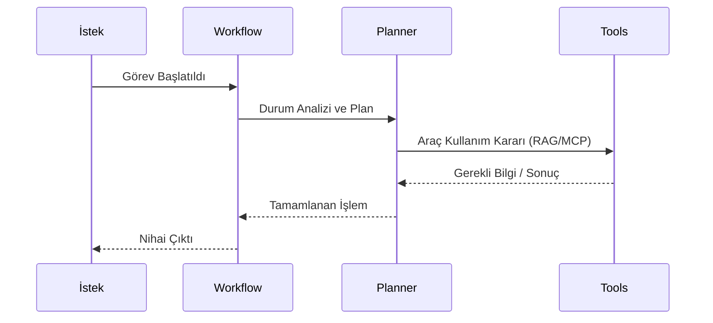

# Sistem Mimarisi

> **NOT:**
> Bu doküman projenin genel sistem mimarisini açıklamaktadır. Yalnızca yüksek seviyeli (high-level) mimariyi kapsar. Backend, Frontend, AI ve diğer alt sistemlerin detayları için kendi dokümanlarına bakınız.

## Amaç

Projenin temel amacı, yapay zekâ destekli ajanların kullanıcılarla doğal dil üzerinden etkileşim kurabildiği, bilgiye erişebildiği, belge analizi yapabildiği ve sistem araçlarını güvenli bir şekilde kullanabildiği modüler bir platform sağlamaktır.

Sistem şu temeller üzerine inşa edilmiştir:
- Modern web teknolojileri
- Büyük Dil Modelleri (LLM)
- Retrieval-Augmented Generation (RAG)
- Model Context Protocol (MCP)
- Çoklu ajan (Multi-agent) mimarisi
- Olay tabanlı (Event-driven) iş akışları

## Mimari Yaklaşımlar

Proje aşağıdaki mimari prensiplere sıkı sıkıya bağlı olarak geliştirilmektedir:

| Prensip | Açıklama |
| --- | --- |
| **Modular Monolith** | Servisler fiziksel olarak tek parça halinde başlar ancak mantıksal olarak modüller halindedir. |
| **Domain Driven Design (DDD)** | İş mantığı domain bazlı modüllere bölünür. |
| **Clean Architecture** | İş kuralları, altyapı ve arayüz katmanları birbirinden tamamen izole edilir. |
| **Repository Pattern** | Veri erişim katmanı soyutlanarak veritabanı bağımsızlığı artırılır. |
| **Dependency Injection** | Bağımlılıklar dışarıdan enjekte edilerek test edilebilirlik sağlanır. |
| **AI First Development** | Sistem başından itibaren yapay zeka entegrasyonu gözetilerek tasarlanır. |

> **ÖNEMLİ:**
> Her katmanın tek bir sorumluluğu bulunmalıdır. İş mantığı, kullanıcı arayüzü, yapay zekâ ve altyapı kesinlikle birbirine karıştırılmamalıdır. Katmanlar yukarı doğru bağımlılık oluşturamaz (Infrastructure -> Domain -> API yönünde).

## Sistem Bileşenleri ve Genel Akış

Sistem dört ana bileşenden oluşmaktadır: **Frontend**, **Backend**, **AI Core** ve **Infrastructure**. Bu bileşenler bağımsız geliştirilmekte ancak ortak bir mimari altında uyumla çalışmaktadır.

Aşağıdaki diyagramda bir isteğin (request) sistem içindeki yaşam döngüsü özetlenmiştir:

## Bileşen Detayları

### 1. Frontend

Frontend, kullanıcı ile sistem arasındaki birincil etkileşim katmanıdır.

- **Sorumluluklar:** Kullanıcı arayüzünü sunmak, API isteklerini yönetmek, sohbet ve dosya yükleme süreçlerini yürütmek.
- **İş Mantığı:** Frontend hiçbir iş kuralı içermez. Tüm iş kuralları Backend tarafından yönetilir.
- **Detaylı Bilgi:** [Frontend Mimarisi](frontend.md)

### 2. Backend

Sistemin yönetim merkezidir. İsteklerin doğrulanması ve iş kurallarının işletilmesinden sorumludur.

- **Sorumluluklar:** API yönetimi, yetkilendirme (Auth/ABAC), veritabanı işlemleri, arka plan süreçleri.
- **Detaylı Bilgi:** [Backend Mimarisi](backend.md)

### 3. AI Core

Karar verme, dil modelleriyle etkileşim ve planlama işlemlerinin yürütüldüğü katmandır. Backend web framework'lerinden tamamen izole şekilde geliştirilmiştir.

- **Sorumluluklar:** LLM yönetimi, prompt orkestrasyonu, ajan grafikleri (LangGraph), araç kullanımı (Tool Calling).
- **Detaylı Bilgi:** [AI Mimarisi](ai.md)

### 4. Infrastructure

Uygulamanın dış dünya, depolama ve servis sağlayıcıları ile olan entegrasyon katmanıdır.

- **Bileşenler:** PostgreSQL, Redis, Qdrant, MinIO, LLM API'leri.
- **Kural:** Infrastructure hiçbir şekilde kendi içinde iş kuralı (business logic) barındırmaz.

## Yapay Zeka İş Akışı

AI gerektiren tüm operasyonlarda belirli bir planlama ve araç seçim adımı uygulanır:

## Teknoloji Yığını

Modern, ölçeklenebilir ve güvenli bir altyapı için aşağıdaki teknolojiler kullanılmaktadır:

| Katman | Teknolojiler |
| --- | --- |
| **Frontend** | React, TypeScript, Tailwind CSS, TanStack Query, React Router |
| **Backend** | FastAPI, Python, SQLAlchemy, Pydantic, Alembic |
| **AI** | LangGraph, LangChain, OpenAI Uyumlu API, Ollama, MCP |
| **Veri** | PostgreSQL, Redis, Qdrant, MinIO |
| **Gözlem** | Langfuse, Prometheus, Grafana |
| **Dağıtım** | Docker, Docker Compose, Kubernetes |

## Temel Tasarım İlkeleri

> **UYARI:**
> Aşağıdaki ilkeler, tüm geliştirme ve kod inceleme (Code Review) süreçlerinde göz önünde bulundurulmalıdır:

- **Modülerlik ve Düşük Bağımlılık:** Katmanlar arası sıkı bağlardan kaçınılmalıdır.
- **Yüksek Uyumluluk (High Cohesion):** Birbirini ilgilendiren kod blokları aynı alanda olmalıdır.
- **Test Edilebilirlik:** Sistem bileşenleri bağımsız test edilebilmelidir.
- **Güvenlik ve Gözlemlenebilirlik:** Hiçbir işlem izlenimsiz bırakılmamalı ve istemci tarafına güvenilmemelidir.
