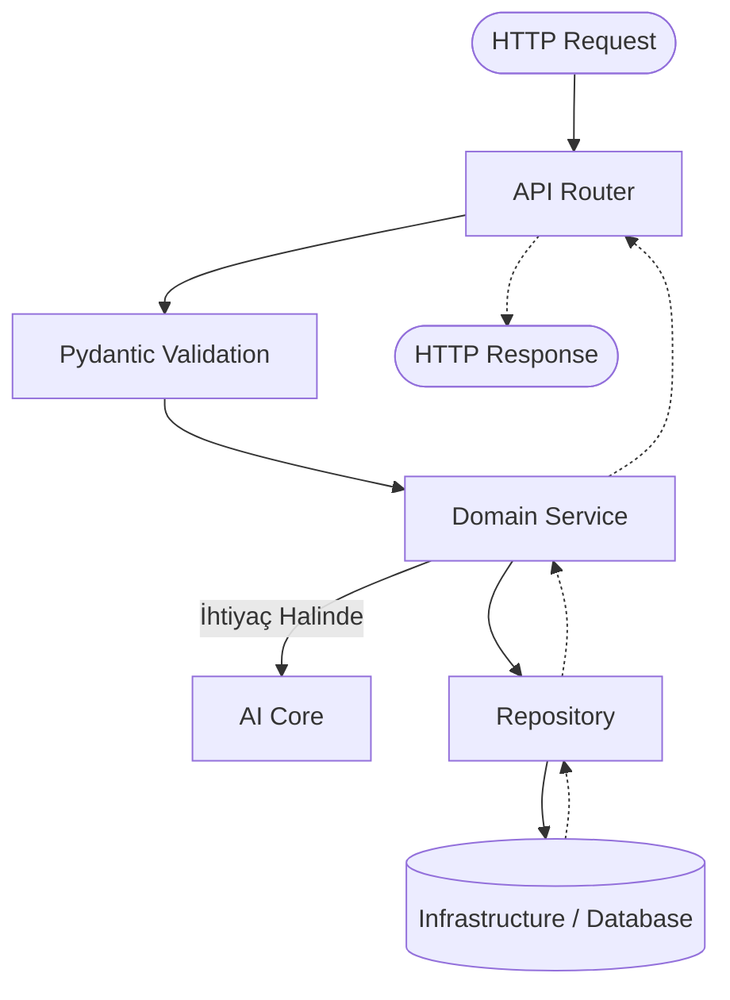

# Backend Mimarisi

> **NOT:**
> Bu doküman backend uygulamasının mimarisini, katmanlarını, veri akışını ve güvenlik konseptlerini (Çok Kiracılık, ABAC, RLS vb.) açıklar. Backend'in amacı API isteklerini yönetmek, iş kurallarını uygulamak, yapay zekâ sistemini koordine etmek ve veri bütünlüğünü sağlamaktır.

## Mimari Yaklaşım

Backend aşağıdaki prensipler etrafında şekillenmiştir:

- **Modular Monolith:** Tek parça ancak domain bazında kesin sınırlarla ayrılmış yapı.
- **Domain Driven Design (DDD):** İş kurallarının domaine göre tasarlanması.
- **Clean Architecture & SOLID:** Katmanlar arası bağımlılıkların sıkı kontrolü.
- **Repository Pattern & Dependency Injection:** Veri erişiminin soyutlanması ve bağımlılıkların enjekte edilmesi.

## Genel Yapı ve Dizin Dizilimi

Projedeki Backend ana klasörleri ve sorumlulukları:

| Dizin | Sorumluluk |
| --- | --- |
| `app/api/` | HTTP uç noktalarının ve global middleware/router tanımlarının bulunduğu yer. |
| `app/core/` | Tüm sistemi ilgilendiren config, güvenlik, exception yönetimi bileşenleri. |
| `app/domains/` | (DDD) Her bir iş biriminin (ör. chat, documents) bağımsız klasörü. |
| `app/ai/` | Yapay zekâ iş akışları, modeller, promptlar ve araçlar. |
| `app/infrastructure/` | Veritabanı, önbellek, dış servis ve depolama bağlantıları. |
| `app/shared/` | Ortak DTO'lar, sabitler ve utility araçları. |
| `app/workers/` | Arka planda çalışan asenkron görevler. |

## İstek Yaşam Döngüsü

Kullanıcıdan gelen bir HTTP isteğinin Backend içindeki yolculuğu aşağıdaki gibidir:



## Domain Katmanları

Her iş alanı (`domains/chat`, `domains/documents` vb.) aşağıdaki yapıya sahiptir:

| Dosya | Görev | İş Kuralı Barındırır mı? |
| --- | --- | :---: |
| `router.py` | HTTP metotlarını yönetir, Service'i çağırır. | Hayır |
| `service.py` | Uygulamanın temel iş kurallarını işletir. | Evet |
| `repository.py` | Veritabanı ile CRUD işlemlerini yürütür. | Hayır |
| `models.py` | ORM modellerini (veritabanı tabloları) tanımlar. | Hayır |
| `schemas.py` | Pydantic giriş/çıkış şemalarını tutar. | Hayır |

> **UYARI:**
> Katman ihlali yapılmamalıdır. Router'da SQL yazılmaz, Service'te HTTP objesi yönetilmez ve Repository'de iş mantığı bulunmaz.

## Çok Kiracılık (Multi-Tenancy) ve Güvenlik

Sistem şirket bazlı (`company_id`), dört farklı rol hiyerarşisi (`root`, `admin`, `manager`, `employee`) barındıran çok kiracılı bir mimaridedir.

### Güvenlik Katmanları (Savunma Hattı)

```mermaid
flowchart LR
    A[İstek] --> B{1. Kiracı Kapsamı}
    B -->|Şirket Uygun| C{2. ABAC Motoru}
    C -->|İzin Verildi| D{3. Gizlilik Seviyesi}
    D -->|Seviye Yeterli| E{4. Guardrails (AI)}
    E -->|Temiz| F((Erişim Başarılı))
    B -.->|Geçersiz| X[Red]
    C -.->|Yetkisiz| X
    D -.->|Seviye Yetersiz| X
    E -.->|Red Edildi| X
```

### Row-Level Security (RLS)

- Tüm kiracı verileri (`users`, `documents`, `drafts`, `chat_sessions` vb.) Postgres düzeyinde RLS (Satır Seviyesinde Güvenlik) ile izole edilmiştir.
- İstek başladığında Middleware üzerinden `current_company_id` GUC'si (Grand Unified Configuration) ayarlanarak Postgres'e iletilir.
- GUC ayarlanmazsa sistem varsayılan olarak **fail-secure** modda çalışır (hiçbir satır görünmez).

### ABAC (Attribute-Based Access Control) Motoru

Yetkilendirme kontrolleri `app.core.authz` altındaki özel bir motor ile çalıştırılır:
- Roller, eylemler ve kaynaklar birleştirilerek değerlendirilir.
- Çoğu sorgu bellek üzerinde (DB ihtiyacı olmadan) hızlıca değerlendirilir.
- Root rolü sınırsız erişime sahipken, çalışanlar (Employee) yalnızca kendi sahip olduğu kaynaklarda işlem yapabilir.

## Bildirimler ve SSE (Server-Sent Events)

Sistem içi bildirimler (`draft_shares` gibi özelliklerde) gerçek zamanlı olarak gönderilir:

1. İşlemin gerçekleştiği yerde bir *Event* fırlatılır.
2. Dinleyiciler (Subscribers) veritabanına bildirim kaydı ekler.
3. Eşzamanlı olarak bildirim, `RedisCache.publish` üzerinden ilgili kanala (`notifications:{company_id}:{user_id}`) basılır.
4. İstemci, bir SSE uç noktası üzerinden bu güncellemeleri anında arayüzde görür.

## Observability & Denetim Kaydı (Audit Log)

Sistemdeki idari ve kritik eylemler, değiştirilmesi veya silinmesi durumunda fark edilecek şekilde **kriptografik zincir (hash-chain)** mimarisiyle kaydedilir (`app.domains.audit`).

- **Metrikler (Prometheus/Grafana):** Şirket bazında istek sayısı, doküman, taslak istatistikleri ve aktif kullanıcı sayıları tutulur.
- **AI İzleme (Langfuse):** Yapay zeka modeline giden girdiler ve çıktılar, kullanıcı bazlı izleme ile kaydedilir.

> **ÖNEMLİ:**
> Sistem performansı için sorgular `list_drafts(..., limit=10_000)` gibi yaklaşımlar yerine, spesifik `count()` SQL metodlarıyla ele alınmalıdır. Pagination her liste yapısında desteklenir.
