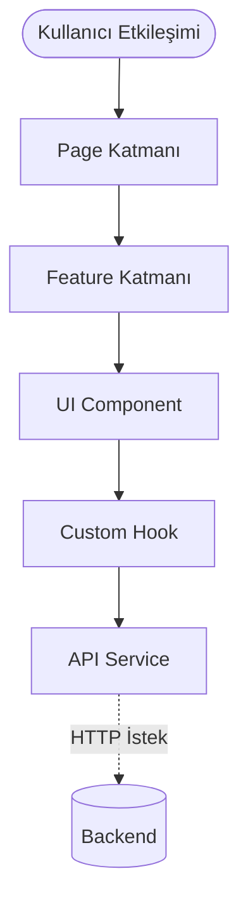
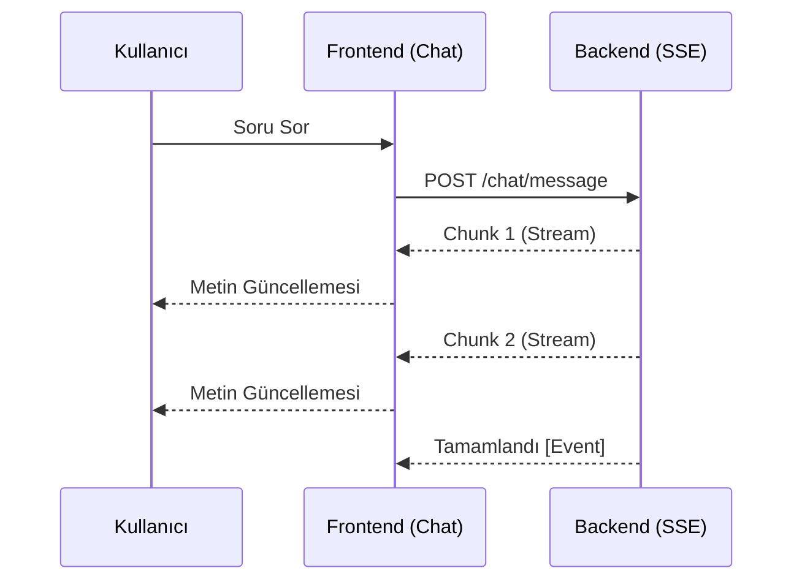

# Frontend Mimarisi

> **NOT:**
> Bu doküman frontend uygulamasının mimarisini, katmanlarını, bileşen organizasyonunu ve sunum stratejisini açıklamaktadır. Frontend, yalnızca kullanıcı deneyiminden ve arayüz yönetiminden sorumludur; iş kuralları kesinlikle barındırmaz.

## Mimari Yaklaşım

Frontend aşağıdaki SOTA (State-of-the-Art) prensiplere göre geliştirilmektedir:

- **Feature Based Architecture:** Kod tabanı teknik bileşenlere (component, hook) göre değil, iş özelliklerine (chat, document vb.) göre klasörlenir.
- **Component Based & Atomic Design:** Küçük, bağımsız ve yeniden kullanılabilir UI birimleri.
- **Separation of Concerns (SoC):** İş mantığı (Hooks/Services) ve görsel katmanın (Components) net ayrımı.
- **Single Responsibility Principle:** Her bileşen tek bir sorumluluğa sahiptir.

## Genel Yapı ve Dizin Dizilimi

Frontend ana klasör yapısı ve sorumlulukları şu şekildedir:

| Dizin | Sorumluluk |
| --- | --- |
| `src/app/` | Routing, Provider'lar, Global hata yönetimi ve uygulama başlatma noktası. |
| `src/pages/` | Kullanıcı tarafından erişilen tam ekran görünümler (Chat, Documents). |
| `src/features/` | İş alanına özel bağımsız modüller (chat logic, document logic vb.). |
| `src/components/` | Uygulama geneli paylaşılan buton, modal, input gibi saf (dumb) UI elemanları. |
| `src/hooks/` | Yeniden kullanılabilir veri yönetimi ve UI harici logic parçaları. |
| `src/services/` | Sadece Backend API ile iletişim kuran istek (fetch/axios) metotları. |
| `src/store/` | Uygulama geneli paylaşılan (Global) durum yönetimi. |

## Kullanıcı Akışı ve Katmanlar Arası İletişim

Frontend mimarisinde bir özelliğin kullanım akışı aşağıdan yukarıya doğru şu şekildedir:

> **UYARI:**
> Frontend doğrudan veritabanı, Qdrant veya LLM ile **iletişim kurmaz**. Tüm akış Backend üzerinden sağlanır.

## State (Durum) Yönetimi Stratejisi

State karmaşasını önlemek için durumlar 3 katmanda ele alınır:

1. **Local State:** Sadece ilgili Component içinde yaşar (Örn: Input içeriği, açık/kapalı modal durumu).
2. **Feature State:** Bir iş alanı içindeki (Örn: Chat) Component'ler arasında paylaşılır (Örn: Aktif seçili mesaj).
3. **Global State & Server State:** Uygulamanın tamamını ilgilendiren oturum, tema ve kullanıcı bilgileri. **TanStack Query** ile sunucu verileri cache'lenerek (Server State) yönetilir. Gereksiz API isteklerinin önüne geçilir.

## Gerçek Zamanlı İşlemler (SSE & Streaming)

AI'ın uzun süren süreçleri (Streaming response, taslak hazırlama, analiz) istemcide akıcı bir deneyim için **Server-Sent Events (SSE)** üzerinden dinlenir:

## Performans ve Optimizasyon

Modern web standartlarına uygunluk için frontend uygulamasında aşağıdaki teknikler aktiftir:
- **Lazy Loading & Code Splitting:** Sadece ziyaret edilen sayfanın kodları (chunk) indirilir.
- **Memoization:** Gereksiz React render'larını engellemek için `useMemo` ve `useCallback` kullanımı.
- **Virtualization:** Çok uzun evrak listeleri veya sohbet geçmişinde sadece ekranda görünen öğelerin render edilmesi.

## Typography ve Design System

Proje, görsel bütünlüğü sağlamak adına `design-system.css` ve `typography.css` üzerinden beslenen merkezi bir tasarım dili kullanır.

- **Renk Paleti & Yüzeyler:** Açık ve koyu tema (Dark Mode) uyumlu semantik renkler kullanılır.
- **Tipografi:** Ana arayüz için `Inter`, başlık ve marka vurguları için `Outfit` tercih edilir. Tasarım SOTA standartlarında okunabilirlik (satır yüksekliği ve maksimum karakter genişliği) gözetilerek ayarlanmıştır.

> **ÖNEMLİ:**
> Arayüz geliştirirken doğrudan px değerleri yerine, Design System içerisindeki `rem` tabanlı tasarım token'ları (spacing, border-radius) kullanılmalıdır. Sayfalar kendi içlerinde bağımsız buton veya input bileşenleri tanımlamamalıdır; her zaman `src/components/` dizinindeki ana bileşenler çağrılmalıdır.
