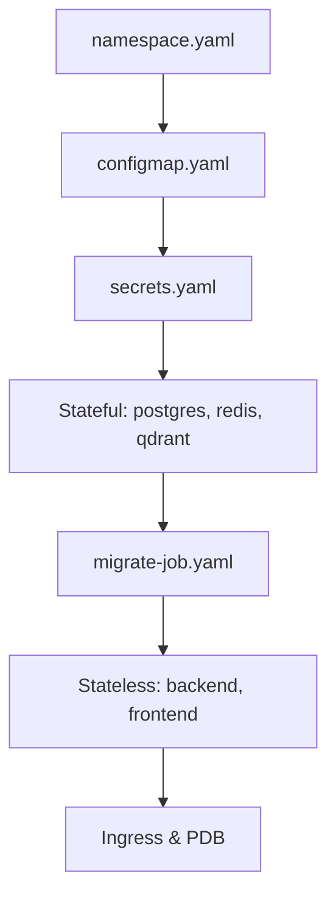

# Kubernetes Dağıtımı

> KACHOW projesi, Helm Chart yerine düz (Plain) manifest dosyaları ile (`deploy/kubernetes/*.yaml`) Self-Hosted Kubernetes kümelerine dağıtılır. Bu set, `kind` kümesinde API seviyesinde uçtan uca doğrulanmıştır.

---

## Topoloji ve Uygulama Sırası (Apply Sequence)

Aşağıdaki sıra zorunludur: Network, Config, Secret, Veritabanları, Migration ve son olarak Uygulama.



### Kurulum Komutları

```bash
# 1. Namespace
kubectl apply -f deploy/kubernetes/namespace.yaml

# 2. Config & Secrets
kubectl apply -f deploy/kubernetes/configmap.yaml
kubectl apply -f deploy/kubernetes/secrets.yaml # DİKKAT: Placeholder'ları mutlaka doldurun!

# 3. Stateful Altyapı
kubectl apply -f deploy/kubernetes/postgres.yaml
kubectl apply -f deploy/kubernetes/qdrant.yaml
kubectl apply -f deploy/kubernetes/redis.yaml

# Pod'ların hazır olmasını bekleyin
kubectl -n kachow wait --for=condition=Ready pod -l app=kachow-postgres --timeout=180s
kubectl -n kachow wait --for=condition=Ready pod -l app=kachow-qdrant --timeout=180s

# 4. Veritabanı Şeması (Migration)
kubectl apply -f deploy/kubernetes/migrate-job.yaml
kubectl -n kachow wait --for=condition=Complete job/kachow-migrate --timeout=120s

# 5. Uygulama ve Ağ
kubectl apply -f deploy/kubernetes/backend.yaml
kubectl apply -f deploy/kubernetes/frontend.yaml
kubectl apply -f deploy/kubernetes/pdb.yaml
kubectl apply -f deploy/kubernetes/ingress.yaml
```

> **NOT:** `backend.yaml` içerisindeki `wait-for-migrations` initContainer, şema (Alembic) hedefine ulaşmadan ana Backend pod'unun başlamasını engeller. Yukarıdaki Job `wait` komutu güvenliği garanti eder.

---

## Değiştirilmesi Zorunlu Değerler (Placeholder'lar)

Yaml dosyalarındaki dummy değerler doğrudan kullanılamaz. İlgili dosyaları düzenleyiniz:

| Dosya | Değiştirilecek Kısım | Açıklama |
| :--- | :--- | :--- |
| `secrets.yaml` | `stringData` blokları | [secrets.md](secrets.md) belgesindeki tüm şifre ve anahtarlar |
| `configmap.yaml`| `OLLAMA_BASE_URL` | Ollama model sunucusunun gerçek iç/dış adresi. |
| `namespace.yaml`| `allow-backend-ollama-egress` | Ollama çıkışını (Egress) güvenli IP/Port (11434) ile sınırlayın. |
| `*.yaml` (Deployment/Job)| `image:` satırları | Push ettiğiniz private/public imaj etiketleri. |
| `ingress.yaml` | `host` ve TLS Issuer | Sistemin yayınlanacağı gerçek FQDN. |

---

## Replica (Ölçekleme) Ayarları ve S3 Zorunluluğu

`backend.yaml` varsayılan olarak `replicas: 1` ile gelir. 
Eğer yerel (Local) depolama yerine **2+ Replika (Yatay Ölçekleme)** isteniyorsa; yerel PVC yerine nesne depolama (Object Storage - S3) kullanılması zorunludur:

1. Kurum içi (On-premise) MinIO veya Bulut (AWS) S3 hizmeti kurun.
2. `configmap.yaml` dosyasında: `STORAGE_TYPE: "s3"`, `S3_BUCKET_NAME` ve `S3_ENDPOINT_URL` tanımlayın.
3. `secrets.yaml` dosyasında: `S3_ACCESS_KEY` ve `S3_SECRET_KEY` tanımlayın.
4. `backend.yaml` içinden `backend-storage-data` VolumeMount tanımını **tamamen silin** ve `replicas` değerini artırın.

---

## Güvenlik Sınırları ve Kotalar (Hardening)

- **NetworkPolicy:** `namespace.yaml` içerisinde tanımlı default-deny (Varsayılan Reddet) politikalarının çalışabilmesi için kümenizin (Cluster) destekleyen bir CNI (Örn: Calico, Cilium) kullanması şarttır. Flannel gibi CNI'lar bu sınırları yok sayar.
- **Resource Quota (Kaynak Tavanı):** Namespace genelinde kaynak kotası zorlanmaktadır. Eklediğiniz herhangi bir yan pod (Sidecar) veya initContainer, kesinlikle `resources.requests` ve `limits` belirtmelidir; aksi takdirde `FailedCreate` hatası alınır.

---

## Sağlık Doğrulaması (Validation)

```bash
# Tüm pod durumlarını inceleyin
kubectl -n kachow get pods

# Backend loglarını takip edin
kubectl -n kachow logs -l app=kachow-backend

# Liveness Probe üzerinden sağlık teyidi
curl -f https://<ingress-host>/api/v1/health
```
