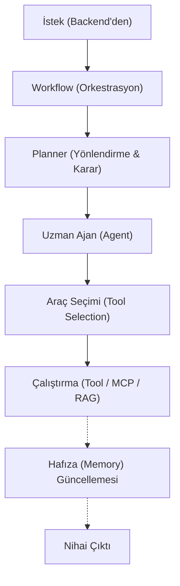

# AI Geliştirme Standartları (AI Standards)

> **NOT:**
> Bu doküman AI katmanının geliştirme standartlarını tanımlar. AI Core, sistemin karar verme, planlama ve mantık yürütme merkezidir. Sisteme eklenecek yeni ajanlar ve iş akışları bu kurallara uygun tasarlanmalıdır.

## Mimari Felsefe ve Kapsam

AI Core, gelen görevleri planlar, araç (Tool) seçer, bilgi toplar (RAG) ve cevap üretir.

| Yapması Gerekenler | Yapmaması Gerekenler |
| :--- | :--- |
| LangGraph ile Workflow yönetir. | HTTP isteği (Request/Response) işlemez. |
| Memory'yi (Kayan Pencere) okur/yazar. | Veritabanına (PostgreSQL) doğrudan erişmez. |
| Tool ve MCP kullanarak işlem yapar. | Kullanıcı arayüzü (React) oluşturmaz veya framework bağımlı kod içermez. |

## AI İstek ve Karar Akışı

AI katmanının istekleri karşılama hiyerarşisi (Top-Down):

## Modüller ve Sorumluluklar

| Modül | Açıklama | Kurallar |
| :--- | :--- | :--- |
| **Workflow** | Görevi planlar, Ajan seçer ve hata yönetir. | Workflow içinde Prompt yazılmaz. Sadece orkestrasyon yapar. |
| **Agent** | Tek bir uzmanlık alanına (Örn: `RAGAgent`) sahiptir. | Birden fazla görevi üstlenemez. ("Super Agent" yapılmaz). |
| **Planner** | Hangi ajanların ve araçların kullanılacağına karar verir. | Doğrudan Tool çalıştırmaz, sadece plan çıkarır. |
| **Tool / MCP** | Dosya okuma, arama gibi spesifik yetenekler sunar. | Tool'lar birbirini doğrudan çağıramaz (AI üzerinden tetiklenir). |
| **RAG** | İlgili belgeleri bulur ve sıralar (Reciprocal Rank Fusion). | Karar vermez veya nihai cevap metni üretmez (Sadece kaynak sunar). |
| **Memory** | Konuşma geçmişini `HISTORY_WINDOW` limitiyle tutar. | Frontend (UI) ile ilgilenmez, sadece LangGraph checkpointer'da yaşar. |

## Prompt Yönetimi ve Model Bağımsızlığı

- **Merkezi Promptlar:** Sistem promptları kod içine gömülmez. Tüm promptlar versiyonlanabilir ve tekrar kullanılabilir biçimde `app/ai/prompts/templates/` altında saklanır.
- **Sağlayıcı Soyutlaması:** AI sistemi OpenAI, Ollama, Anthropic gibi tek bir modele kilitlenmez. Model değişikliği Workflow kodunda değişikliğe neden olmamalıdır.
- **Kademeli Karar (Reasoning):** Kullanıcının hız ve kalite tercihlerine göre (`fast`, `balanced`, `deep`) modeller dinamik olarak yönetilir. Workflow düğümleri (nodes) donanım preset'ine göre karmaşıklığını ayarlar.

## Token Yönetimi ve Guardrails

- **Bağlam (Context) Sınırı:** Token taşmasını ve yavaşlamayı engellemek için sadece en gerekli bilgi modele iletilir. Geçmiş konuşmalar özetlenerek (SummaryMemory) dahil edilir.
- **Güvenlik Çiti (Guardrails):** LLM çıktısına koşulsuz güvenilmez. Üretilen JSON veya yapılandırılmış formatlar Pydantic şemaları ile anında doğrulanır (Validation).

> **ÖNEMLİ:**
> Yeni bir AI özelliği (Agent/Workflow) geliştirildiğinde; deterministik testleri (Evaluation) çalıştırılmalı ve başarı, token tüketimi, gecikme süresi (latency) ölçümlenerek raporlanmalıdır. (Ayrıntılar `testing.md` dokümanındadır).
