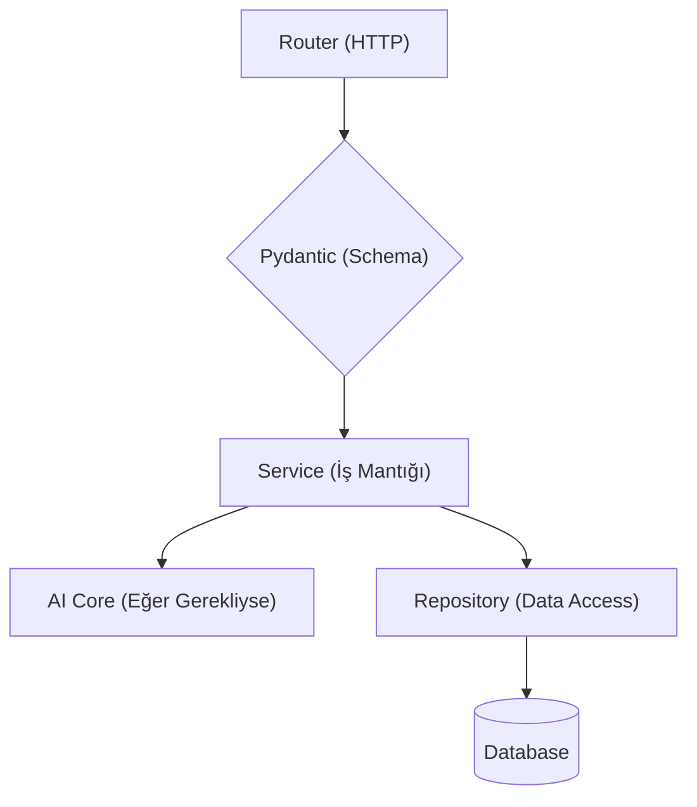
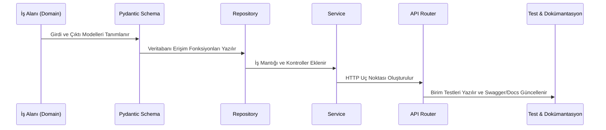

# Backend Geliştirme Standartları (Backend Standards)

> **NOT:**
> Bu doküman Backend geliştirme süreçlerinin standartlarını, mimari katmanları, isimlendirme ve test beklentilerini tanımlar. Bu katmanın asıl amacı **iş kurallarını yönetmek, API isteklerini karşılamak, veri bütünlüğünü korumak ve AI orkestrasyonunu sağlamaktır.**

## Mimari Felsefe ve Katmanlar (DDD)

Backend, **Domain Driven Design (DDD)** prensiplerine göre iş alanlarına (chat, documents, users vb.) bölünmüştür.
Her iş alanı kendi içinde kesin çizgilerle ayrılmış katmanlardan oluşur:

| Katman | Sorumluluk | Yapılmaması Gerekenler |
| :--- | :--- | :--- |
| **Router** | HTTP isteklerini (Request) karşılar, doğrular, sonucu (Response) döner. | SQL yazılmaz. İş kuralı veya AI çağrısı yapılmaz. |
| **Service** | İş kurallarını yürütür, Repository ve AI Core'u koordine eder, Event yayınlar. | HTTP veya Request nesnesi bilinmez. ORM sorgusu yazılmaz. |
| **Repository** | Veritabanı (CRUD, filtreleme, sayfalama) işlemlerini üstlenir. | Veri mantığı dışında iş kuralı içermez. |
| **Models** | Veritabanı tablolarının ORM temsilidir. | API doğrulaması, HTTP mantığı bulundurmaz. |
| **Schemas** | API giriş/çıkışlarını yöneten Pydantic tanımlarıdır. | Database modeli ile aynı amaçta (ikisi bir arada) kullanılamaz. |

> **UYARI:**
> Katmanlar arası bağımlılıklar yalnızca **Dependency Injection** (Bağımlılık Enjeksiyonu) kullanılarak sağlanmalıdır. Hiçbir servis veya router nesnesi, ihtiyaç duyduğu sınıfı doğrudan `new` anahtar kelimesiyle veya manuel instantiate ederek kullanmamalıdır.

## Yeni Özellik Geliştirme İş Akışı

Yeni bir Backend özelliği veya endpoint eklenirken kodlama süreci "Veriden -> İletişime" (Bottom-Up) şekilde ilerlemelidir:

## AI Katmanı ile İletişim
Backend sistemi AI algoritmalarının, promptların, LLM yapılandırmalarının veya araçların (tools, MCP) **nasıl çalıştığını bilmez**. Bu işlemlerin hepsi `app/ai` içerisinde tutulur. Backend yalnızca AI servislerini bir kara kutu (black-box) olarak çağırıp sonucunu alır.

## Performans ve Arka Plan (Background) İşlemleri
* **Asenkronluk:** Embedding oluşturma, RAG için indeksleme, büyük dosya analizleri gibi zaman alan işlemler HTTP yanıt süresini uzatmamak için arka planda (Worker/Background Tasks) yapılmalıdır.
* **Veritabanı Performansı:** Gereksiz `SELECT N+1` problemlerinden kaçınılmalı, ilişkili veriler verimli Join'ler veya Eager Loading yöntemleriyle çekilmelidir. Caching (Redis) uygun noktalarda kullanılmalıdır.

## Dosya Boyutları ve Kod Organizasyonu
Bir dosyanın çok büyümesi, "Tek Sorumluluk" (Single Responsibility) kuralının aşıldığının göstergesidir.
- **Router:** ≤ 300 satır
- **Service:** ≤ 500 satır
- **Repository:** ≤ 300 satır
Bu sınırları aşan dosyalar alt servislere (helpers/sub-services) bölünmelidir. `utils` veya `helpers` gibi klasörler çöp kutusu (dump) olarak kullanılmaz; anlamlı modüllere yerleştirilir.

> **ÖNEMLİ:**
> Kimlik Doğrulama (Authentication) ve Yetkilendirme (Authorization) mekanizmaları **merkezidir**. Endpoint düzeyinde bağımsız (hardcoded) güvenlik kontrolü yapılamaz; Middleware veya standart Dependency yapıları kullanılmalıdır.