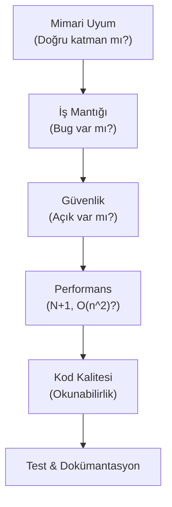

# Kod İnceleme Standartları (Code Review)

> **NOT:**
> Bu doküman proje genelindeki kod inceleme süreçlerini tanımlar. Amaç sadece hata bulmak değil, mimari bütünlüğü korumak, teknik borcu engellemek ve ekip içi bilgi paylaşımını artırmaktır.

## İnceleme Süreci ve Hiyerarşisi

Her Pull Request (PR) objektif, yapıcı ve aşağıdaki öncelik sırasıyla incelenir:

## Alanlara Göre Kontrol Kriterleri

| Kategori | Kontrol Soruları |
| :--- | :--- |
| **Backend** | Router içinde iş mantığı veya SQL var mı? Dependency Injection kullanılmış mı? Exception yönetimi doğru yapılmış mı? |
| **Frontend** | Component çok mu büyük (250+ satır)? State doğru seviyede mi (Global/Local)? Doğrudan fetch kullanılmış mı? |
| **AI Core** | Ajanlar tek sorumluluğa sahip mi? Prompt kodun içine mi gömülmüş? Araç (Tool) çağrısı güvenli mi? |
| **Güvenlik** | Girdi doğrulaması yapılmış mı? Env sırları (secret) koda sızmış mı? |
| **Performans** | Döngü içinde gereksiz veritabanı/LLM sorgusu var mı? Gereksiz render oluşuyor mu? |

## AI Tarafından Üretilen Kod

> **ÖNEMLİ:**
> Sisteme yardımcı olan AI araçlarının (Copilot/Agent) ürettiği kodlar da tamamen bu standartlara tabidir. İncelemelerde özellikle **halüsinasyon (var olmayan kütüphane uydurma), kod tekrarı ve karmaşıklık (over-engineering)** aranmalıdır.

## Yapıcı Geri Bildirim Örnekleri

Kod değerlendirilirken kişiye değil koda odaklanılır, alternatif çözüm önerilir.

- **Doğru:** "Bu döngü yerine SQL tarafında toplu (batch) insert yapmak performansı artırabilir."
- **Yanlış:** "Bu çok yavaş çalışır."
- **Doğru:** "Component'in bu kısmı sadece görsellikle ilgili, ayrı bir UI bileşenine ayırabilir miyiz?"
- **Yanlış:** "Çok uzun olmuş, baştan yaz."

## Birleştirme (Merge) Kriterleri

Aşağıdaki liste tamamlanmadan kod ana dala (main) alınamaz:

1. Mimari ihlal olmamalıdır.
2. Yazılan özellik için ilgili Unit/Integration testleri eklenmiş ve geçiyor olmalıdır.
3. CI/CD boru hattı (Lint, Build) başarılı olmalıdır.
4. Dokümantasyon (`README`, `architecture` vb.) güncellenmiş olmalıdır.
5. İnceleyen (Reviewer) tarafından açılan sorunlar/yorumlar çözülmüş olmalıdır.
6. Kod değişiklikleri tek bir mantıksal odak noktasında (Küçük PR kuralı) olmalıdır.
