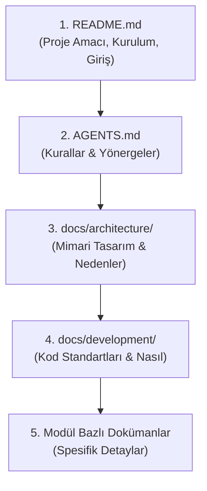

# Dokümantasyon Standartları (Documentation)

> **NOT:**
> Bu doküman proje genelindeki bilgi paylaşımını ve dokümantasyon kültürünü tanımlar. Dokümantasyon kodun yerine geçmez, sadece kodun arkasındaki nedeni (neden tasarlandı) ve çalışma modelini (nasıl kullanılır) açıklar.

## Doküman Hiyerarşisi ve Okuma Sırası

Sistemi tanımak isteyen bir geliştirici (veya AI aracı), dokümanları aşağıdaki yukarıdan aşağıya (top-down) hiyerarşide incelemelidir:

## Klasörlerin Dokümantasyon Rolleri

| Dizin / Dosya | İçerik ve Amaç |
| :--- | :--- |
| **README.md** | Projenin vitrinidir. Sadece proje amacı, kurulum komutları ve doküman indeksini barındırır. Teknik derinliğe inilmez. |
| **architecture/** | Sistemin "neden" böyle tasarlandığını açıklar (Örn: RAG mimarisi, MCP, Backend katmanları). Diyagramlarla zenginleştirilmelidir. |
| **development/** | Geliştirme sürecinin "nasıl" işleyeceğini tanımlar (Örn: Naming, Testing, Git Workflow). |

## Kod İçi Dokümantasyon (Yorum Satırları)

- Kod mümkün olduğunca **kendi kendini açıklayıcı** olmalıdır (Doğru isimlendirmelerle).
- Yorum satırları kodu tekrar etmek için (ör. `// sayacı bir artır`) değil, kompleks bir iş mantığının "neden" yazıldığını açıklamak için kullanılmalıdır.

## Güncelleme ve Sürdürülebilirlik Kuralı

> **ÖNEMLİ:**
> Mimariyi etkileyen yeni bir özellik, yeni bir API, yeni bir AI workflow veya klasör eklendiğinde ilgili dokümantasyon dosyası **mutlaka güncellenmelidir**. Açıklaması olmayan "ölü kod" veya sistemle çelişen "bayat" (stale) doküman bırakılmasına müsaade edilmez.

**Pull Request Açma Şartı:**
Her geliştirici (veya AI ajanı) PR açmadan önce şu soruyu sormak zorundadır:
*"Yapılan bu değişiklik herhangi bir dokümanı etkiliyor mu?"*
Yanıt evet ise, kod ve doküman aynı PR içerisinde güncellenmiş olmalıdır.

## Yapılmaması Gerekenler

- Çalışmayan veya eski API örneklerini doküman içinde bırakmak.
- Aynı bilgiyi birden fazla belgede kopyalayarak tekrarlamak (Tek doğru kaynak kuralına aykırıdır).
- AI tarafından üretilen dokümanları insan onayı/okuması olmadan doğrudan birleştirmek (merge).
