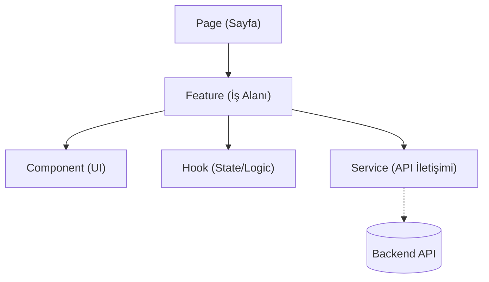

# Frontend Geliştirme Standartları (Frontend Standards)

> **NOT:**
> Bu doküman Frontend uygulamasında uyulması gereken tasarım kalıplarını, bileşen (Component) hiyerarşisini, state yönetimini ve performans kurallarını tanımlar. Frontend'in temel görevi **veriyi etkili, şık (SOTA) ve performanslı şekilde kullanıcıya sunmaktır**.

## Feature-First Architecture (Özellik Odaklı Mimari)

Frontend kod tabanı, dosya türüne (components, hooks vb.) göre değil, uygulamanın sunduğu **iş özelliklerine** (chat, documents, settings vb.) göre klasörlenir.

| Katman | Görev Dağılımı | Yapılmaması Gerekenler |
| :--- | :--- | :--- |
| **Page** | Ekran iskeletini çizer, Layout ve Feature'ları birleştirir. Yönlendirme (Routing) yapar. | Karmaşık iş mantığı veya detaylı arayüz elemanı barındırmaz. API çağırmaz. |
| **Feature** | Spesifik bir iş alanını (Örn: `chat`) barındırır. Kendi component ve hook'larını içerir. | Başka Feature'ların iç yapısına bağımlı olamaz (İzole çalışmalıdır). |
| **Component** | Tekrar kullanılabilir UI (Görsel) birimleridir. (Örn: Button, Table) | API çağırmaz. Doğrudan iş mantığı (business logic) içermez. |
| **Hook** | Yeniden kullanılabilir veri çekme ve durum (state) yönetimi davranışlarını kapsar. | JSX döndürmez (UI üretmez). |
| **Service** | Sadece Backend API'ye HTTP isteklerini (`fetch`/`axios`) yapar. | UI bağımlılığı içermez. (Component'ler doğrudan fetch kullanamaz). |

## State (Durum) Yönetimi Stratejisi

State (durum) yönetimi projenin en kritik kısımlarından biridir. UI durumu ile Sunucu (Server) durumu kesin olarak ayrılmalıdır.

| State Seviyesi | Kapsam | Örnek Kullanım |
| :--- | :--- | :--- |
| **Local State** | Yalnızca bir Component içinde yaşar. | Açılır menü durumu (open/closed), Input metni. |
| **Feature State** | Bir Feature'ın içindeki componentler paylaşır. | Aktif sohbet id'si, filtreleme seçenekleri. |
| **Global State** | Tüm uygulamanın her yerinden erişilebilir. (Gereksiz büyütülmemelidir) | Kullanıcı (User) bilgisi, Tema (Dark/Light), Dil tercihi. |
| **Server State** | Backend'den gelen verilerin yönetimi. (Örn: TanStack Query ile) | Sunucudaki evrak listesinin cache'lenmesi. |

> **ÖNEMLİ:**
> Sunucudan çekilen veriler (Server State) kesinlikle Global veya Local State içerisinde tekrar tutulmaz (Kopya veri oluşturulmaz). Doğrudan Cache üzerinden yönetilir.

## Performans ve Gerçek Zamanlılık (Real-Time)

* **Optimizasyon Teknikleri:** Lazy Loading (rota bazlı yükleme), Code Splitting ve Virtualization (uzun listelerin sadece görünen kısmını render etme) kullanılmalıdır.
* **Gereksiz Render'lar:** React tabanlı bileşenlerde gereksiz render'ı engellemek için gerektiğinde `useMemo` ve `useCallback` değerlendirilmelidir, ancak "erken optimizasyon" yapılmamalıdır.
* **Loading ve Streaming:** Uzun süren işlemlerde kullanıcıya daima dönüt (Skeleton, Spinner) verilmelidir. AI yanıtları veya belge analizleri gibi işlemler **Streaming (SSE)** üzerinden akıcı (gerçek zamanlı) gösterilmelidir. Arayüz asla "donuk" hissettirmemelidir.

## Ortak Component'ler ve Layout Kullanımı
* Uygulama genelinde paylaşılan saf UI bileşenleri (Button, Modal, Input, Avatar) sadece `src/components/` dizini altında merkezi olarak tutulur.
* Her Feature kendi içerisinde özel bir Button veya Input oluşturmamalı, ortak kütüphaneyi tüketmelidir.
* Tema yönetimi ve renk tanımlamaları merkezidir; bileşenler içine doğrudan "hardcoded" renk yazılmaz.

## Dosya Boyutları ve Sınırları
Kod okunabilirliğini korumak için bileşenler ve dosyalar küçük tutulmalıdır:
- **Component:** ≤ 250 satır
- **Hook:** ≤ 250 satır
- **Service:** ≤ 250 satır
- **Page:** ≤ 200 satır

> **UYARI:**
> Frontend katmanı **asla** SQL yazmaz, LLM Prompt'u üretmez, AI modeli çağırmaz ve MCP protokolünü yönetmez. Tüm bu teknik ağır yükler Backend ve AI katmanlarına aittir. Hata mesajları ise doğrudan teknik yığın izi (stack trace) olarak değil, kullanıcı dostu mesajlar (Toast/Alert) olarak sunulmalıdır.
