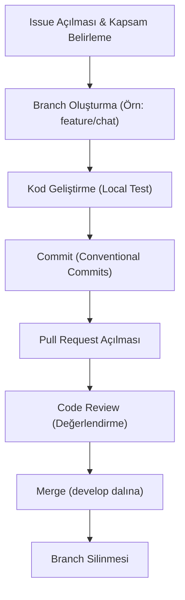

# Git İş Akışı Standartları (Git Workflow)

> **NOT:**
> Bu doküman proje genelindeki Git dallanma stratejisini (branching model) ve işleme (commit) kurallarını tanımlar. Temiz bir Git geçmişi (history), sorunsuz geri dönüşler (rollback) ve çakışmasız takım çalışması için tüm geliştiriciler bu kurallara uymalıdır.

## Ana Dallar (Main Branches)

Proje iki temel dal üzerinden ilerler:

| Dal Adı | Sorumluluk | Kurallar |
| :--- | :--- | :--- |
| `main` | Üretime (Production) hazır stabil kodu barındırır. | Doğrudan geliştirme yapılamaz, doğrudan commit atılamaz, **Force Push** kesinlikle yasaktır. |
| `develop` | Güncel geliştirme dalıdır. | Tüm yeni özellikler önce burada birleştirilir. |

## Dal Türleri ve Adlandırma (Branch Types)

Her geliştirme uygun önek (prefix) taşıyan bir dalda yapılmalıdır. Dalların her biri **yalnızca tek bir Issue**'yu çözmelidir.

| Dal Türü | Kullanım Amacı | Örnekler |
| :--- | :--- | :--- |
| `feature/` | Yeni bir özellik (iş alanı) geliştirilmesi. | `feature/chat-streaming`, `feature/rag-pipeline` |
| `fix/` | Üretimdeki veya geliştirme aşamasındaki bir hatanın çözümü. | `fix/login-timeout`, `fix/chat-history` |
| `refactor/` | Kodun davranışını değiştirmeden yapılan teknik iyileştirmeler. | `refactor/backend`, `refactor/chat-service` |
| `docs/` | Yalnızca dokümantasyon (`.md`) değişiklikleri. | `docs/readme`, `docs/architecture` |
| `test/` | Birim veya entegrasyon testlerinin yazılması. | `test/rag`, `test/workflow` |
| `chore/` | Bakım, paket güncellemesi veya CI/CD yapılandırması. | `chore/docker`, `chore/github-actions` |
| `hotfix/` | Üretim (main) ortamındaki acil kritik hataların doğrudan çözümü. | `hotfix/api-security` (Çözüm hem main hem develop'a merge edilir) |

## Geliştirme Süreci (Development Flow)

Standart bir geliştirme döngüsü aşağıdaki sıralamayı takip eder:

## İşleme Kuralları (Conventional Commits)

Projede uluslararası standart olan **Conventional Commits** kuralı kullanılır.
Format: `type(scope): message`

- **Doğru Örnekler:**
  - `feat(chat): add streaming support`
  - `fix(auth): refresh expired token`
  - `docs(ai): update workflow documentation`
  - `chore(ci): update github actions`

> **UYARI:**
> Commit boyutları küçük tutulmalıdır. Bir özellik (feat) ile büyük bir hata çözümü (fix) aynı commit içerisine konulamaz.

## Birleştirme (Pull Request) Süreci

PR açılırken doğrudan "Merge" yapılamaz. Aşağıdaki kurallar aranır:
1. PR açıklaması net olmalıdır (Amaç, Etkilenen Modüller, Gerekirse Ekran Görüntüsü).
2. Kod inceleme (Code Review) onayından geçmiş olmalıdır.
3. Testler ve CI boru hattı başarılı olmalıdır.
4. Çakışma (Conflict) varsa PR sahibi çakışmayı yerelde çözüp tekrar push etmelidir. Çakışmalar aceleyle ve test edilmeden çözülmemelidir.
