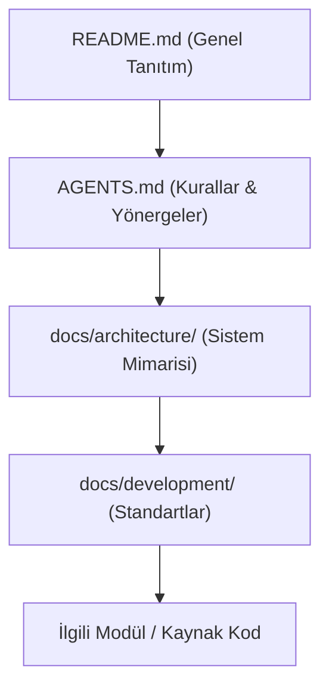

# Proje Geliştirme Kuralları (Project Rules)

> **NOT:**
> Bu doküman proje genelinde (Backend, Frontend, AI, DevOps) geçerli olan temel geliştirme felsefesini ve kurallarını tanımlar. Ekipteki her geliştirici ve projeye entegre tüm AI asistanları bu kurallara uymakla yükümlüdür.

## Temel İlkeler

Sistemin uzun vadeli bakım maliyetini düşük tutmak ve mimari bütünlüğü sağlamak için geliştirilen her özellik aşağıdaki SOTA (State-of-the-Art) prensiplerine uymalıdır:

- **Okunabilirlik ve Basitlik:** Karmaşık (over-engineered) çözümlerden kaçınılır.
- **Modülerlik ve Tek Sorumluluk:** Her dosya, sınıf veya fonksiyon tek bir amaca hizmet eder.
- **Tek Doğru Kaynak (SSOT):** Bir bilgi (endpoint, veri modeli, sabit değer, iş kuralı) sistemde yalnızca **tek bir yerde** tanımlanır.
- **Açık Dokümantasyon:** Kod ile birlikte mimari belgeler de eş zamanlı güncellenir.

## Mimariye Bağlılık ve Kod Organizasyonu

Yeni bir gereksinim her zaman **mevcut mimari kurallar** gözetilerek entegre edilmelidir. Mimariyi ihlal eden veya etrafından dolaşan ("hacky") çözümler kabul edilmez.

| Durum | Kural |
| :--- | :--- |
| **Yeni Klasör/Dosya İhtiyacı** | Önce mevcut yapı değerlendirilir. Rastgele dosya oluşturulamaz. |
| **Tekrarlayan Kod** | Ortak kullanılan yapılar merkezi (shared) modüllere taşınır. (Kopyala-yapıştır yasaktır) |
| **Bağımlılık (Paket) Ekleme** | "Gerçekten gerekli mi?", "Mevcut çözüm yetersiz mi?" soruları yanıtlanmadan eklenemez. |

> **UYARI:**
> Her Pull Request (PR) **tek bir amacı** gerçekleştirmelidir. Yeni özellik geliştirilirken aynı anda ilgisiz bir refactoring veya bağımlılık güncellemesi yapılamaz.

## Güvenlik, Konfigürasyon ve Loglama

* **En Az Yetki İlkesi:** Tüm geliştirmeler, güvenlik duvarları (RLS, ABAC) gözetilerek yapılmalıdır. Kullanıcı girdisine asla güvenilmez.
* **Konfigürasyon Yönetimi:** API anahtarları, şifreler, port numaraları ve URL'ler doğrudan kaynak koda (hardcoded) yazılmaz. Çevresel değişkenlerden (env) okunur.
* **Loglama:** Sistemdeki kritik olaylar (hata, AI çağrısı, giriş/çıkış) izlenebilir ve filtrelenebilir şekilde loglanır. Log kayıtlarında gizli veya hassas veri (PII, parola vb.) tutulmaz.
* **Hata Yönetimi:** Hatalar sessizce geçiştirilmez. Beklenen tüm hatalar merkezi olarak yakalanır ve kullanıcıya güvenli (teknik olmayan) bir mesajla sunulur.

## AI Destekli Geliştirme Kuralları

> **ÖNEMLİ:**
> Projede aktif olarak kullanılan yapay zekâ asistanlarının (Agent/Copilot) ürettiği kodlar, insan yapımı kodlarla tamamen **aynı inceleme standartlarına** tabidir. Doğrudan AI çıktısı güvenilerek üretim ortamına (production) veya ana dala (main) atılamaz, doğrulanmalıdır.

## Dokümantasyon Okuma Hiyerarşisi

Sisteme yeni dahil olan bir geliştirici veya AI ajanı, belgeleri aşağıdaki sırayla analiz etmelidir:

## İlgili Alan Standartları

Bu doküman genel proje çatısını tanımlar. Alan bazlı spesifik geliştirme kuralları için aşağıdaki belgelere başvurulmalıdır:
- [Backend Standartları](backend-standards.md)
- [Frontend Standartları](frontend-standards.md)
- [AI Standartları](ai-standards.md)
