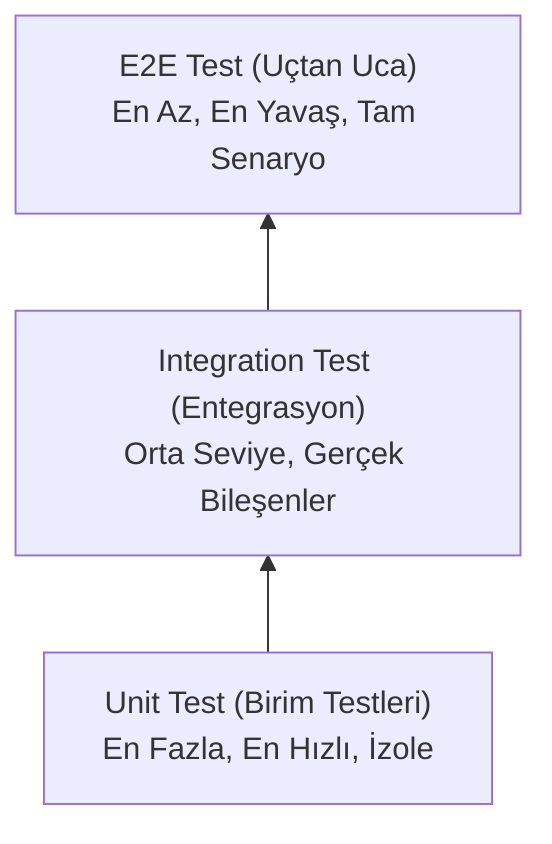

# Test Standartları (Testing Standards)

> **NOT:**
> Bu doküman proje genelindeki (Backend, Frontend ve AI) test stratejilerini tanımlar. Testlerin amacı hataları erken yakalamak, güvenli refactoring yapabilmek ve üretim ortamındaki riskleri minimuma indirmektir.

## Test Piramidi (Test Pyramid)

Proje, SOTA standartlarında kabul gören test piramidi yaklaşımını benimser:

## Backend Test Seviyeleri

| Seviye | Test Edilenler | Yöntem & Kurallar |
| :--- | :--- | :--- |
| **Unit Test** | Service, Repository, Validation kuralları. | Dış bağımlılıklar (Veritabanı, AI) tamamen Mock'lanmalıdır. İzole çalışır. |
| **Integration** | DB sorguları, Cache, Background Tasks. | Gerçek veritabanı veya Redis bileşenleriyle (test container vb.) koşulur. |
| **API Test** | HTTP Route, Schema doğrulama, Auth. | Girdi/Çıktı sözleşmelerine (Contract) uygunluk denetlenir. |

## Frontend Test Seviyeleri

| Seviye | Test Edilenler | Yöntem & Kurallar |
| :--- | :--- | :--- |
| **Component** | Button, Form, Modal, Table gibi UI elemanları. | Render durumu ve kullanıcı etkileşimleri (click, input) kontrol edilir. |
| **Hook Test** | Custom Hook'ların state ve mantığı. | Bağımsız olarak test edilir. |
| **Page / E2E** | Kullanıcı akışları (Login, Evrak Yükleme vb.). | Doğru yönlendirme ve arayüz tepkileri (Loading, Error, Success) doğrulanır. |

## AI Katmanı Test Seviyeleri

Yapay zekâ katmanı, standart bir yazılımdan farklı ve olasılıksal davrandığı için çok seviyeli test edilir:

| Odak Noktası | Kontrol Edilen Kriterler |
| :--- | :--- |
| **Tool / MCP** | Araçların doğru yetkiyle çalışması, hata (timeout) yönetimi. |
| **Workflow** | Düğümlerin (Node) doğru sırada çalışması, karar dallanmaları. |
| **Prompt** | Beklenen formatın ve şemanın (Pydantic) hatasız üretilmesi. |
| **RAG** | Doğru dokümanların bulunması, Chunk sıralamasının doğruluğu (RRF). |
| **Evaluation** | Token kullanımı, gecikme (latency), modelin tutarlılığı ve halüsinasyon oranı. |

> **ÖNEMLİ:**
> LLM çağrısı yapmayan karar fonksiyonları (Örn: lexical füzyon) doğrudan deterministik değerlendirme `make eval` üzerinden ölçülür. LLM kararlarının eşik ayarları (Thresholds) manuel `eval` raporlarıyla belgelenmelidir (Ayrıntı: `evaluation/README.md`).

## Test İsimlendirme ve Organizasyonu

Test adları teknik fonksiyon isminden ziyade **davranışı** net açıklamalıdır.

- **Doğru:** `test_upload_document_fails_when_file_is_too_large`
- **Yanlış:** `test_upload`, `doc_test_1`

**Mock Kullanımı:**
Ağlantıya ve dış sisteme bağlı test yazılmaz. LLM sağlayıcıları, PostgreSQL, Qdrant, Redis ve MCP sunucuları mutlaka sahte nesnelerle (Mock) izole edilerek testlerin **tekrarlanabilir ve hızlı** olması sağlanmalıdır.
