# Use Case Diyagramı

Sistemin dört ana aktörü var: evrak işlemlerini yürüten **Kamu Çalışanı**, birim/şirket ayarlarını yöneten **Sistem Yöneticisi**, arka planda çalışan **Yapay Zeka Ajan Sistemi** (LangGraph tabanlı çoklu-ajan orkestrasyon) ve dış bir **Mevzuat Servisi** (MCP protokolü üzerinden erişilen harici/yerel mevzuat kaynağı). Aşağıdaki diyagram, şartnamedeki Görev 1 ve Görev 2 maddelerinin her birini ayrı bir use case olarak gösterir.

```mermaid
graph TB
    subgraph Aktorler["Aktörler"]
        Memur["👤 Kamu Çalışanı"]
        Yonetici["👤 Sistem Yöneticisi"]
        Ajan["🤖 Yapay Zeka Ajan Sistemi<br/>(LangGraph)"]
        Mevzuat["🌐 Mevzuat Servisi<br/>(MCP)"]
    end

    subgraph Gorev1["Görev 1 — Evrak Sınıflandırma ve İçerik Analizi"]
        UC1["Evrak Yükleme<br/>(PDF / görüntü / metin)"]
        UC2["OCR ile Metin Çıkarma"]
        UC3["Evrak Türünü Belirleme"]
        UC4["Önemli Bilgi Unsurlarını Çıkarma<br/>(sayı, tarih, konu, muhatap...)"]
        UC5["Eksik Bilgi Tespiti"]
        UC6["İlgili Mevzuat Önerisi"]
        UC7["Kısa Özet Oluşturma"]
        UC8["Hassasiyet / PII Tarama<br/>(bonus)"]
    end

    subgraph Gorev2["Görev 2 — Resmî Yazı Taslaklama ve Birim Yönlendirme"]
        UC9["Yazı Türüne Karar Verme<br/>(üst yazı / cevap / bilgilendirme / diğer)"]
        UC10["Resmî Üslupla Taslak Oluşturma"]
        UC11["Taslağı Doğrulama ve Revize Etme"]
        UC12["Birime Yönlendirme Önerisi"]
        UC13["Sürece Dair Kullanıcıyı Bilgilendirme<br/>(canlı ilerleme akışı)"]
        UC14["Eksik Bilgiyi Kullanıcıdan Talep Etme<br/>(İnsan Onaylı Akış)"]
    end

    subgraph Yonetim["Yönetim"]
        UC15["Birim / Şirket Kuralları Tanımlama"]
        UC16["Denetim Kaydı (Audit Log) İnceleme"]
        UC17["Kota / Kullanım Takibi"]
    end

    Memur --> UC1
    UC1 --> UC2
    Ajan --> UC2
    Ajan --> UC3
    Ajan --> UC4
    Ajan --> UC5
    Ajan --> UC6
    Mevzuat -.->|mevzuat metni sağlar| UC6
    Ajan --> UC7
    Ajan --> UC8

    Memur --> UC9
    Ajan --> UC9
    Ajan --> UC10
    Ajan --> UC11
    Ajan --> UC12
    Ajan --> UC13
    Memur --> UC13
    Ajan --> UC14
    Memur -->|eksik bilgiyi tamamlar| UC14

    Yonetici --> UC15
    Yonetici --> UC16
    Yonetici --> UC17
```

## Notlar

- **Kamu Çalışanı**, evrakı yükler, sürecin her adımında ilerleme bilgisini görür ve ajan sistemi eksik bilgi istediğinde (UC14) araya girer.
- **Yapay Zeka Ajan Sistemi**, Görev 1 ve Görev 2'deki neredeyse tüm use case'leri otomatik yürütür; hiçbiri LLM başarısız olduğunda çökmez — her birinde deterministik/kural tabanlı bir yedek (fallback) mekanizması vardır.
- **Mevzuat Servisi**, `app/mcp/` altındaki MCP istemcisi üzerinden çağrılır; erişilemezse yerel mevzuat derlemi (corpus) devreye girer.
- **Sistem Yöneticisi**, birim listesi, şirket-özel yazışma kuralları ve kota gibi çalışma zamanı ayarlarını yönetir — bunlar Görev 2'deki birim yönlendirme ve taslak stiline doğrudan girdi sağlar.
