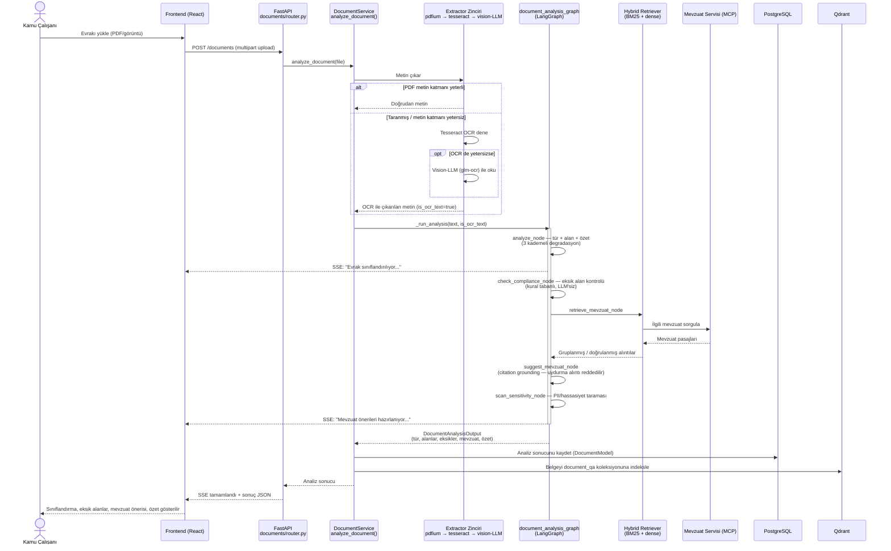

# Görev 1 Sıra Diyagramı — Evrak Sınıflandırma ve İçerik Analizi

Bir evrak yüklendiğinde `DocumentService.analyze_document` çağrılır, metin çıkarma zincirinden geçer ve `document_analysis_graph` (LangGraph) üzerinde sınıflandırma → alan çıkarımı → uyum kontrolü → mevzuat önerisi → hassasiyet taraması adımları sırayla/paralel çalışır. Her düğüm SSE üzerinden ilerleme olayı yayınlar.

## Notlar

- Her düğüm zaman aşımı ve yeniden deneme politikasına sahiptir (`app/ai/workflows/resilience.py`); bir adım başarısız olursa graf çökmez, kademeli olarak daha basit bir moda düşer.
- Mevzuat önerisi, alıntı doğrulaması (grounding) başarısız olursa yalnızca ham atıf (açıklamasız) döner — LLM'in uydurma gerekçe üretmesi engellenir.
- Detaylı özet (kısa özetten farklı olarak) bu akışın içinde **çalışmaz**; ayrı bir endpoint üzerinden istek üzerine üretilir çünkü ölçülen gecikmesi (184–288 sn) ana akışı yavaşlatır.
