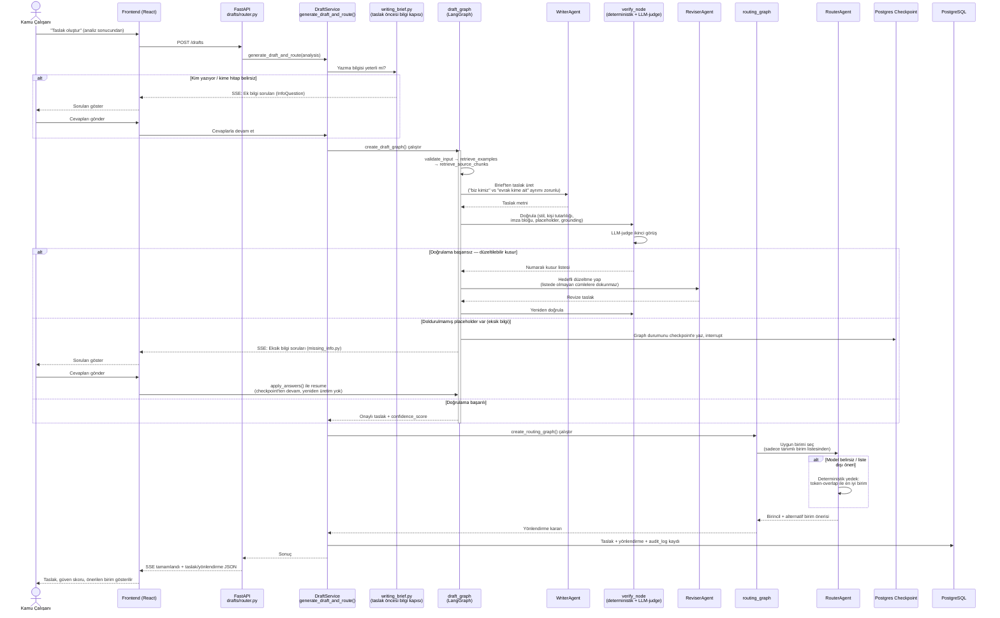

# Görev 2 Sıra Diyagramı — Resmî Yazı Taslaklama ve Birim Yönlendirme

Analiz tamamlandıktan sonra kullanıcı (veya otomatik akış) taslak oluşturmayı tetikler. `draft_graph`, yazma → doğrulama → revizyon döngüsünü çalıştırır; eksik bilgi varsa LangGraph'ın *interrupt* mekanizmasıyla akış duraklatılır ve kullanıcıdan cevap beklenir. Ardından `routing_graph` doğru birimi önerir.

## Notlar

- **İnsan onaylı akış (HITL)**, LangGraph'ın gerçek *interrupt/resume* mekanizmasıyla çalışır — akış bellekte beklemez, Postgres'e checkpoint'lenir; kullanıcı saatler sonra bile cevap verse akış kaldığı yerden devam eder.
- **Reviser**, verify adımının çıkardığı numaralı kusur listesi dışındaki hiçbir cümleye dokunmaz — bu, "düzeltirken başka yeri bozma" tasarım ilkesidir.
- **Router**, model hiçbir öneri veremese veya tanımlı birim listesi dışında bir şey önerse bile her zaman boş olmayan bir öneri döner (deterministik yedek sayesinde).
- `confidence_score` ve `applied_rules` (skorun arkasındaki kural dökümü) kullanıcıya şeffaf şekilde gösterilir — bu, Görev 2'nin "sürece dair açık bilgilendirme" maddesinin karşılığıdır.
