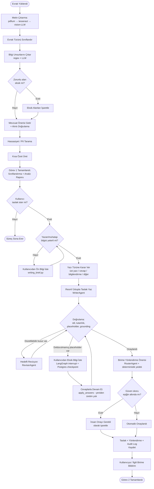

# Aktivite Diyagramı — Evrak Yaşam Döngüsü

Bir evrakın sisteme girişinden taslağın onaylanıp ilgili birime yönlendirilmesine kadar geçen tüm süreç, karar noktalarıyla birlikte.

## Notlar

- Diyagramdaki her karar noktası, kodda gerçek bir dallanmaya karşılık gelir (örn. `CheckMissing` → `app/ai/compliance/checker.py`, `Verify` → `draft_graph.py` içindeki `verify_node`).
- Sistem hiçbir noktada "çöküp durmaz": LLM başarısız olursa her adımın deterministik/heuristik bir yedeği devreye girer (sınıflandırmada tür `OTHER`'a düşer, yönlendirmede token-overlap ile en iyi birim seçilir, mevzuat önerisinde ham atıfa geri dönülür).
- `AskMissing` adımı gerçek bir askıya alma (interrupt) noktasıdır — kullanıcı cevap verene kadar sistem kaynak tüketmeden bekler, süreç kesintiye uğramaz.
