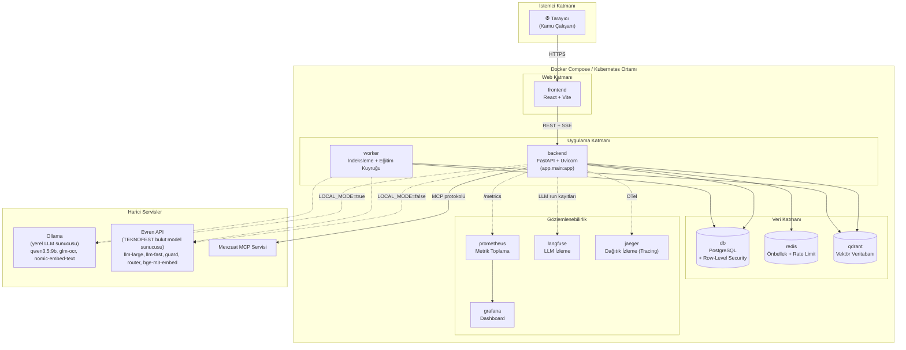

# Dağıtım (Deployment) Diyagramı

`compose.yml` (geliştirme) ve `compose.prod.yml` (üretim) dosyalarına dayanan gerçek servis topolojisi. Üretimde ayrıca `deploy/kubernetes` altında bir Kubernetes kurulumu bulunur (bkz. [docs/deployment/kubernetes.md](../deployment/kubernetes.md)).

## Notlar

- **`LOCAL_MODE`** ayarı, backend'in Ollama (yerel) ile Evren (TEKNOFEST'in barındırdığı bulut API) arasında hangi LLM sağlayıcısını kullanacağını belirler; ikisi de `BaseLLMClient` soyutlaması arkasında birbirinin yerine geçebilir.
- **`db`** servisi, çok kiracılı izolasyon için Postgres Row-Level Security (RLS) ile çalışır (`alembic/versions/0013_rls.py` ve sonrasında güçlendirilir).
- **`worker`**, kullanıcı isteğini bloklamayan arka plan işlerini (belge indeksleme, LoRA/DPO eğitim işleri) yürütür.
- Üretim ortamında (`compose.prod.yml` / Kubernetes) aynı servis kümesi, ek sertleştirme (hardening), sır yönetimi (secrets) ve yedekleme/geri yükleme (backup-restore) prosedürleriyle çalışır — ayrıntılar için [docs/deployment/](../deployment/) altındaki ilgili dosyalara bakınız.
