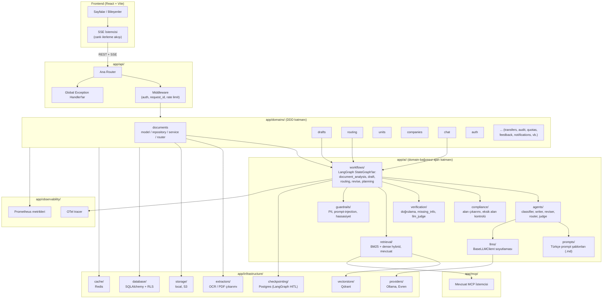

# Bileşen / Mimari Diyagramı

Backend, alan-odaklı (domain-driven) bir yapı ile yapay zeka mantığını ayrıştırır: `app/domains/` iş kurallarını ve HTTP yüzeyini taşır, `app/ai/` ise hiçbir domain'e bağımlı olmayan, tamamen yeniden kullanılabilir bir ajan/LLM katmanıdır.

## Notlar

- **`app/ai/`**, hiçbir yerde `app.domains` içe aktarmaz — bu, ajan/LLM mantığının domain'lerden bağımsız, test edilebilir ve yeniden kullanılabilir kalmasını sağlayan bilinçli bir mimari sınırdır.
- **`app/domains/*/router.py`** dosyaları HTTP yüzeyidir (FastAPI); asıl iş mantığı `service.py`'de, veri erişimi `repository.py`'de, ORM modeli `model/`'de yaşar — her domain aynı 4 katmanlı deseni tekrarlar.
- **LangGraph workflow'ları** (`app/ai/workflows/`), agent'ları (`app/ai/agents/`) düğüm (node) olarak kullanan yönlendirilmiş çizgeler (DAG); her düğüm zaman aşımı/yeniden deneme politikasına ve SSE olay yayınına sahiptir.
- Frontend, backend ile yalnızca REST + Server-Sent Events (SSE) üzerinden konuşur; WebSocket kullanılmaz.
