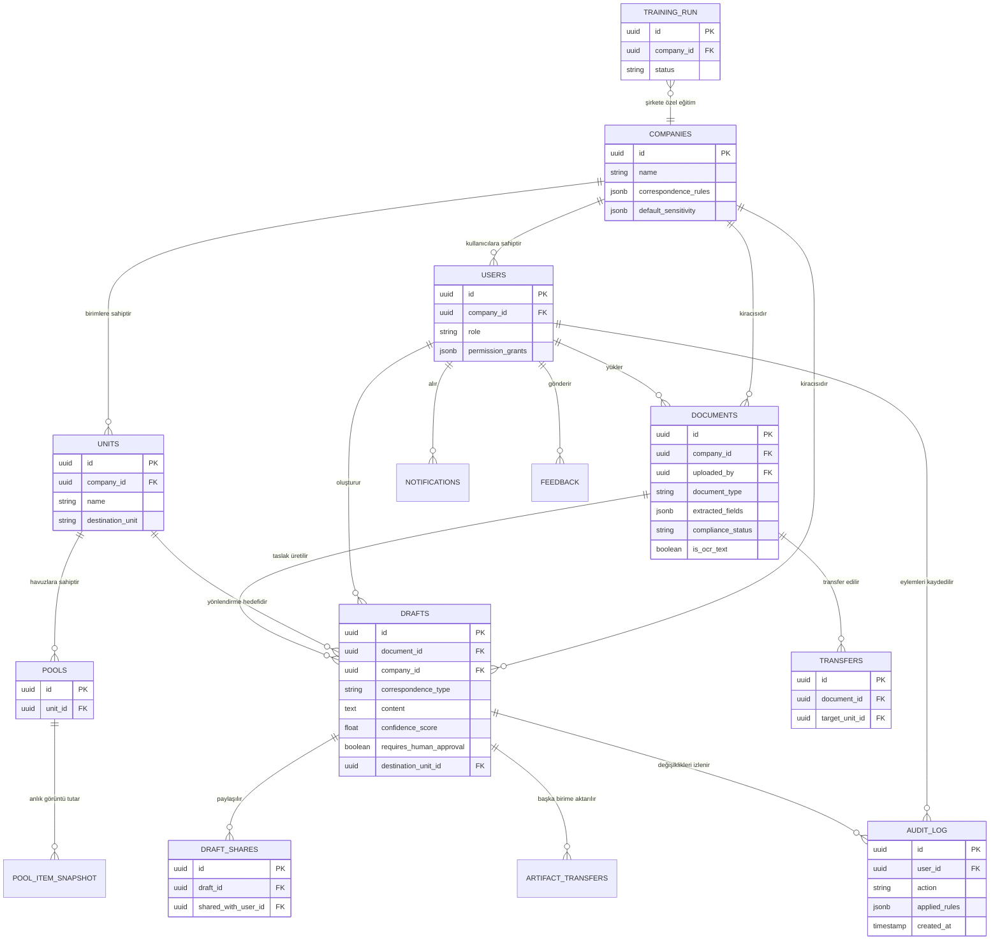

# Veri Modeli — ER Diyagramı

Ana Postgres tabloları arasındaki ilişkiler (28 Alembic migration'ının vardığı şema). Şirket/birim bazlı çok kiracılılık (multi-tenancy) ve Row-Level Security (RLS), `company_id` üzerinden neredeyse tüm tablolara yayılır.

## Notlar

- **Row-Level Security (RLS)**, `0013_rls.py` ve `0016_recorder_tables_rls.py` migration'larıyla `company_id` üzerinden aktif edilir — bağlantıyı yapan rol (`kachow_app`) RLS'i atlayamayan kısıtlı bir roldür, bu yüzden izolasyon uygulama koduna değil veritabanı seviyesine dayanır.
- **`DRAFTS.confidence_score`** ve **`requires_human_approval`**, Görev 2'nin "kullanıcıya açık bilgilendirme" ve "insan onayı" maddelerinin veritabanı karşılığıdır; `AUDIT_LOG.applied_rules` bu skorun arkasındaki kural dökümünü saklar.
- Şema, 0001 (baseline) ile 0028 (drafts unique constraint) arasındaki migration geçmişinde kademeli olarak genişlemiştir: guardrail alanları, kullanıcı yetki seviyesi (user_clearance), sohbet geçmişi, kotalar, geri bildirim, eğitim koşuları (training runs), mesajlaşma ve favoriler zamanla eklenmiştir.
