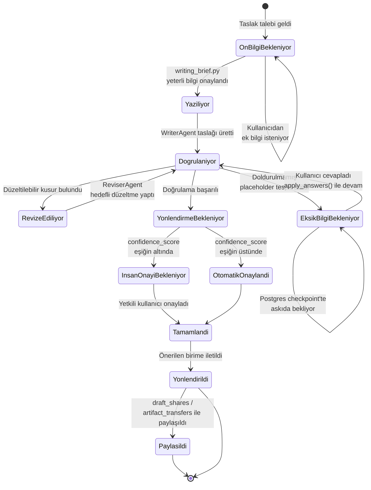

# Taslak Durum Diyagramı

Bir resmî yazı taslağının, `draft_graph` içinde oluşturulmasından nihai olarak birime yönlendirilip paylaşılmasına kadar geçirdiği durumlar.

## Notlar

- **`EksikBilgiBekleniyor`** durumu, bellekte bekleyen bir işlem değildir — LangGraph *interrupt* mekanizmasıyla Postgres'e checkpoint'lenir; sunucu yeniden başlasa bile taslak kaldığı yerden devam edebilir.
- **`RevizeEdiliyor` ↔ `Dogrulaniyor`** döngüsü sınırsız değildir; `reasoning_levels.py`'deki taslak-deneme sayısı ayarına göre üst sınırlıdır (fast/balanced/deep profillerine göre değişir).
- **`InsanOnayiBekleniyor`**, Görev 2'nin "gerekli durumlarda eksik bilgi talep edebilme" ve şeffaflık maddelerinin bir uzantısıdır — düşük güven skorlu taslaklar otomatik gönderilmez, bir insanın onayını bekler.
