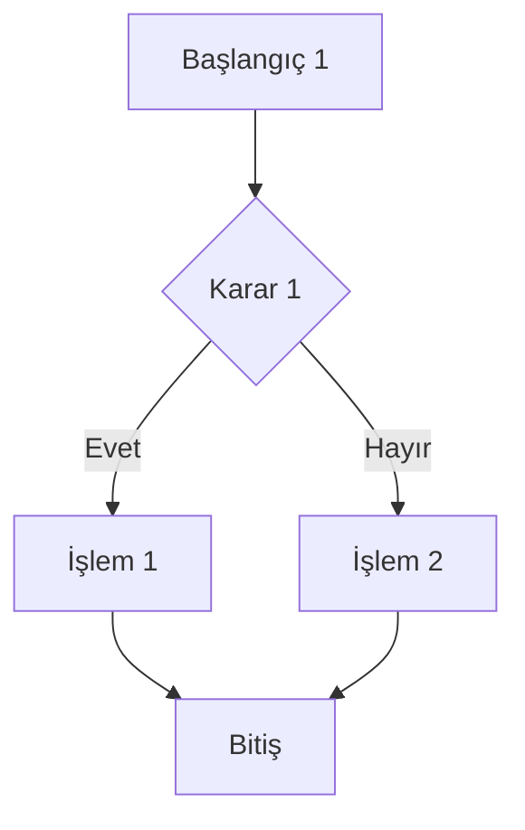
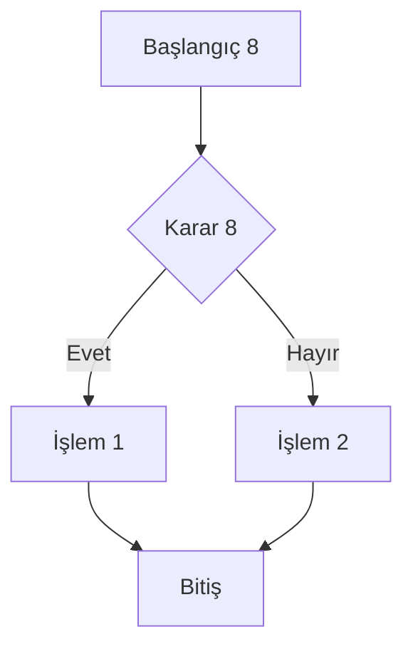
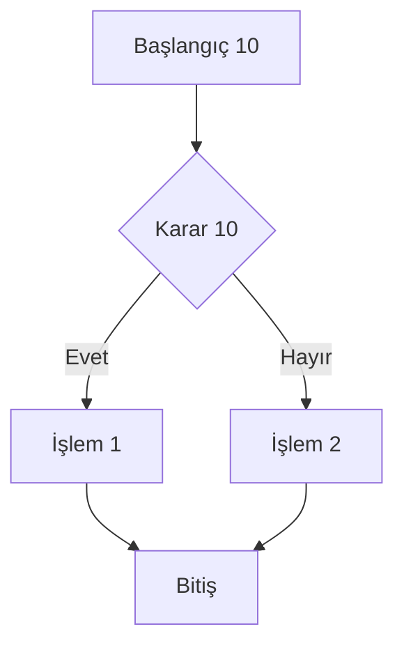
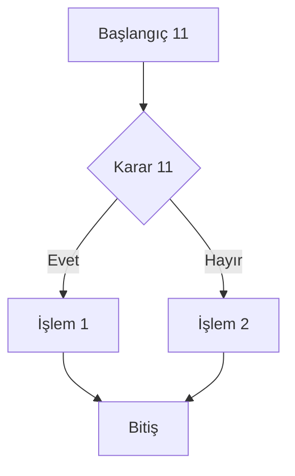

# Aktivite ve Akış Diyagramları

## 1. Aktivite Akışı 1

## 2. Aktivite Akışı 2

## 3. Aktivite Akışı 3

## 4. Aktivite Akışı 4

## 5. Aktivite Akışı 5

## 6. Aktivite Akışı 6

## 7. Aktivite Akışı 7

## 8. Aktivite Akışı 8

## 9. Aktivite Akışı 9

## 10. Aktivite Akışı 10

## 11. Aktivite Akışı 11

## 12. Aktivite Akışı 12

## 13. Aktivite Akışı 13

## 14. Aktivite Akışı 14

## 15. Aktivite Akışı 15

