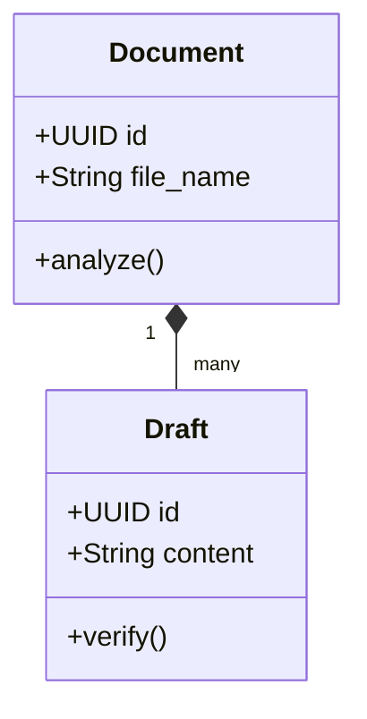
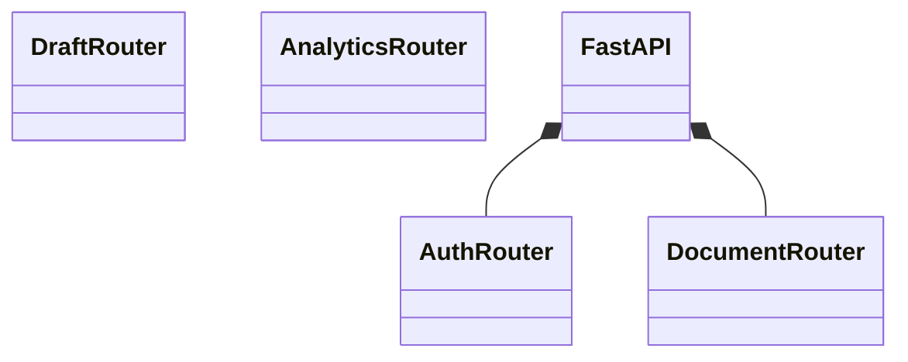
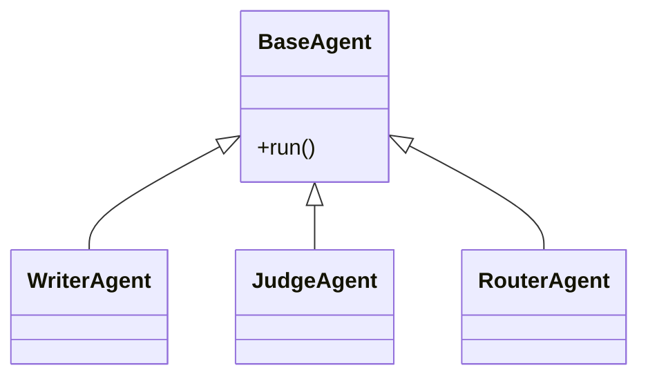
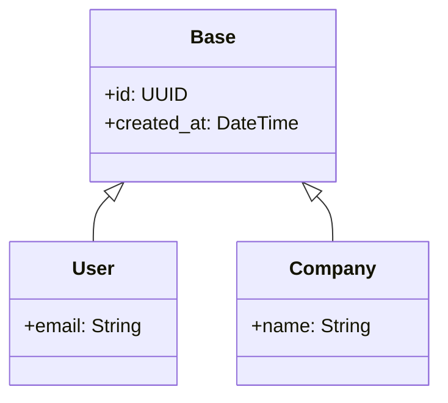
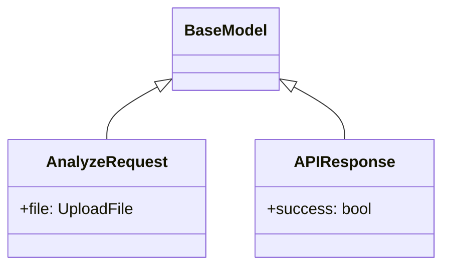

# Sınıf (Class) Diyagramları

## 1. Domain Entity Sınıfları

```mermaid
classDiagram
    class Document {
      +UUID id
      +String file_name
      +analyze()
    }
    class Draft {
      +UUID id
      +String content
      +verify()
    }
    Document "1" *-- "many" Draft
```

## 2. API Router Sınıfları

```mermaid
classDiagram
    class AuthRouter
    class DocumentRouter
    class DraftRouter
    class AnalyticsRouter
    FastAPI *-- AuthRouter
    FastAPI *-- DocumentRouter
```

## 3. Ajan Hiyerarşisi

```mermaid
classDiagram
    class BaseAgent {
      +run()
    }
    class WriterAgent
    class JudgeAgent
    class RouterAgent
    BaseAgent <|-- WriterAgent
    BaseAgent <|-- JudgeAgent
    BaseAgent <|-- RouterAgent
```

## 4. Veritabanı Modelleri

```mermaid
classDiagram
    class Base {
      +id: UUID
      +created_at: DateTime
    }
    class User {
      +email: String
    }
    class Company {
      +name: String
    }
    Base <|-- User
    Base <|-- Company
```

## 5. Pydantic Şemaları

```mermaid
classDiagram
    class BaseModel
    class AnalyzeRequest {
      +file: UploadFile
    }
    class APIResponse {
      +success: bool
    }
    BaseModel <|-- AnalyzeRequest
    BaseModel <|-- APIResponse
```

