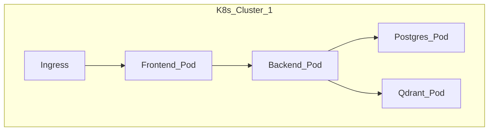

# Dağıtım (Deployment) Diyagramları

## 1. Dağıtım Topolojisi 1

```mermaid
graph TD
    subgraph K8s_Cluster_0
      Ingress --> Frontend_Pod
      Frontend_Pod --> Backend_Pod
      Backend_Pod --> Postgres_Pod
      Backend_Pod --> Qdrant_Pod
    end
```

## 2. Dağıtım Topolojisi 2

```mermaid
graph TD
    subgraph K8s_Cluster_1
      Ingress --> Frontend_Pod
      Frontend_Pod --> Backend_Pod
      Backend_Pod --> Postgres_Pod
      Backend_Pod --> Qdrant_Pod
    end
```

## 3. Dağıtım Topolojisi 3

```mermaid
graph TD
    subgraph K8s_Cluster_2
      Ingress --> Frontend_Pod
      Frontend_Pod --> Backend_Pod
      Backend_Pod --> Postgres_Pod
      Backend_Pod --> Qdrant_Pod
    end
```

## 4. Dağıtım Topolojisi 4

```mermaid
graph TD
    subgraph K8s_Cluster_3
      Ingress --> Frontend_Pod
      Frontend_Pod --> Backend_Pod
      Backend_Pod --> Postgres_Pod
      Backend_Pod --> Qdrant_Pod
    end
```

## 5. Dağıtım Topolojisi 5

```mermaid
graph TD
    subgraph K8s_Cluster_4
      Ingress --> Frontend_Pod
      Frontend_Pod --> Backend_Pod
      Backend_Pod --> Postgres_Pod
      Backend_Pod --> Qdrant_Pod
    end
```

