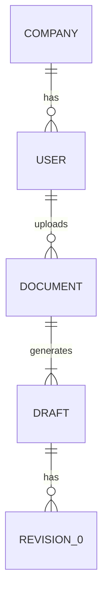
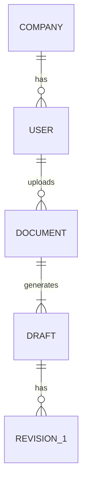

# Varlık-İlişki (ERD) Diyagramları

## 1. Varlık İlişki Diyagramı 1

## 2. Varlık İlişki Diyagramı 2

## 3. Varlık İlişki Diyagramı 3

## 4. Varlık İlişki Diyagramı 4

## 5. Varlık İlişki Diyagramı 5

