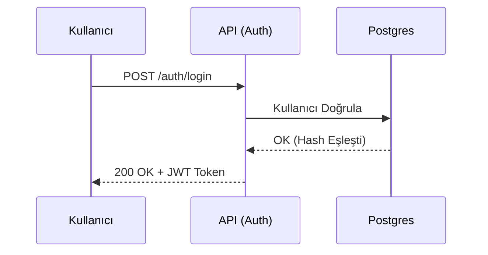
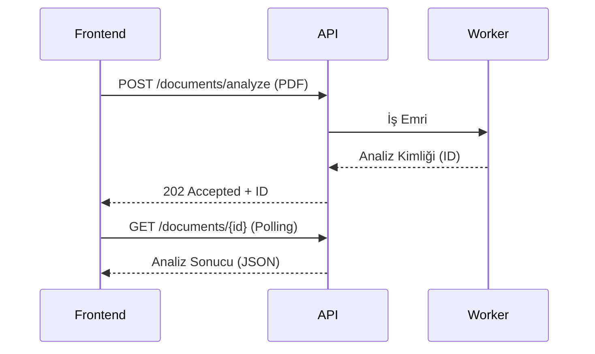
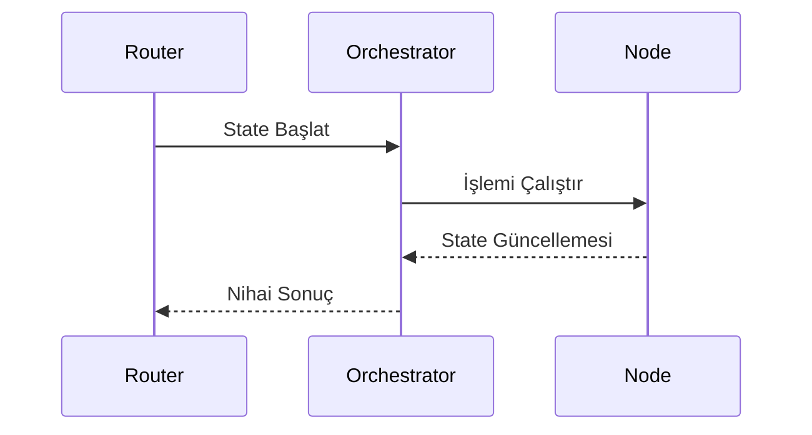
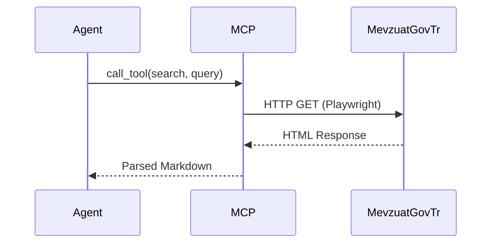
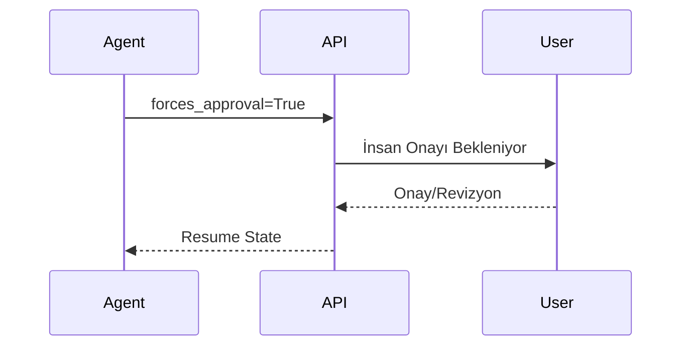
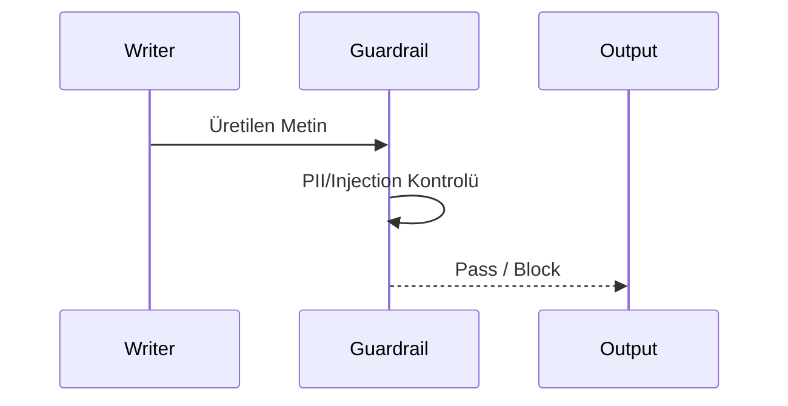
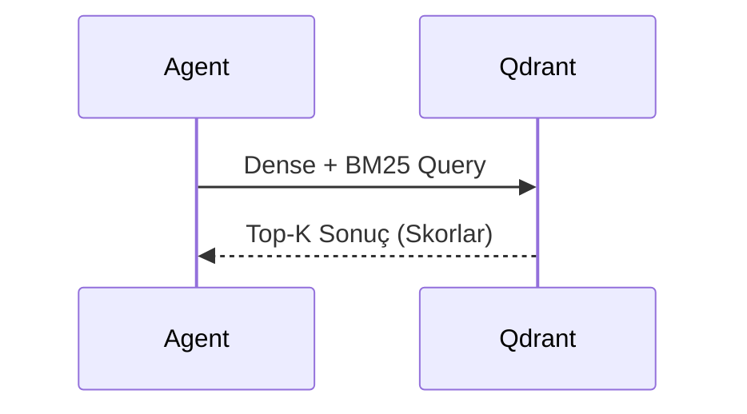
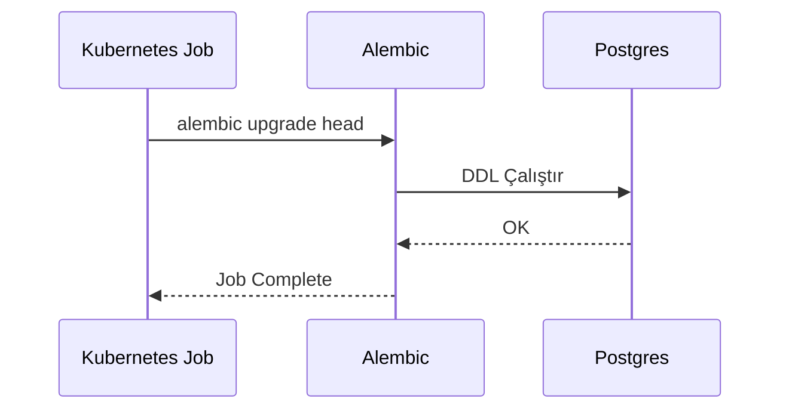
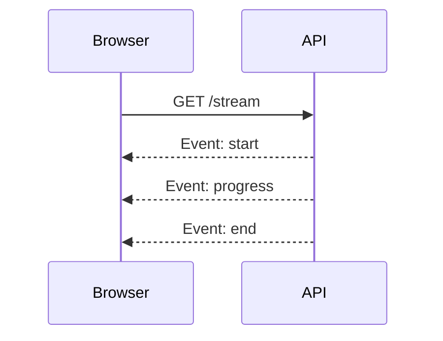
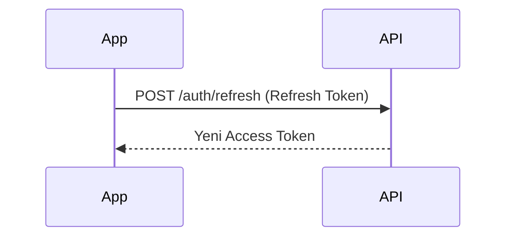

# Sekans (Sequence) Diyagramları

## 1. Kullanıcı Giriş (Login) Sekansı

## 2. Evrak Yükleme ve Analiz Sekansı

## 3. LangGraph Orkestrasyon Sekansı

## 4. Mevzuat MCP Arama Sekansı

## 5. HITL (Human in the Loop) Sekansı

## 6. LLM Judge (Güvenlik) Sekansı

## 7. Vektör Arama (RAG) Sekansı

## 8. Veritabanı Şema Göçü (Migration) Sekansı

## 9. Frontend SSE (Server-Sent Events) Sekansı

## 10. Token Yenileme (Refresh) Sekansı

