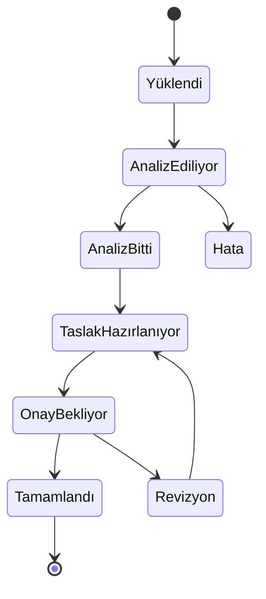
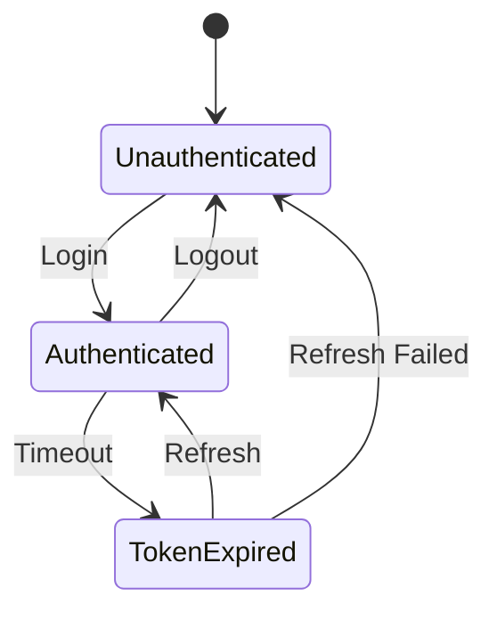
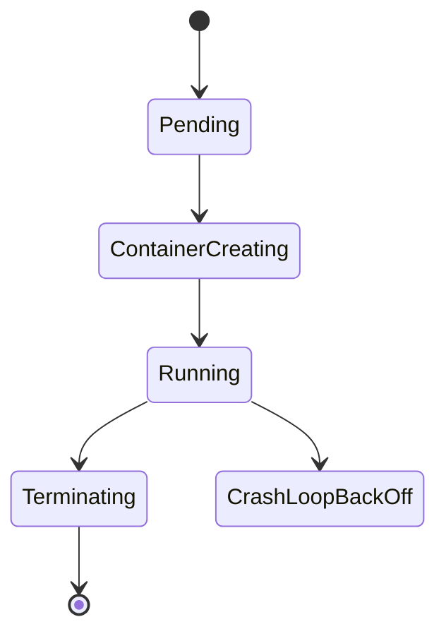
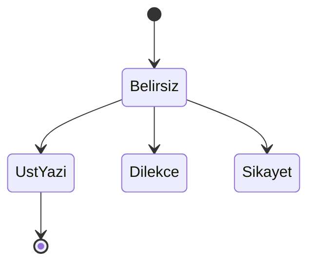
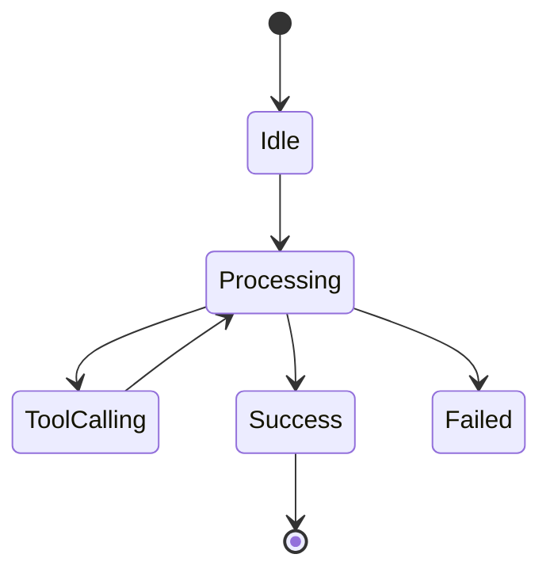

# Durum Makinesi (State) Diyagramları

## 1. Evrak Durum Makinesi

```mermaid
stateDiagram-v2
    [*] --> Yüklendi
    Yüklendi --> AnalizEdiliyor
    AnalizEdiliyor --> AnalizBitti
    AnalizEdiliyor --> Hata
    AnalizBitti --> TaslakHazırlanıyor
    TaslakHazırlanıyor --> OnayBekliyor
    OnayBekliyor --> Tamamlandı
    OnayBekliyor --> Revizyon
    Revizyon --> TaslakHazırlanıyor
    Tamamlandı --> [*]
```

## 2. Oturum (Session) State

```mermaid
stateDiagram-v2
    [*] --> Unauthenticated
    Unauthenticated --> Authenticated : Login
    Authenticated --> TokenExpired : Timeout
    TokenExpired --> Authenticated : Refresh
    Authenticated --> Unauthenticated : Logout
    TokenExpired --> Unauthenticated : Refresh Failed
```

## 3. Kubernetes Pod State

```mermaid
stateDiagram-v2
    [*] --> Pending
    Pending --> ContainerCreating
    ContainerCreating --> Running
    Running --> Terminating
    Running --> CrashLoopBackOff
    Terminating --> [*]
```

## 4. Yazışma Türü State

```mermaid
stateDiagram-v2
    [*] --> Belirsiz
    Belirsiz --> UstYazi
    Belirsiz --> Dilekce
    Belirsiz --> Sikayet
    UstYazi --> [*]
```

## 5. Ajan State

```mermaid
stateDiagram-v2
    [*] --> Idle
    Idle --> Processing
    Processing --> ToolCalling
    ToolCalling --> Processing
    Processing --> Success
    Processing --> Failed
    Success --> [*]
```

