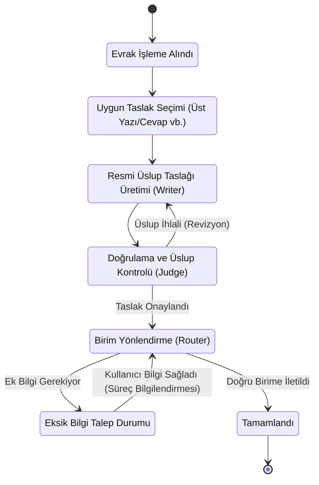
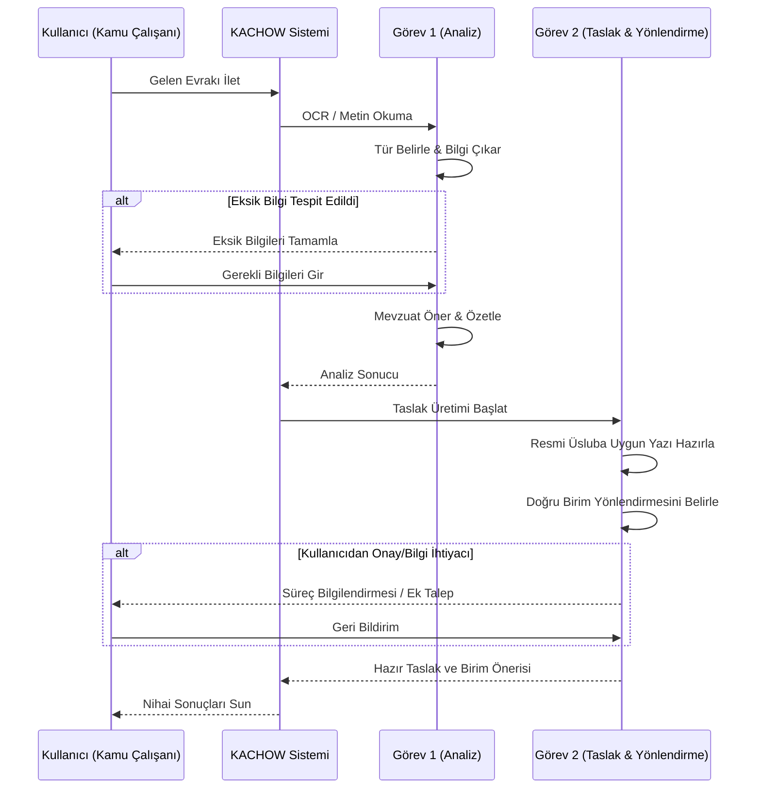

# TEKNOFEST 2026 Görev Analizi Diyagramları

Aşağıdaki diyagramlar, TEKNOFEST 2026 yarışma şartnamesinde belirtilen Görev 1 ve Görev 2'nin KACHOW platformunda nasıl teknik iş akışlarına dönüştürüldüğünü gösterir.

## Görev 1: Evrak Sınıflandırma ve İçerik Analizi

Bu görev, evrakın kuruma ulaştığı ilk anda yapılan dijital ön işleme (preprocessing) aşamasını modeller.

```mermaid
flowchart TD
    %% Stil Tanımlamaları
    classDef input fill:#2c3e50,stroke:#34495e,stroke-width:2px,color:#fff
    classDef process fill:#2980b9,stroke:#2980b9,stroke-width:2px,color:#fff
    classDef ai fill:#27ae60,stroke:#2ecc71,stroke-width:2px,color:#fff
    classDef output fill:#8e44ad,stroke:#9b59b6,stroke-width:2px,color:#fff

    Start([Evrak Sisteme Ulaştı]):::input --> OCR{Metin Okunabilir mi?}
    OCR -->|Evet| Parse[Doğrudan Metin Çıkarımı]:::process
    OCR -->|Hayır| Tesseract[OCR ile Görselden Metin Çıkarımı]:::process
    
    Parse --> AI_Classify
    Tesseract --> AI_Classify
    
    subgraph KACHOW Analiz Çekirdeği (Agent)
        AI_Classify[Evrak Türünü Belirle]:::ai
        AI_Extract[Önemli Bilgi Unsurlarını Çıkar]:::ai
        AI_Missing{Eksik Bilgi Var mı?}:::ai
        AI_Laws[İlgili Mevzuat/Yönetmelik Öner]:::ai
        AI_Summary[Kısa ve Öz Özet Oluştur]:::ai
        
        AI_Classify --> AI_Extract
        AI_Extract --> AI_Missing
        AI_Missing -->|Var| Alert[İnsan Kontrolü: Eksik Bilgi]:::output
        AI_Missing -->|Yok| AI_Laws
        Alert --> AI_Laws
        AI_Laws --> AI_Summary
    end
    
    AI_Summary --> Finish([Analiz Raporu Hazır]):::output
```

## Görev 2: Resmî Yazı Taslaklama ve Birim Yönlendirme

Bu görev, birinci aşamada elde edilen verilerle doğru birim yönlendirmesini yapmayı ve resmi cevabı taslaklamayı modeller.



## Görev 1 & Görev 2 Entegre Sistem Dizisi (Sequence)

İki görevin kesintisiz birleşik akışta nasıl çalıştığını anlatan sekans diyagramı.


